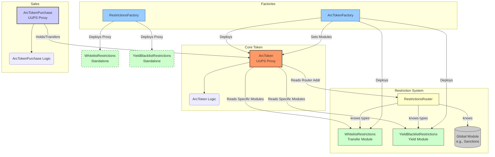

# Arc Token Framework

## Overview

The Arc Token Framework provides a robust and flexible system for creating and managing ERC20 tokens, particularly suited for representing Real World Assets (RWAs). It features a modular architecture that separates core token functionality from transfer and yield distribution restrictions, allowing for customizable compliance and behavior rules.

The system is built around the central `ArcToken` contract, which delegates restriction checks to a configurable `RestrictionsRouter`. This router can direct checks to global modules (e.g., for sanctions lists) or token-specific modules (e.g., KYC whitelists). The framework includes factories for deploying new tokens (`ArcTokenFactory`) and associated restriction modules (`RestrictionsFactory`), as well as a contract for managing token sales (`ArcTokenPurchase`).

## Architecture

The Arc system employs a modular design where the core token interacts with various specialized contracts:

## Core Components

---

### `ArcToken.sol`

-   **Type:** UUPS Upgradeable ERC20 Token (`ERC20Upgradeable`, `AccessControlUpgradeable`, `ReentrancyGuardUpgradeable`, `UUPSUpgradeable`)
-   **Overview:** Represents the RWA share/token. Manages core ERC20 logic, holder tracking, yield distribution, and delegates transfer/yield restriction checks via the `RestrictionsRouter` and specific modules.

#### Key Functions

| Function                                                                         | Description                                                                                    | Access Control             |
| :------------------------------------------------------------------------------- | :--------------------------------------------------------------------------------------------- | :------------------------- |
| `initialize(...)`                                                                | Initializes the token, sets roles, router, yield token, initial supply.                        | Initializer                |
| `setSpecificRestrictionModule(bytes32 typeId, address moduleAddress)`            | Links a specific restriction module instance (e.g., Whitelist) to this token.                  | `ADMIN_ROLE`               |
| `getSpecificRestrictionModule(bytes32 typeId)`                                   | Returns the address of the linked specific restriction module for a given type.                | View                       |
| `updateTokenName(string memory newName)`                                         | Updates the token's name.                                                                      | `MANAGER_ROLE`             |
| `mint(address to, uint256 amount)`                                               | Mints new tokens.                                                                              | `MINTER_ROLE`              |
| `burn(address from, uint256 amount)`                                             | Burns tokens.                                                                                  | `BURNER_ROLE`              |
| `setYieldToken(address yieldTokenAddr)`                                          | Sets the ERC20 token used for yield payouts.                                                   | `YIELD_MANAGER_ROLE`       |
| `previewYieldDistribution(uint256 amount)`                                       | Previews yield distribution amounts for all holders, respecting restrictions.                  | View                       |
| `previewYieldDistributionWithLimit(uint256 amount, uint256 start, uint256 limit)` | Previews yield distribution for a batch of holders.                                            | View                       |
| `distributeYield(uint256 amount)`                                                | Distributes `yieldToken` to eligible holders (transfers from caller).                          | `YIELD_DISTRIBUTOR_ROLE`   |
| `distributeYieldWithLimit(uint256 totalAmount, uint256 start, uint256 limit)`    | Distributes `yieldToken` to a batch of eligible holders.                                       | `YIELD_DISTRIBUTOR_ROLE`   |
| `setTokenURI(string memory newTokenURI)`                                         | Sets the metadata URI.                                                                         | `MANAGER_ROLE`             |
| `updateTokenSymbol(string memory newSymbol)`                                     | Updates the token's symbol.                                                                    | `MANAGER_ROLE`             |
| `decimals()`                                                                     | Returns token decimals.                                                                        | View Override              |
| `name()`                                                                         | Returns token name (prefers updated name if set).                                              | View Override              |
| `symbol()`                                                                       | Returns token symbol (prefers updated symbol if set).                                          | View Override              |
| `_authorizeUpgrade(address newImplementation)`                                   | Hook for upgrade authorization.                                                                | Internal, `UPGRADER_ROLE`  |
| `_update(address from, address to, uint256 amount)`                              | Internal transfer hook; enforces restrictions, updates holder set.                             | Internal Override          |

#### Events

| Event                                                                 | Description                                                                     |
| :-------------------------------------------------------------------- | :------------------------------------------------------------------------------ |
| `YieldDistributed(uint256 amount, address indexed token)`             | Emitted when yield is successfully distributed.                                 |
| `YieldTokenUpdated(address indexed newYieldToken)`                    | Emitted when the yield token address is changed.                                |
| `TokenNameUpdated(string oldName, string newName)`                    | Emitted when the token name is updated.                                         |
| `TokenURIUpdated(string newTokenURI)`                                 | Emitted when the token URI is updated.                                          |
| `SymbolUpdated(string oldSymbol, string newSymbol)`                   | Emitted when the token symbol is updated.                                       |
| `SpecificRestrictionModuleSet(bytes32 indexed typeId, address indexed moduleAddress)` | Emitted when a specific restriction module address is set for the token. |

#### Custom Errors

-   `YieldTokenNotSet()`
-   `NoTokensInCirculation()`
-   `InvalidYieldTokenAddress()`
-   `IssuePriceMustBePositive()` (Note: Issue price logic not present in current `ArcToken.sol`)
-   `InvalidAddress()`
-   `TransferRestricted()`
-   `YieldDistributionRestricted()`
-   `ZeroAmount()`
-   `ModuleNotSetForType(bytes32 typeId)`
-   `RouterNotSet()`

#### Constants

-   `ADMIN_ROLE`, `MANAGER_ROLE`, `YIELD_MANAGER_ROLE`, `YIELD_DISTRIBUTOR_ROLE`, `MINTER_ROLE`, `BURNER_ROLE`, `UPGRADER_ROLE` (Role identifiers)
-   `TRANSFER_RESTRICTION_TYPE`, `YIELD_RESTRICTION_TYPE`, `GLOBAL_SANCTIONS_TYPE` (Module type identifiers)

---

### `ArcTokenFactory.sol`

-   **Type:** UUPS Upgradeable Factory (`Initializable`, `AccessControlUpgradeable`, `UUPSUpgradeable`)
-   **Overview:** Deploys `ArcToken` proxies and their associated token-specific `WhitelistRestrictions` and `YieldBlacklistRestrictions` modules. Manages `ArcToken` implementation upgrades.

#### Key Functions

| Function                                                                         | Description                                                                                     | Access Control         |
| :------------------------------------------------------------------------------- | :---------------------------------------------------------------------------------------------- | :--------------------- |
| `initialize(address routerAddress)`                                              | Initializes the factory with the `RestrictionsRouter` address.                                  | Initializer            |
| `createToken(...)` (multiple signatures)                                         | Deploys `ArcToken` proxy, its specific restriction modules, links them, sets URI, grants roles. | External               |
| `getTokenImplementation(address token)`                                          | Returns the implementation address for a given `ArcToken` proxy created by this factory.        | External View          |
| `upgradeToken(address token, address newImplementation)`                         | Upgrades a specific `ArcToken` proxy to a new, whitelisted implementation.                      | `DEFAULT_ADMIN_ROLE`   |
| `whitelistImplementation(address newImplementation)`                             | Adds an `ArcToken` implementation address to the whitelist for upgrades.                        | `DEFAULT_ADMIN_ROLE`   |
| `removeWhitelistedImplementation(address implementation)`                        | Removes an `ArcToken` implementation address from the whitelist.                                | `DEFAULT_ADMIN_ROLE`   |
| `isImplementationWhitelisted(address implementation)`                            | Checks if an `ArcToken` implementation is whitelisted.                                          | External View          |
| `_authorizeUpgrade(address newImplementation)`                                   | Hook for factory upgrade authorization.                                                         | Internal, `DEFAULT_ADMIN_ROLE` |

#### Events

| Event                                                                                                     | Description                                                                                   |
| :-------------------------------------------------------------------------------------------------------- | :-------------------------------------------------------------------------------------------- |
| `TokenCreated(address indexed tokenAddress, address indexed owner, address indexed impl, string, string, string, uint8)` | Emitted when a new `ArcToken` proxy and its modules are successfully created.               |
| `ImplementationWhitelisted(address indexed implementation)`                                               | Emitted when an `ArcToken` implementation is whitelisted for upgrades.                        |
| `ImplementationRemoved(address indexed implementation)`                                                   | Emitted when an `ArcToken` implementation is removed from the whitelist.                    |
| `TokenUpgraded(address indexed token, address indexed newImplementation)`                                 | Emitted when an `ArcToken` proxy is successfully upgraded.                                  |

#### Custom Errors

-   `ImplementationNotWhitelisted()`
-   `TokenNotCreatedByFactory()`
-   `RouterNotSet()`
-   `FailedToCreateRestrictionsModule()`
-   `FailedToSetRestrictions()`

#### Constants

-   `TRANSFER_RESTRICTION_TYPE`, `YIELD_RESTRICTION_TYPE` (Module type identifiers, mirroring `ArcToken`)

---

### `ArcTokenPurchase.sol`

-   **Type:** UUPS Upgradeable Sales Contract (`Initializable`, `AccessControlUpgradeable`, `UUPSUpgradeable`, `ReentrancyGuardUpgradeable`)
-   **Overview:** Manages the sale of `ArcToken`s, acting as a treasury for tokens being sold and purchase currency received. Supports storefront configuration.

#### Key Functions

| Function                                                                                                                               | Description                                                                                          | Access Control         |
| :------------------------------------------------------------------------------------------------------------------------------------- | :--------------------------------------------------------------------------------------------------- | :--------------------- |
| `initialize(address admin)`                                                                                                            | Initializes the sales contract, setting the admin.                                                   | Initializer            |
| `enableToken(address _tokenContract, uint256 _numberOfTokens, uint256 _tokenPrice)`                                                     | Enables a specific `ArcToken` for sale, setting quantity and price. Requires tokens in contract.     | `onlyTokenAdmin`       |
| `buy(address _tokenContract, uint256 _purchaseAmount)`                                                                                 | Executes a purchase; transfers `purchaseToken` from buyer, transfers `ArcToken` to buyer.            | External, `nonReentrant` |
| `setPurchaseToken(address purchaseTokenAddress)`                                                                                       | Sets the ERC20 token address used for purchases (e.g., USDC).                                        | `DEFAULT_ADMIN_ROLE`   |
| `setStorefrontConfig(address _tokenContract, string _domain, ...)`                                                                     | Configures metadata for an off-chain storefront associated with a token sale.                        | `onlyTokenAdmin`       |
| `getTokenInfo(address _tokenContract)`                                                                                                 | Returns sales status (enabled, price, total, sold) for a token.                                      | External View          |
| `isEnabled(address _tokenContract)`                                                                                                    | Checks if a token sale is enabled.                                                                   | External View          |
| `getMaxNumberOfTokens(address _tokenContract)`                                                                                         | Returns the remaining number of tokens available for sale (base units).                              | External View          |
| `getTokenPrice(address _tokenContract)`                                                                                                | Returns the price per full `ArcToken` unit in `purchaseToken`.                                     | External View          |
| `getStorefrontConfig(address _tokenContract)`                                                                                          | Returns the storefront configuration for a token.                                                    | External View          |
| `getStorefrontConfigByDomain(string memory _domain)`                                                                                   | Returns the storefront configuration associated with a domain.                                     | External View          |
| `getAddressByDomain(string memory _domain)`                                                                                            | Returns the `ArcToken` contract address associated with a domain.                                  | External View          |
| `purchaseToken()`                                                                                                                      | Returns the address of the current `purchaseToken`.                                                  | External View          |
| `withdrawPurchaseTokens(address to, uint256 amount)`                                                                                   | Withdraws collected `purchaseToken`s from the contract.                                              | `DEFAULT_ADMIN_ROLE`   |
| `withdrawUnsoldArcTokens(address _tokenContract, address to, uint256 amount)`                                                          | Withdraws unsold `ArcToken`s from the contract.                                                      | `DEFAULT_ADMIN_ROLE`   |
| `_authorizeUpgrade(address newImplementation)`                                                                                         | Hook for contract upgrade authorization.                                                             | Internal, `DEFAULT_ADMIN_ROLE` |

#### Events

| Event                                                                                                 | Description                                                              |
| :---------------------------------------------------------------------------------------------------- | :----------------------------------------------------------------------- |
| `PurchaseMade(address indexed buyer, address indexed tokenContract, uint256 amount, uint256 pricePaid)` | Emitted when a user successfully buys tokens.                            |
| `TokenSaleEnabled(address indexed tokenContract, uint256 numberOfTokens, uint256 tokenPrice)`         | Emitted when a token sale is enabled or updated.                         |
| `StorefrontConfigSet(address indexed tokenContract, string domain)`                                   | Emitted when storefront configuration is set or updated for a token.     |
| `PurchaseTokenUpdated(address indexed newPurchaseToken)`                                              | Emitted when the purchase token address is changed.                      |

#### Custom Errors

-   `PurchaseTokenNotSet()`
-   `PurchaseAmountTooLow()`
-   `NotEnoughTokensForSale()`
-   `ContractBalanceInsufficient()`
-   `PurchaseTransferFailed()`
-   `TokenTransferFailed()`
-   `InvalidPurchaseTokenAddress()`
-   `TokenPriceMustBePositive()`
-   `NumberOfTokensMustBePositive()`
-   `ContractMissingRequiredTokens()`
-   `NotTokenAdmin(address caller, address token)`
-   `DomainCannotBeEmpty()`
-   `DomainAlreadyInUse(string domain)`
-   `NoConfigForDomain(string domain)`
-   `CannotWithdrawToZeroAddress()`
-   `AmountMustBePositive()`
-   `InsufficientUnsoldTokens()`
-   `ArcTokenWithdrawalFailed()`
-   `PurchaseTokenWithdrawalFailed()`
-   `TokenNotEnabled()`
-   `ZeroAmount()`

---

### `RestrictionsRouter.sol`

-   **Type:** Central Router & Registry (`Initializable`, `AccessControlUpgradeable`) (Note: Not currently UUPS Upgradeable itself)
-   **Overview:** Manages the registration of restriction module types and provides addresses for global modules. Acts as the central lookup point for `ArcToken`.

#### Key Functions

| Function                                                                         | Description                                                                                           | Access Control       |
| :------------------------------------------------------------------------------- | :---------------------------------------------------------------------------------------------------- | :------------------- |
| `initialize(address admin)`                                                      | Initializes the router, setting the admin.                                                            | Initializer          |
| `registerModuleType(bytes32 typeId, bool isGlobal, address initialImpl)`         | Registers a new type of restriction module (e.g., Transfer, Yield, Sanctions).                        | `DEFAULT_ADMIN_ROLE` |
| `setGlobalModuleAddress(bytes32 typeId, address moduleAddress)`                  | Sets the single, global instance address for a module type marked as global.                          | `DEFAULT_ADMIN_ROLE` |
| `getGlobalModuleAddress(bytes32 typeId)`                                         | Returns the address of the registered global module for a given type.                                 | External View        |
| `getModuleInfo(bytes32 typeId)`                                                  | Returns information (isGlobal, implementation) about a registered module type.                        | External View        |
| `isModuleTypeRegistered(bytes32 typeId)`                                         | Checks if a module type ID has been registered.                                                       | External View        |

#### Events

| Event                                                                         | Description                                                                     |
| :---------------------------------------------------------------------------- | :------------------------------------------------------------------------------ |
| `ModuleTypeRegistered(bytes32 indexed typeId, bool isGlobal, address indexed initialImpl)` | Emitted when a new restriction module type is registered.                       |
| `GlobalModuleAddressSet(bytes32 indexed typeId, address indexed moduleAddress)` | Emitted when the address for a global restriction module instance is set/updated. |

#### Custom Errors

-   `ModuleTypeNotRegistered(bytes32 typeId)`
-   `ModuleTypeAlreadyRegistered(bytes32 typeId)`
-   `ModuleNotGlobal(bytes32 typeId)`
-   `ModuleIsGlobal(bytes32 typeId)`
-   `InvalidModuleAddress()`

---

### `WhitelistRestrictions.sol`

-   **Type:** Transfer Restriction Module (`ITransferRestrictions`, `Initializable`, `AccessControlUpgradeable`) (Note: Not currently UUPS Upgradeable itself)
-   **Overview:** A token-specific module deployed by `ArcTokenFactory`. Restricts transfers based on a managed whitelist and a global toggle.

#### Key Functions

| Function                                             | Description                                                                          | Access Control         |
| :--------------------------------------------------- | :----------------------------------------------------------------------------------- | :--------------------- |
| `initialize(address admin)`                          | Initializes the module, sets admin, defaults `transfersAllowed` to true.             | Initializer            |
| `addToWhitelist(address account)`                    | Adds an address to the transfer whitelist.                                           | `MANAGER_ROLE`         |
| `removeFromWhitelist(address account)`               | Removes an address from the transfer whitelist.                                      | `MANAGER_ROLE`         |
| `addBatchToWhitelist(address[] memory accounts)`     | Adds multiple addresses to the whitelist.                                            | `MANAGER_ROLE`         |
| `removeBatchFromWhitelist(address[] memory accounts)`| Removes multiple addresses from the whitelist.                                       | `MANAGER_ROLE`         |
| `setTransfersAllowed(bool allowed)`                  | Enables or disables transfer restriction checks globally for this module instance. | `ADMIN_ROLE`           |
| `isWhitelisted(address account)`                     | Checks if an address is on the whitelist.                                            | External View          |
| `transfersAllowed()`                                 | Returns the current state of the global transfer toggle.                             | External View          |
| `isTransferAllowed(address from, address to, uint256 amount)` | Hook called by `ArcToken`: checks toggle and sender/receiver whitelist status.   | External View Override |
| `beforeTransfer(...)`, `afterTransfer(...)`          | Placeholder hooks from `ITransferRestrictions` (currently no-op).                    | External Override      |

#### Events

| Event                                       | Description                                                  |
| :------------------------------------------ | :----------------------------------------------------------- |
| `WhitelistMemberAdded(address indexed account)` | Emitted when an address is added to the whitelist.           |
| `WhitelistMemberRemoved(address indexed account)` | Emitted when an address is removed from the whitelist.       |
| `TransfersAllowedSet(bool allowed)`         | Emitted when the global transfer restriction toggle is changed. |

#### Custom Errors

-   `AccountAlreadyWhitelisted(address account)`
-   `AccountNotWhitelisted(address account)`

#### Constants

-   `ADMIN_ROLE`, `MANAGER_ROLE` (Role identifiers)

---

### `YieldBlacklistRestrictions.sol`

-   **Type:** Yield Restriction Module (`IYieldRestrictions`, `Initializable`, `AccessControlUpgradeable`) (Note: Not currently UUPS Upgradeable itself)
-   **Overview:** A token-specific module deployed by `ArcTokenFactory`. Restricts yield distribution based on a managed blacklist.

#### Key Functions

| Function                                                 | Description                                                  | Access Control         |
| :------------------------------------------------------- | :----------------------------------------------------------- | :--------------------- |
| `initialize(address admin)`                              | Initializes the module, sets admin.                          | Initializer            |
| `addToBlacklist(address account)`                        | Adds an address to the yield blacklist.                      | `MANAGER_ROLE`         |
| `removeFromBlacklist(address account)`                   | Removes an address from the yield blacklist.                 | `MANAGER_ROLE`         |
| `addBatchToBlacklist(address[] memory accounts)`         | Adds multiple addresses to the blacklist.                    | `MANAGER_ROLE`         |
| `removeBatchFromBlacklist(address[] memory accounts)`    | Removes multiple addresses from the blacklist.               | `MANAGER_ROLE`         |
| `isBlacklisted(address account)`                         | Checks if an address is on the blacklist.                    | External View          |
| `isYieldAllowed(address account)`                        | Hook called by `ArcToken`: checks if address is blacklisted. | External View Override |

#### Events

| Event                                         | Description                                              |
| :-------------------------------------------- | :------------------------------------------------------- |
| `BlacklistMemberAdded(address indexed account)` | Emitted when an address is added to the blacklist.       |
| `BlacklistMemberRemoved(address indexed account)` | Emitted when an address is removed from the blacklist.   |

#### Custom Errors

-   `AccountAlreadyBlacklisted(address account)`
-   `AccountNotBlacklisted(address account)`

#### Constants

-   `ADMIN_ROLE`, `MANAGER_ROLE` (Role identifiers)

---

### `RestrictionsFactory.sol`

-   **Type:** UUPS Upgradeable Factory (`Initializable`, `AccessControlUpgradeable`, `UUPSUpgradeable`)
-   **Overview:** Deploys standalone, proxied instances of restriction modules (e.g., `WhitelistRestrictions`). Manages restriction module implementation upgrades.

#### Key Functions

| Function                                                 | Description                                                                                     | Access Control         |
| :------------------------------------------------------- | :---------------------------------------------------------------------------------------------- | :--------------------- |
| `initialize()`                                           | Initializes the factory, setting deployer as admin.                                             | Initializer            |
| `createWhitelistRestrictions(address admin)`             | Deploys a new proxied `WhitelistRestrictions` instance and initializes it.                      | External               |
| `getRestrictionsImplementation(address restrictions)`    | Returns the implementation address for a given restriction module proxy created by this factory.  | External View          |
| `whitelistImplementation(address newImplementation)`     | Adds a restriction module implementation address to the whitelist for upgrades.                 | `DEFAULT_ADMIN_ROLE`   |
| `removeWhitelistedImplementation(address implementation)`| Removes a restriction module implementation address from the whitelist.                         | `DEFAULT_ADMIN_ROLE`   |
| `isImplementationWhitelisted(address implementation)`    | Checks if a restriction module implementation is whitelisted.                                   | External View          |
| `_authorizeUpgrade(address newImplementation)`           | Hook for factory upgrade authorization.                                                         | Internal, `DEFAULT_ADMIN_ROLE` |

#### Events

| Event                                                                                                     | Description                                                                                 |
| :-------------------------------------------------------------------------------------------------------- | :------------------------------------------------------------------------------------------ |
| `RestrictionsCreated(address indexed restrictionsAddress, address indexed owner, address indexed impl, string type)` | Emitted when a new restriction module proxy (e.g., "Whitelist") is successfully created. |
| `ImplementationWhitelisted(address indexed implementation)`                                               | Emitted when a restriction module implementation is whitelisted for upgrades.               |
| `ImplementationRemoved(address indexed implementation)`                                                   | Emitted when a restriction module implementation is removed from the whitelist.           |
| `RestrictionsUpgraded(address indexed restrictions, address indexed newImplementation)`                   | Emitted when a restriction module proxy is successfully upgraded (Note: Upgrade logic TBD). |

#### Custom Errors

-   `ImplementationNotWhitelisted()`
-   `NotCreatedByFactory()`

---

## Deployment & Setup

A typical deployment sequence involves:

1.  **Deploy `RestrictionsRouter`:** This central component is needed first. Initialize it.
2.  **Deploy `ArcTokenFactory`:** Initialize it with the `RestrictionsRouter` address.
3.  **(Optional) Deploy `RestrictionsFactory`:** If needed for standalone module creation. Initialize it.
4.  **Deploy `ArcTokenPurchase`:** Initialize with an admin address. Set the `purchaseToken` address.
5.  **Use `ArcTokenFactory` to create `ArcToken`s:**
    -   Call `createToken` on the factory. This deploys:
        -   An `ArcTokenProxy` pointing to a new `ArcToken` implementation.
        -   A new `WhitelistRestrictions` instance.
        -   A new `YieldBlacklistRestrictions` instance.
    -   The factory automatically links the new modules to the new `ArcToken`.
6.  **Configure Token & Modules:**
    -   Grant any additional roles needed on the `ArcToken` or its modules.
    -   Call `addToWhitelist` on the token's specific `WhitelistRestrictions` module for initial holders/buyers.
    -   Configure yield blacklist rules if necessary using the token's `YieldBlacklistRestrictions` module.
7.  **(Optional) Enable Sales:**
    -   Transfer `ArcToken`s intended for sale *to* the `ArcTokenPurchase` contract.
    -   Call `enableToken` on `ArcTokenPurchase` for the specific `ArcToken`, setting the price and quantity.
    -   Configure storefront settings using `setStorefrontConfig`.

## License

MIT License
