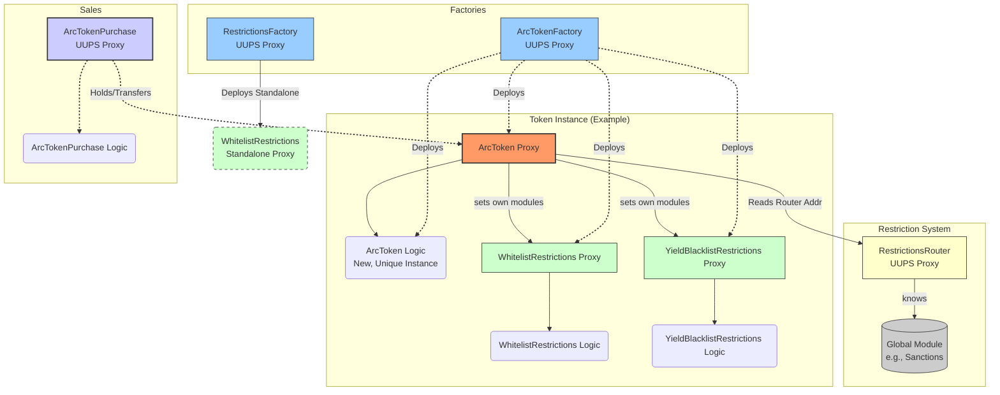

# Arc Token Framework

> [!NOTE]
> **Arc Token is now live on Plume!**
> Nest Alpha Vault includes Mineral Vault, which is an ArcToken: [https://app.nest.credit/nest-alpha-vault](https://app.nest.credit/nest-alpha-vault)

## Overview

The Arc Token Framework provides a robust and flexible system for creating and managing UUPS-upgradeable ERC20 tokens, particularly suited for representing Real World Assets (RWAs). It features a highly modular architecture that separates core token functionality from transfer and yield distribution restrictions, allowing for fully customizable compliance and behavior rules on a per-token basis.

The system is built around the central `ArcToken` contract. Crucially, this contract contains no hardcoded restriction logic. Instead, it delegates all compliance checks to external, pluggable modules. These checks are routed through a central `RestrictionsRouter`, which can direct them to global modules (e.g., for system-wide sanctions lists) or token-specific modules (e.g., for KYC whitelists).

The framework includes two key factories:
1.  `ArcTokenFactory`: Deploys new `ArcToken` proxies. Uniquely, for each token, it deploys a **new `ArcToken` implementation contract**, ensuring complete logical isolation. It also deploys dedicated, proxied restriction modules for each token.
2.  `RestrictionsFactory`: Deploys standalone, proxied restriction modules that can be shared or used independently.

A dedicated `ArcTokenPurchase` contract is provided to manage token sales in a secure, configurable manner. All major components of the system (`ArcToken`, factories, router, and modules) are UUPS upgradeable.

## Architecture

The Arc system employs a modular, proxy-based design where the core token interacts with various specialized contracts. The architecture emphasizes per-token isolation, with each `ArcToken` proxy pointing to its own unique implementation contract.

## Core Components

---

### `ArcToken.sol`

-   **Type:** UUPS Upgradeable ERC20 Token (`ERC20Upgradeable`, `AccessControlUpgradeable`, `ReentrancyGuardUpgradeable`, `UUPSUpgradeable`)
-   **Overview:** Represents the share/token. Manages core ERC20 logic, holder tracking (via `EnumerableSet`), yield distribution, and delegates all transfer/yield restriction checks via the `RestrictionsRouter` and specific modules.

#### Key Functions

| Function | Description | Access Control |
| :--- | :--- | :--- |
| `initialize(...)` | Initializes the token, sets roles, router, yield token, initial supply. | Initializer |
| `setRestrictionModule(bytes32 typeId, address moduleAddress)` | Links a specific restriction module instance (e.g., Whitelist) to this token. | `ADMIN_ROLE` |
| `getRestrictionModule(bytes32 typeId)` | Returns the address of the linked specific restriction module for a given type. | View |
| `updateTokenName(string memory newName)` | Updates the token's name. | `MANAGER_ROLE` |
| `updateTokenSymbol(string memory newSymbol)` | Updates the token's symbol. | `MANAGER_ROLE` |
| `mint(address to, uint256 amount)` | Mints new tokens. | `MINTER_ROLE` |
| `burn(address from, uint256 amount)` | Burns tokens. | `BURNER_ROLE` |
| `setYieldToken(address yieldTokenAddr)` | Sets the ERC20 token used for yield payouts. | `YIELD_MANAGER_ROLE` |
| `previewYieldDistribution(uint256 amount)` | Previews yield distribution amounts for all holders, respecting restrictions. | View |
| `previewYieldDistributionWithLimit(uint256 amount, uint256 start, uint256 limit)` | Previews yield distribution for a batch of holders. | View |
| `distributeYield(uint256 amount)` | Distributes `yieldToken` to eligible holders (transfers from caller). | `YIELD_DISTRIBUTOR_ROLE` |
| `distributeYieldWithLimit(uint256 totalAmount, uint256 start, uint256 limit)` | Distributes `yieldToken` to a batch of eligible holders. | `YIELD_DISTRIBUTOR_ROLE` |
| `setTokenURI(string memory newTokenURI)` | Sets the metadata URI. | `MANAGER_ROLE` |
| `uri()` | Returns the metadata URI. | View |
| `decimals()` | Returns token decimals. | View Override |
| `name()` | Returns token name (prefers updated name if set). | View Override |
| `symbol()` | Returns token symbol (prefers updated symbol if set). | View Override |
| `_authorizeUpgrade(address newImplementation)` | Hook for upgrade authorization. | Internal, `UPGRADER_ROLE` |
| `_update(address from, address to, uint256 amount)` | Internal transfer hook; enforces restrictions, updates holder set. | Internal Override |

#### Yield Distribution Mechanism

The contract provides two methods for distributing yield to token holders:

1.  **Full Distribution (`distributeYield`)**: This function iterates through the entire set of token holders and transfers the appropriate yield share to each eligible address. This approach is gas-intensive and is designed for scenarios where the total number of holders is expected to be relatively small, such as with permissioned assets requiring KYC where the holder base is controlled.

2.  **Batched Distribution (`distributeYieldWithLimit`)**: For tokens with a larger number of holders, this function allows for paginated distribution. An off-chain script or keeper can call this function repeatedly in batches, using the `startIndex` and `maxHolders` parameters to process a subset of holders in each transaction. The function returns the `nextIndex` to be used in the subsequent call, allowing the process to continue until all holders have been paid. This significantly reduces the gas cost per transaction and avoids hitting block gas limits.

The yield calculation correctly determines an `effectiveTotalSupply` by only including the balances of holders who are not restricted from receiving yield (as determined by the `YIELD_RESTRICTION_TYPE` and `GLOBAL_SANCTIONS_TYPE` modules), ensuring that yield is not allocated to ineligible accounts.

#### Events

| Event | Description |
| :--- | :--- |
| `YieldDistributed(uint256 amount, address indexed token)` | Emitted when yield is successfully distributed. |
| `YieldTokenUpdated(address indexed newYieldToken)` | Emitted when the yield token address is changed. |
| `TokenNameUpdated(string oldName, string newName)` | Emitted when the token name is updated. |
| `TokenURIUpdated(string newTokenURI)` | Emitted when the token URI is updated. |
| `SymbolUpdated(string oldSymbol, string newSymbol)` | Emitted when the token symbol is updated. |
| `SpecificRestrictionModuleSet(bytes32 indexed typeId, address indexed moduleAddress)` | Emitted when a specific restriction module address is set for the token. |

#### Custom Errors

-   `YieldTokenNotSet()`
-   `NoTokensInCirculation()`
-   `InvalidYieldTokenAddress()`
-   `IssuePriceMustBePositive()` (Note: Defined but not used in `ArcToken.sol`)
-   `InvalidAddress()`
-   `TransferRestricted()`
-   `YieldDistributionRestricted()`
-   `ZeroAmount()`
-   `ModuleNotSetForType(bytes32 typeId)`
-   `RouterNotSet()`

#### Constants

-   `ADMIN_ROLE`, `MANAGER_ROLE`, `YIELD_MANAGER_ROLE`, `YIELD_DISTRIBUTOR_ROLE`, `MINTER_ROLE`, `BURNER_ROLE`, `UPGRADER_ROLE` (Role identifiers)
-   `TRANSFER_RESTRICTION_TYPE`, `YIELD_RESTRICTION_TYPE`, `GLOBAL_SANCTIONS_TYPE` (Module type identifiers from `RestrictionTypes.sol`)

---

### `ArcTokenFactory.sol`

-   **Type:** UUPS Upgradeable Factory (`Initializable`, `AccessControlUpgradeable`, `UUPSUpgradeable`)
-   **Overview:** Deploys `ArcToken` proxies and their associated infrastructure. For each call to `createToken`, it deploys a **new, unique `ArcToken` implementation contract** and a proxy pointing to it. It also deploys proxied, token-specific instances of `WhitelistRestrictions` and `YieldBlacklistRestrictions` and links them to the new token. The factory maintains a whitelist of `ArcToken` implementation code hashes to authorize future upgrades.

#### Key Functions

| Function | Description | Access Control |
| :--- | :--- | :--- |
| `initialize(address routerAddress)` | Initializes the factory with the `RestrictionsRouter` address. | Initializer |
| `createToken(string name, ...)` | Deploys `ArcToken` proxy, its **unique** logic contract, its specific restriction modules (as proxies), links them, sets URI, and grants roles. | External |
| `getTokenImplementation(address token)` | Returns the unique implementation address for a given `ArcToken` proxy created by this factory. | External View |
| `upgradeToken(address token, address newImplementation)` | Upgrades a specific `ArcToken` proxy to a new implementation whose code hash is whitelisted. | `DEFAULT_ADMIN_ROLE` |
| `whitelistImplementation(address newImplementation)` | Adds an `ArcToken` implementation's code hash to the whitelist for upgrades. | `DEFAULT_ADMIN_ROLE` |
| `removeWhitelistedImplementation(address implementation)` | Removes an `ArcToken` implementation's code hash from the whitelist. | `DEFAULT_ADMIN_ROLE` |
| `isImplementationWhitelisted(address implementation)` | Checks if an `ArcToken` implementation's code hash is whitelisted. | External View |
| `_authorizeUpgrade(address newImplementation)` | Hook for factory upgrade authorization. | Internal, `DEFAULT_ADMIN_ROLE` |

#### Events

| Event | Description |
| :--- | :--- |
| `TokenCreated(address indexed tokenAddress, ...)` | Emitted when a new `ArcToken` proxy and its modules are successfully created. |
| `ModuleLinked(address indexed tokenAddress, ...)` | Emitted when a restriction module is linked to a created token. |
| `ImplementationWhitelisted(address indexed implementation)` | Emitted when an `ArcToken` implementation is whitelisted for upgrades. |
| `ImplementationRemoved(address indexed implementation)` | Emitted when an `ArcToken` implementation is removed from the whitelist. |
| `TokenUpgraded(address indexed token, address indexed newImplementation)` | Emitted when an `ArcToken` proxy is successfully upgraded. |

#### Custom Errors

-   `ImplementationNotWhitelisted()`
-   `TokenNotCreatedByFactory()`
-   `RouterNotSet()`
-   `FailedToCreateRestrictionsModule()`
-   `FailedToSetRestrictions()`

#### Constants

-   `TRANSFER_RESTRICTION_TYPE`, `YIELD_RESTRICTION_TYPE` (Module type identifiers, mirroring `ArcToken`)

---

### `ArcTokenPurchase.sol`

-   **Type:** UUPS Upgradeable Sales Contract (`Initializable`, `AccessControlUpgradeable`, `UUPSUpgradeable`, `ReentrancyGuardUpgradeable`)
-   **Overview:** Manages the sale of `ArcToken`s, acting as a treasury for tokens being sold and purchase currency received. Supports storefront configuration. Verifies that tokens sold were created by the configured `ArcTokenFactory`.

#### Key Functions

| Function | Description | Access Control |
| :--- | :--- | :--- |
| `initialize(address admin, address factory)` | Initializes the sales contract, setting the admin and token factory. | Initializer |
| `enableToken(address _tokenContract, uint256 _numberOfTokens, uint256 _tokenPrice)` | Enables a specific `ArcToken` for sale, setting quantity and price. Requires tokens in contract. | `onlyTokenAdmin` |
| `disableToken(address _tokenContract)` | Disables a token sale, preventing further purchases. | `onlyTokenAdmin` |
| `buy(address _tokenContract, uint256 _purchaseAmount, uint256 _amountOutMinimum)` | Executes a purchase; includes slippage protection (`_amountOutMinimum`). | External, `nonReentrant` |
| `setPurchaseToken(address purchaseTokenAddress)` | Sets the ERC20 token address used for purchases (e.g., USDC). | `DEFAULT_ADMIN_ROLE` |
| `setTokenFactory(address factoryAddress)` | Sets the `ArcTokenFactory` address for verifying tokens. | `DEFAULT_ADMIN_ROLE` |
| `setStorefrontConfig(address _tokenContract, string _domain, ...)` | Configures metadata for an off-chain storefront associated with a token sale. | `onlyTokenAdmin` |
| `getTokenInfo(address _tokenContract)` | Returns sales status (enabled, price, total, sold) for a token. | External View |
| `isEnabled(address _tokenContract)` | Checks if a token sale is enabled. | External View |
| `getMaxNumberOfTokens(address _tokenContract)` | Returns the remaining number of tokens available for sale (base units). | External View |
| `getTokenPrice(address _tokenContract)` | Returns the price per full `ArcToken` unit in `purchaseToken`. | External View |
| `getStorefrontConfig(address _tokenContract)` | Returns the storefront configuration for a token. | External View |
| `getStorefrontConfigByDomain(string memory _domain)` | Returns the storefront configuration associated with a domain. | External View |
| `getAddressByDomain(string memory _domain)` | Returns the `ArcToken` contract address associated with a domain. | External View |
| `purchaseToken()` | Returns the address of the current `purchaseToken`. | External View |
| `tokenFactory()` | Returns the address of the configured `ArcTokenFactory`. | External View |
| `withdrawPurchaseTokens(address to, uint256 amount)` | Withdraws collected `purchaseToken`s from the contract. | `DEFAULT_ADMIN_ROLE` |
| `withdrawUnsoldArcTokens(address _tokenContract, address to, uint256 amount)` | Withdraws unsold `ArcToken`s from the contract. | `onlyTokenAdmin` |
| `_authorizeUpgrade(address newImplementation)` | Hook for contract upgrade authorization. | Internal, `DEFAULT_ADMIN_ROLE` |

#### Events

| Event | Description |
| :--- | :--- |
| `PurchaseMade(address indexed buyer, ...)` | Emitted when a user successfully buys tokens. |
| `TokenSaleEnabled(address indexed tokenContract, ...)` | Emitted when a token sale is enabled or updated. |
| `TokenSaleDisabled(address indexed tokenContract)` | Emitted when a token sale is disabled. |
| `StorefrontConfigSet(address indexed tokenContract, string domain)` | Emitted when storefront configuration is set or updated for a token. |
| `PurchaseTokenUpdated(address indexed newPurchaseToken)` | Emitted when the purchase token address is changed. |
| `TokenFactoryUpdated(address indexed newFactory)` | Emitted when the token factory address is changed. |

#### Custom Errors

-   `PurchaseTokenNotSet()`
-   `PurchaseAmountTooLow()`
-   `NotEnoughTokensForSale()`
-   `ContractBalanceInsufficient()`
-   `PurchaseTransferFailed()`
-   `TokenTransferFailed()`
-   `InvalidPurchaseTokenAddress()`
-   `TokenPriceMustBePositive()`
-   `NumberOfTokensMustBePositive()`
-   `ContractMissingRequiredTokens()`
-   `NotTokenAdmin(address caller, address token)`
-   `DomainCannotBeEmpty()`
-   `DomainAlreadyInUse(string domain)`
-   `NoConfigForDomain(string domain)`
-   `CannotWithdrawToZeroAddress()`
-   `AmountMustBePositive()`
-   `InsufficientUnsoldTokens()`
-   `ArcTokenWithdrawalFailed()`
-   `PurchaseTokenWithdrawalFailed()`
-   `TokenNotEnabled()`
-   `ZeroAmount()`
-   `TooLittleReceived()`
-   `TokenFactoryNotSet()`
-   `TokenNotCreatedByFactory()`
-   `CannotChangePurchaseTokenWithActiveSales()`

---

### `RestrictionsRouter.sol`

-   **Type:** UUPS Upgradeable Central Router & Registry (`Initializable`, `AccessControlUpgradeable`, `UUPSUpgradeable`)
-   **Overview:** Manages the registration of restriction module types and provides addresses for global modules. Acts as the central lookup point for `ArcToken`.

#### Key Functions

| Function | Description | Access Control |
| :--- | :--- | :--- |
| `initialize(address admin)` | Initializes the router, setting the admin. | Initializer |
| `registerModuleType(bytes32 typeId, bool isGlobal, address globalImplementation)` | Registers a new type of restriction module. | `ROUTER_ADMIN_ROLE` |
| `updateGlobalModuleImplementation(bytes32 typeId, address newGlobalImplementation)` | Updates the implementation address for a registered global module type. | `ROUTER_ADMIN_ROLE` |
| `removeModuleType(bytes32 typeId)` | Removes a registered module type. Use with caution. | `ROUTER_ADMIN_ROLE` |
| `getGlobalModuleAddress(bytes32 typeId)` | Returns the address of the registered global module for a given type. | External View |
| `getModuleInfo(bytes32 typeId)` | Returns information (isGlobal, implementation, exists) about a registered module type. | External View |
| `_authorizeUpgrade(address newImplementation)` | Hook for contract upgrade authorization. | Internal, `UPGRADER_ROLE` |

#### Events

| Event | Description |
| :--- | :--- |
| `ModuleTypeRegistered(bytes32 indexed typeId, bool isGlobal, address globalImplementation)` | Emitted when a new restriction module type is registered. |
| `GlobalImplementationUpdated(bytes32 indexed typeId, address indexed newGlobalImplementation)` | Emitted when the address for a global restriction module is updated. |
| `ModuleTypeRemoved(bytes32 indexed typeId)` | Emitted when a module type is removed. |

#### Custom Errors

-   `ModuleTypeNotRegistered(bytes32 typeId)`
-   `ModuleTypeAlreadyRegistered(bytes32 typeId)`
-   `ModuleNotGlobal(bytes32 typeId)`
-   `ModuleIsGlobal(bytes32 typeId)`
-   `InvalidGlobalImplementationAddress()`
-   `InvalidTypeId()`

---

### `WhitelistRestrictions.sol`

-   **Type:** UUPS Upgradeable Transfer Restriction Module (`ITransferRestrictions`, `Initializable`, `UUPSUpgradeable`, `AccessControlEnumerableUpgradeable`)
-   **Overview:** A token-specific module, typically deployed as a proxy by `ArcTokenFactory`. Restricts transfers based on a managed whitelist and a global toggle.

#### Key Functions

| Function | Description | Access Control |
| :--- | :--- | :--- |
| `initialize(address admin)` | Initializes the module, sets admin roles. | Initializer |
| `addToWhitelist(address account)` | Adds an address to the transfer whitelist. | `MANAGER_ROLE` |
| `removeFromWhitelist(address account)` | Removes an address from the transfer whitelist. | `MANAGER_ROLE` |
| `batchAddToWhitelist(address[] calldata accounts)` | Adds multiple addresses to the whitelist. | `MANAGER_ROLE` |
| `setTransfersAllowed(bool allowed)` | Enables or disables transfer restriction checks globally for this module instance. | `ADMIN_ROLE` |
| `isWhitelisted(address account)` | Checks if an address is on the whitelist. | External View |
| `getWhitelistedAddresses()` | Returns an array of all whitelisted addresses. | External View |
| `transfersAllowed()` | Returns the current state of the global transfer toggle. | External View |
| `isTransferAllowed(address from, address to, uint256 amount)` | Hook called by `ArcToken`: checks toggle and sender/receiver whitelist status. | External View Override |
| `beforeTransfer(...)`, `afterTransfer(...)` | Placeholder hooks from `ITransferRestrictions` (no-op). | External Override |
| `_authorizeUpgrade(address newImplementation)` | Hook for contract upgrade authorization. | Internal, `UPGRADER_ROLE` |

#### Events

| Event | Description |
| :--- | :--- |
| `AddedToWhitelist(address indexed account)` | Emitted when an address is added to the whitelist. |
| `RemovedFromWhitelist(address indexed account)` | Emitted when an address is removed from the whitelist. |
| `TransfersRestrictionToggled(bool transfersAllowed)` | Emitted when the global transfer restriction toggle is changed. |
| `WhitelistStatusChanged(address indexed account, bool isWhitelisted)` | Deprecated-style event, also emitted for whitelist changes. |

#### Custom Errors

-   `AlreadyWhitelisted(address account)`
-   `NotWhitelisted(address account)`
-   `TransferRestricted()`
-   `InvalidAddress()`
-   `CannotAddZeroAddress()`
-   `CannotRemoveZeroAddress()`

#### Constants

-   `ADMIN_ROLE`, `MANAGER_ROLE`, `UPGRADER_ROLE`, `WHITELIST_ADMIN_ROLE` (Role identifiers)

---

### `YieldBlacklistRestrictions.sol`

-   **Type:** UUPS Upgradeable Yield Restriction Module (`IYieldRestrictions`, `Initializable`, `AccessControlUpgradeable`, `UUPSUpgradeable`)
-   **Overview:** A token-specific module, typically deployed as a proxy by `ArcTokenFactory`. Restricts yield distribution based on a managed blacklist.

#### Key Functions

| Function | Description | Access Control |
| :--- | :--- | :--- |
| `initialize(address admin)` | Initializes the module, sets admin roles. | Initializer |
| `addToBlacklist(address account)` | Adds an address to the yield blacklist. | `YIELD_BLACKLIST_ADMIN_ROLE` |
| `removeFromBlacklist(address account)` | Removes an address from the yield blacklist. | `YIELD_BLACKLIST_ADMIN_ROLE` |
| `batchAddToBlacklist(address[] calldata accounts)` | Adds multiple addresses to the blacklist. | `YIELD_BLACKLIST_ADMIN_ROLE` |
| `isBlacklisted(address account)` | Checks if an address is on the blacklist. | External View |
| `isYieldAllowed(address account)` | Hook called by `ArcToken`: checks if address is blacklisted. | External View Override |
| `_authorizeUpgrade(address newImplementation)` | Hook for contract upgrade authorization. | Internal, `UPGRADER_ROLE` |

#### Events

| Event | Description |
| :--- | :--- |
| `YieldBlacklistUpdated(address indexed account, bool isBlacklisted)` | Emitted when an address is added to or removed from the blacklist. |

#### Custom Errors

-   `InvalidAddress()`
-   `AlreadyBlacklisted()`
-   `NotBlacklisted()`

#### Constants

-   `YIELD_BLACKLIST_ADMIN_ROLE`, `UPGRADER_ROLE` (Role identifiers)

---

### `RestrictionsFactory.sol`

-   **Type:** UUPS Upgradeable Factory (`Initializable`, `AccessControlUpgradeable`, `UUPSUpgradeable`)
-   **Overview:** Deploys standalone, proxied instances of restriction modules (e.g., `WhitelistRestrictions`). Manages restriction module implementation upgrades by whitelisting code hashes.

#### Key Functions

| Function | Description | Access Control |
| :--- | :--- | :--- |
| `initialize()` | Initializes the factory, setting deployer as admin. | Initializer |
| `createWhitelistRestrictions(address admin)` | Deploys a new proxied `WhitelistRestrictions` instance and initializes it. | External |
| `getRestrictionsImplementation(address restrictions)` | Returns the implementation address for a given restriction module proxy. | External View |
| `whitelistImplementation(address newImplementation)` | Adds a restriction module implementation's code hash to the whitelist. | `DEFAULT_ADMIN_ROLE` |
| `removeWhitelistedImplementation(address implementation)` | Removes a restriction module implementation's code hash from the whitelist. | `DEFAULT_ADMIN_ROLE` |
| `isImplementationWhitelisted(address implementation)` | Checks if a restriction module implementation's code hash is whitelisted. | External View |
| `_authorizeUpgrade(address newImplementation)` | Hook for factory upgrade authorization. | Internal, `DEFAULT_ADMIN_ROLE` |

#### Events

| Event | Description |
| :--- | :--- |
| `RestrictionsCreated(address indexed restrictionsAddress, ...)` | Emitted when a new restriction module proxy is successfully created. |
| `ImplementationWhitelisted(address indexed implementation)` | Emitted when a restriction module implementation is whitelisted. |
| `ImplementationRemoved(address indexed implementation)` | Emitted when a restriction module implementation is removed. |
| `RestrictionsUpgraded(address indexed restrictions, ...)` | Emitted on upgrade. (Note: The contract has no public upgrade function, suggesting this may be part of an incomplete feature). |

#### Custom Errors

-   `ImplementationNotWhitelisted()`
-   `NotCreatedByFactory()`

---

## Deployment & Setup

A typical deployment sequence involves:

1.  **Deploy `RestrictionsRouter`:** This central component is needed first. Initialize it, granting admin roles.
2.  **Deploy `ArcTokenFactory`:** Initialize it with the `RestrictionsRouter` address.
3.  **(Optional) Deploy `RestrictionsFactory`:** If needed for standalone/shared module creation. Initialize it.
4.  **Deploy `ArcTokenPurchase`:** Initialize it with an admin address and the `ArcTokenFactory` address.
5.  **Use `ArcTokenFactory` to create `ArcToken`s:**
    -   Call `createToken` on the factory. This deploys:
        -   A new, unique `ArcToken` implementation contract.
        -   An `ArcTokenProxy` pointing to that new implementation.
        -   A new `WhitelistRestrictions` proxy instance.
        -   A new `YieldBlacklistRestrictions` proxy instance.
    -   The factory automatically links the new restriction modules to the new `ArcToken`.
6.  **Configure Token & Modules:**
    -   Grant any additional roles needed on the `ArcToken` or its modules.
    -   Use `batchAddToWhitelist` on the token's specific `WhitelistRestrictions` module for initial holders/buyers.
    -   Configure yield blacklist rules if necessary using the token's `YieldBlacklistRestrictions` module.
7.  **(Optional) Enable Sales:**
    -   Set the `purchaseToken` (e.g., USDC) on `ArcTokenPurchase`.
    -   Transfer `ArcToken`s intended for sale *to* the `ArcTokenPurchase` contract.
    -   Call `enableToken` on `ArcTokenPurchase` for the specific `ArcToken`, setting the price and quantity.
    -   Configure storefront settings using `setStorefrontConfig`.

## License

MIT License
