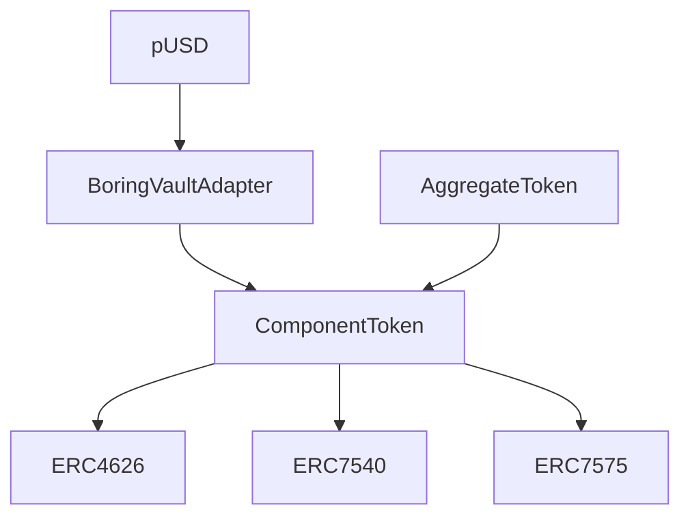

## Nest Smart Contracts

A protocol for creating and managing tokenized asset portfolios with support for both synchronous and asynchronous operations. Built on ERC4626, ERC7540, and ERC7575 standards.

## Table of Contents
1. [Overview](#overview)
2. [Architecture](#architecture)
3. [Key Components](#key-components)
4. [Core Concepts](#core-concepts)
5. [Development](#development)

## Overview
Nest Smart Contracts enables the creation of tokenized portfolios through a composable system of vaults. The protocol implements:
- ERC4626 for basic vault functionality
- ERC7540 for operator controls
- ERC7575 for asynchronous operations

## Core Standards

### ERC-4626: Tokenized Vaults
The base standard for tokenized vaults that:
- Provides a standard API for yield-bearing vaults
- Handles deposits and withdrawals of tokens
- Manages share tokens representing ownership
- Includes methods for asset/share conversion
- Supports preview functions for simulating operations

https://eips.ethereum.org/EIPS/eip-4626

### ERC-7540: Asynchronous Operations
Extends ERC-4626 to support asynchronous operations by:
- Adding request/claim pattern for deposits and redemptions
- Supporting controller-based request management
- Enabling operator approvals for request management
- Providing view functions for pending and claimable requests

https://eips.ethereum.org/EIPS/eip-7540

### ERC-7575: Multi-Asset Support
Adapts ERC-4626 for multi-asset scenarios by:
- Allowing multiple entry points for the same share token
- Supporting conversion between arbitrary tokens
- Enabling external share token implementations
- Providing vault-to-share lookup functionality

https://eips.ethereum.org/EIPS/eip-7575

## Architecture



## Key Components

### ComponentToken
The base abstract contract that implements core vault functionality:
- Asynchronous deposit/redeem operations (ERC-7540)
- Multi-asset support (ERC-7575)
- Core vault functionality (ERC-4626)
- Supports both synchronous and asynchronous deposit/redeem operations
- Uses a controller pattern for request management
- Tracks pending and claimable requests

### AggregateToken
A specialized implementation of ComponentToken that manages a portfolio of other ComponentTokens:

```solidity
struct AggregateTokenStorage {
    IComponentToken[] componentTokenList;
    mapping(IComponentToken => bool) componentTokenMap;
    uint256 askPrice;  // Price for buying using asset
    uint256 bidPrice;  // Price for selling to receive asset
    bool paused;       // Deposit pause state
}
```

Key features:
- Manages a basket of ComponentTokens
- Supports pausing deposits
- Handles portfolio rebalancing
- Configurable ask/bid prices
- Admin functions for portfolio management

### BoringVaultAdapter
An abstract adapter contract that interfaces with BoringVault:
- Handles vault interactions
- Manages atomic operations
- Provides price conversion functionality
- Supports asynchronous redemptions

### pUSD
The unified Plume USD stablecoin implementation:
- Built on BoringVaultAdapter
- Standardized name ("Plume USD") and symbol ("pUSD")


## Core Concepts

### Asynchronous Operations
The protocol supports both synchronous and asynchronous operations:

### Controller Pattern
The protocol uses a controller pattern for managing deposit and redemption requests:

1. **Controller Responsibilities**
   - Executes final deposit/redeem operations
   - Tracks pending and claimable requests
   - Acts as an intermediary between users and the vault

2. **Request Flow**
```solidity
event DepositRequest(
    address indexed controller,
    address indexed owner,
    uint256 indexed requestId,
    address sender,
    uint256 assets
);
```
3. **Implementation Patterns**


Single Controller:
```
Controller
├── Owner1
├── Owner2
└── Owner3
```
- Efficient for batching operations
- Simpler management
- Suitable for centralized services

Individual Controllers:
```
Owner1 --> Controller1
Owner2 --> Controller2
Owner3 --> Controller3
```
- Better request tracking
- More granular control
- Direct owner management


### Asynchronous Operations
The protocol supports both synchronous and asynchronous operations:

1. **Deposit Flow**
   - Request deposit (transfers assets)
   - Wait for approval
   - Claim shares

2. **Redemption Flow**
   - Request redemption (burns shares)
   - Wait for approval
   - Claim assets

## Contract Interactions

### Deposit Flow
1. User initiates deposit request
2. Controller processes request
3. Assets are transferred
4. Shares are minted

```solidity
// Owner initiates request
   function requestDeposit(
        uint256 assets,
        address controller,
        address owner
    ) public virtual returns (uint256 requestId) {
        // Controller executes final deposit
        deposit(assets, receiver, controller)
    }
```

### Redemption Flow
1. User initiates redeem request
2. Controller processes request
3. Shares are burned
4. Assets are transferred

```solidity
  function requestRedeem(
        uint256 shares,
        address controller,
        address owner
    ) public virtual returns (uint256 requestId) {
```


## Understanding ComponentToken and AggregateToken

### ComponentToken Controller Pattern

#### Controller vs Owner Relationship:
- The controller and owner can be different addresses
- Multiple owners can indeed share the same controller
- The controller pattern is part of the ERC7540 standard implementation

#### Role of Controller:
The controller is the address that:

- Has the authority to execute the final deposit() and redeem() operations

- Is used as the key in mappings that track pending and claimable requests:

#### Request Flow:

#### Tracking Requests:
- Requests are tracked by controller address, not owner
- All requests use `REQUEST_ID = 0` (they are fungible)
- You cannot directly map requests to specific owners through the contract storage.

#### Practical Use:
The controller pattern allows for:
- Intermediary/operator services to manage deposits/redemptions
- Batching of multiple owner requests through a single controller
- Additional validation/control layer between request initiation and execution

If you need to track specific owner requests, you would need to:
- Either maintain that mapping in your integration layer
- Or use a dedicated controller for each owner
- Or track through events which include both owner and controller addresses

The events emitted can help track the relationship:

```solidity
event DepositRequest(
    address indexed controller, 
    address indexed owner, 
    uint256 indexed requestId, 
    address sender, 
    uint256 assets
);
```

### AggregateToken Implementation
The AggregateToken is a special implementation of ComponentToken that acts as a basket or portfolio of other ComponentTokens.

#### Core Purpose:
It's a token that represents a collection of other ComponentTokens
It has its own asset (specified during initialization).

Users can buy/sell the AggregateToken at specified ask/bid prices

#### Key Features:

```solidity
struct AggregateTokenStorage {
    // List of component tokens in the basket
    IComponentToken[] componentTokenList;
    // Quick lookup for component tokens
    mapping(IComponentToken => bool exists) componentTokenMap;
    // Prices for buying/selling the aggregate token
    uint256 askPrice;
    uint256 bidPrice;
}
```

#### Admin Operations:
- Can add component tokens to the basket:
```solidity
function addComponentToken(IComponentToken componentToken) external onlyRole(ADMIN_ROLE)
```
- Can buy/sell component tokens:
```solidity
function buyComponentToken(IComponentToken componentToken, uint256 assets)
function sellComponentToken(IComponentToken componentToken, uint256 componentTokenAmount)
```

- Can handle async requests:
```solidity
function requestBuyComponentToken(IComponentToken componentToken, uint256 assets)
function requestSellComponentToken(IComponentToken componentToken, uint256 componentTokenAmount)
```

#### Price Mechanism:
- Uses ask price for buying (higher)
- Uses bid price for selling (lower)
- Prices are scaled by BASE (1e18)
```solidity
function convertToShares(uint256 assets) returns (uint256) {
    return assets * _BASE / askPrice;
}

function convertToAssets(uint256 shares) returns (uint256) {
    return shares * bidPrice / _BASE;
}
```

#### Use Case Example:
- Could be used to create a "basket" token that represents multiple underlying assets
- Example: A USD basket token containing USDC, USDT, and DAI as component tokens
- The admin can rebalance the portfolio by buying/selling component tokens
- Users interact with a single token while getting exposure to multiple assets

The AggregateToken essentially provides a way to create managed portfolios of ComponentTokens with controlled entry/exit prices.

#### Controller Patterns
##### 1. Controllers in Practice:

You can have multiple patterns:

###### Pattern 1: 1 Controller for Many Owners
```
  Controller1 -> [Owner1, Owner2, Owner3...]
```
- Good for batching operations
- Simpler management
- Used when a central service manages deposits/redeems

###### Pattern 2: 1:1 Controller to Owner

```
  Controller1 -> Owner1
  Controller2 -> Owner2
  Controller3 -> Owner3
```
  - Better for individual tracking
  - More granular control
  - Each owner manages their own operations

#### Batching Strategy for Slippage Protection:

```solidity
struct Batch {
    uint256 batchId;
    uint256 totalAssets;
    uint256 totalShares;
    uint256 executionPrice;
    mapping(address => UserRequest) requests;
}

struct UserRequest {
    uint256 assets;
    uint256 minSharesOut;  // slippage protection
    bool claimed;
}
```


Example implementation:

```solidity
contract BatchedComponentToken is ComponentToken {
    mapping(uint256 => Batch) public batches;
    uint256 public currentBatchId;
    
    function requestDeposit(
        uint256 assets,
        uint256 minSharesOut,
        address controller
    ) external returns (uint256 batchId) {
        batchId = currentBatchId;
        batches[batchId].requests[msg.sender] = UserRequest({
            assets: assets,
            minSharesOut: minSharesOut,
            claimed: false
        });
        batches[batchId].totalAssets += assets;
        
        // Transfer assets to contract
        asset.transferFrom(msg.sender, address(this), assets);
        
        emit DepositRequest(controller, msg.sender, batchId, assets);
    }
    
    function executeBatch(uint256 batchId, uint256 executionPrice) external onlyController {
        Batch storage batch = batches[batchId];
        batch.executionPrice = executionPrice;
        batch.totalShares = (batch.totalAssets * 1e18) / executionPrice;
        
        emit BatchExecuted(batchId, executionPrice);
    }
    
    function claim(uint256 batchId) external {
        Batch storage batch = batches[batchId];
        UserRequest storage request = batch.requests[msg.sender];
        require(!request.claimed, "Already claimed");
        
        uint256 shares = (request.assets * 1e18) / batch.executionPrice;
        require(shares >= request.minSharesOut, "Slippage too high");
        
        request.claimed = true;
        _mint(msg.sender, shares);
        
        emit Claimed(msg.sender, batchId, shares);
    }
}
```

This approach:
1. Groups requests into batches
2. Allows setting min output for slippage protection
3. Executes all requests in a batch at same price
4. Users can claim their shares after batch execution
5. Maintains fairness within each batch

The current ComponentToken uses REQUEST_ID = 0 because it treats all requests as fungible, but this batching approach would give you more granular control while still maintaining efficiency through batching.


### Controller-Owner Relationship:
```solidity
// In ComponentToken.sol
mapping(address controller => uint256 assets) pendingDepositRequest;
mapping(address controller => uint256 assets) claimableDepositRequest;
```

The controller is used as the key for tracking requests, so users must use the same controller throughout a deposit/redeem cycle. This is because:

1. When requesting:
```solidity
function requestDeposit(uint256 assets, address controller, address owner) {
    // Stores request under controller's address
    pendingDepositRequest[controller] += assets;
}
```


2. When claiming:
```solidity
function deposit(uint256 assets, address receiver, address controller) {
    // Looks up request using same controller address
    require(claimableDepositRequest[controller] >= assets);
}
```


As for the number of controllers, there are two common patterns:
1. Centralized Controller Pattern (~1 controller):
```
Controller
├── Owner1
├── Owner2
└── Owner3
```

- Used when an intermediary (like a protocol) manages deposits
- More gas efficient for batch operations
- Simpler to manage
- But requires trust in the controller


2. Individual Controller Pattern (~N controllers):
```
Owner1 → Controller1
Owner2 → Controller2
Owner3 → Controller3
```

- Each owner acts as their own controller
- More decentralized
- Better for tracking individual requests
- No trust requirements


The AdapterToken implementation uses the centralized pattern approach:

```solidity
if (msg.sender != address($.externalContract)) {
    revert Unauthorized(msg.sender, address($.externalContract));
}
```


## Deployment

Example deployment script for pUSD:


```solidity
// Deploy implementation
pUSD pUSDToken = new pUSD();
// Deploy proxy
ERC1967Proxy pUSDProxy = new ERC1967Proxy(
    address(pUSDToken),
    abi.encodeCall(
        pUSD.initialize,
            (owner, asset, vault)
        )
    );
```


## Development

### Prerequisites
- Solidity ^0.8.25
- Foundry


### Setup

```bash
$ foundryup
$ forge install
```

### Compile

```bash
$ forge compile
```

### Test

```bash
$ forge test
$ forge coverage
```

### Deploy

```bash
$ forge script script/DeployNestContracts.s.sol --rpc-url $RPC_URL --broadcast \
    --verify --verifier blockscout --verifier-url $VERIFIER_URL -g 500 --legacy
```

```
ETH_RPC_URL=https://test-rpc.plumenetwork.xyz/
VERIFIER_URL=https://test-explorer.plumenetwork.xyz/api\?
```

