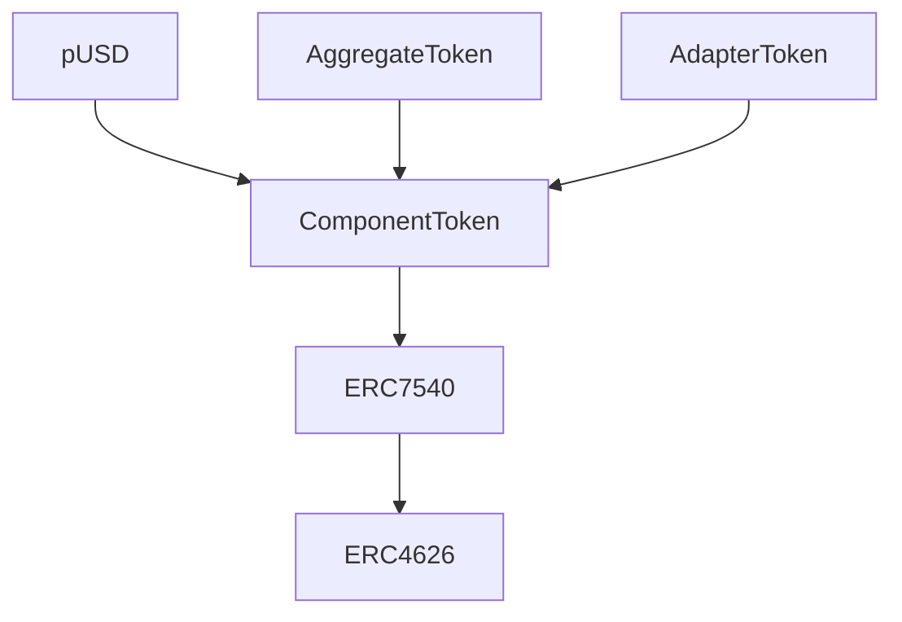

## Nest Smart Contracts

A protocol for creating and managing tokenized asset portfolios with asynchronous deposits and redemptions.

## Table of Contents
1. [Overview](#overview)
2. [Architecture](#architecture)
3. [Key Components](#key-components)
4. [Core Concepts](#core-concepts)
5. [Contract Interactions](#contract-interactions)
6. [Deployment](#deployment)
7. [Development](#development)
8. [Testing](#testing)

## Overview
Nest Smart Contracts enables the creation of tokenized portfolios with support for both synchronous and asynchronous operations. The protocol implements ERC4626, ERC7540, and ERC7575 standards for vault interactions.

## Architecture





## Key Components

### pUSD
The unified Plume USD stablecoin implementation that interfaces with a vault for balance management.

### ComponentToken
The base implementation supporting both synchronous and asynchronous deposit/redeem operations.


### AdapterToken
An implementation that interfaces with external assets, enabling integration with other protocols.

## Core Concepts

### Asynchronous Operations
- Deposits and redemptions can be processed asynchronously
- Uses a request-notify-claim pattern
- Supports both controller and operator roles

### Price Management
- AggregateToken implements bid/ask pricing
- Prices are scaled by BASE (1e18)
- Supports dynamic price updates by admin

## Contract Interactions

### Deposit Flow
1. User initiates deposit request
2. Controller processes request
3. Assets are transferred
4. Shares are minted

```solidity
// Owner initiates request
   function requestDeposit(
        uint256 assets,
        address controller,
        address owner
    ) public virtual returns (uint256 requestId) {
        // Controller executes final deposit
        deposit(assets, receiver, controller)
    }
```

### Redemption Flow
1. User initiates redeem request
2. Controller processes request
3. Shares are burned
4. Assets are transferred

```solidity
  function requestRedeem(
        uint256 shares,
        address controller,
        address owner
    ) public virtual returns (uint256 requestId) {
```


## Understanding ComponentToken and AggregateToken

### ComponentToken Controller Pattern

#### Controller vs Owner Relationship:
- The controller and owner can be different addresses
- Multiple owners can indeed share the same controller
- The controller pattern is part of the ERC7540 standard implementation

#### Role of Controller:
The controller is the address that:

- Has the authority to execute the final deposit() and redeem() operations

- Is used as the key in mappings that track pending and claimable requests:

#### Request Flow:

#### Tracking Requests:
- Requests are tracked by controller address, not owner
- All requests use `REQUEST_ID = 0` (they are fungible)
- You cannot directly map requests to specific owners through the contract storage.

#### Practical Use:
The controller pattern allows for:
- Intermediary/operator services to manage deposits/redemptions
- Batching of multiple owner requests through a single controller
- Additional validation/control layer between request initiation and execution

If you need to track specific owner requests, you would need to:
- Either maintain that mapping in your integration layer
- Or use a dedicated controller for each owner
- Or track through events which include both owner and controller addresses

The events emitted can help track the relationship:

```solidity
event DepositRequest(
    address indexed controller, 
    address indexed owner, 
    uint256 indexed requestId, 
    address sender, 
    uint256 assets
);
```

### AggregateToken Implementation
The AggregateToken is a special implementation of ComponentToken that acts as a basket or portfolio of other ComponentTokens.

#### Core Purpose:
It's a token that represents a collection of other ComponentTokens
It has its own asset (specified during initialization).

Users can buy/sell the AggregateToken at specified ask/bid prices

#### Key Features:

```solidity
struct AggregateTokenStorage {
    // List of component tokens in the basket
    IComponentToken[] componentTokenList;
    // Quick lookup for component tokens
    mapping(IComponentToken => bool exists) componentTokenMap;
    // Prices for buying/selling the aggregate token
    uint256 askPrice;
    uint256 bidPrice;
}
```

#### Admin Operations:
- Can add component tokens to the basket:
```solidity
function addComponentToken(IComponentToken componentToken) external onlyRole(ADMIN_ROLE)
```
- Can buy/sell component tokens:
```solidity
function buyComponentToken(IComponentToken componentToken, uint256 assets)
function sellComponentToken(IComponentToken componentToken, uint256 componentTokenAmount)
```

- Can handle async requests:
```solidity
function requestBuyComponentToken(IComponentToken componentToken, uint256 assets)
function requestSellComponentToken(IComponentToken componentToken, uint256 componentTokenAmount)
```

#### Price Mechanism:
- Uses ask price for buying (higher)
- Uses bid price for selling (lower)
- Prices are scaled by BASE (1e18)
```solidity
function convertToShares(uint256 assets) returns (uint256) {
    return assets * _BASE / askPrice;
}

function convertToAssets(uint256 shares) returns (uint256) {
    return shares * bidPrice / _BASE;
}
```

#### Use Case Example:
- Could be used to create a "basket" token that represents multiple underlying assets
- Example: A USD basket token containing USDC, USDT, and DAI as component tokens
- The admin can rebalance the portfolio by buying/selling component tokens
- Users interact with a single token while getting exposure to multiple assets

The AggregateToken essentially provides a way to create managed portfolios of ComponentTokens with controlled entry/exit prices.

## Deployment

Example deployment script for pUSD:


```solidity
// Deploy implementation
pUSD pUSDToken = new pUSD();
// Deploy proxy
ERC1967Proxy pUSDProxy = new ERC1967Proxy(
    address(pUSDToken),
    abi.encodeCall(
        pUSD.initialize,
            (owner, asset, vault)
        )
    );
```


## Development

### Prerequisites
- Solidity ^0.8.25
- Foundry


### Setup

```bash
$ foundryup
$ forge install
```

### Compile

```bash
$ forge compile
```

### Test

```bash
$ forge test
$ forge coverage
```

### Deploy

```bash
$ forge script script/DeployNestContracts.s.sol --rpc-url $RPC_URL --broadcast \
    --verify --verifier blockscout --verifier-url $VERIFIER_URL -g 500 --legacy
```

```
ETH_RPC_URL=https://test-rpc.plumenetwork.xyz/
VERIFIER_URL=https://test-explorer.plumenetwork.xyz/api\?
```

