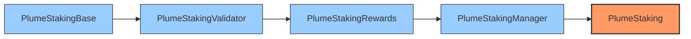
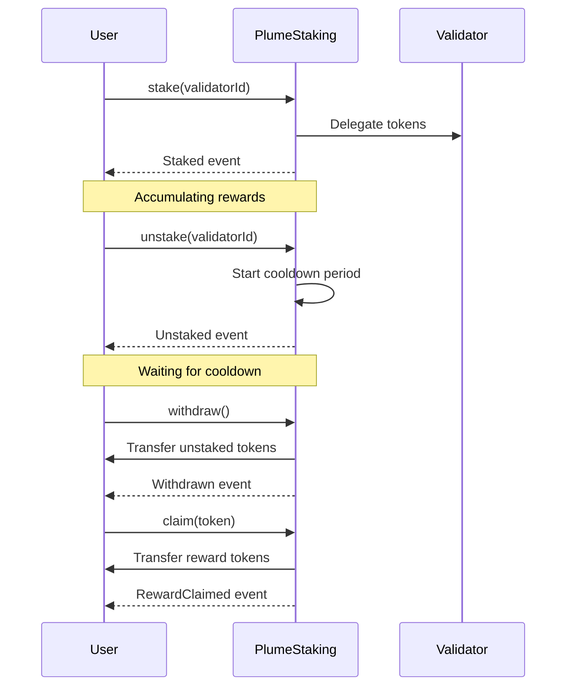

# PlumeStaking

PlumeStaking is a flexible and comprehensive staking system for PLUME tokens that supports multiple validators, reward distribution, and a cooling period for unstaked tokens.

## Architecture

PlumeStaking uses a modular architecture with linear inheritance to organize functionality:



- **PlumeStakingBase**: Core staking functionality and interface implementation
- **PlumeStakingValidator**: Validator-specific operations and management
- **PlumeStakingRewards**: Rewards calculation, distribution, and management
- **PlumeStakingManager**: Administrative functions and system management
- **PlumeStaking**: Main contract entry point, inherits all functionality

## Core Functions

### Staking Functions

| Function | Description |
|----------|-------------|
| `stake(uint16 validatorId)` | Stake PLUME tokens to a specific validator |
| `stakeOnBehalf(uint16 validatorId, address staker)` | Stake on behalf of another user |
| `unstake(uint16 validatorId)` | Unstake tokens from a specific validator |
| `withdraw()` | Withdraw tokens that have completed the cooldown period |

### Reward Functions

| Function | Description |
|----------|-------------|
| `claim(address token)` | Claim rewards for a specific token (global) |
| `claim(address token, uint16 validatorId)` | Claim rewards for a specific token from a specific validator |
| `claimAll()` | Claim all accumulated rewards from all tokens |
| `restakeRewards(uint16 validatorId)` | Stake native token rewards without withdrawing first |

### View Functions

| Function | Description |
|----------|-------------|
| `stakingInfo()` | Get general information about the staking contract |
| `stakeInfo(address user)` | Get staking information for a specific user |
| `amountStaked()` | Get the amount of PLUME staked by the caller |
| `amountCooling()` | Get the amount of PLUME in cooling period for the caller |
| `amountWithdrawable()` | Get the amount of PLUME that is withdrawable for the caller |
| `getClaimableReward(address user, address token)` | Get claimable reward amount for a user and token |

### Administrative Functions

| Function | Description |
|----------|-------------|
| `addValidator(...)` | Add a new validator to the system |
| `addRewardToken(address token)` | Add a token to the rewards list |
| `removeRewardToken(address token)` | Remove a token from the rewards list |
| `setRewardRates(address[] tokens, uint256[] rates)` | Set reward rates for tokens |
| `addRewards(address token, uint256 amount)` | Add rewards to the pool |
| `setValidatorCapacity(uint16 validatorId, uint256 maxCapacity)` | Set the maximum capacity for a validator |
| `setCooldownInterval(uint256 interval)` | Set the cooldown interval |
| `setMinStakeAmount(uint256 amount)` | Set the minimum stake amount |
| `adminWithdraw(address token, uint256 amount, address recipient)` | Admin function to withdraw tokens |

## Events

### Core Staking Events

| Event | Description |
|-------|-------------|
| `Staked(address user, uint16 validatorId, uint256 amount, uint256 fromCooling, uint256 fromParked, uint256 fromWallet)` | Emitted when a user stakes PLUME |
| `StakedOnBehalf(address sender, address staker, uint16 validatorId, uint256 amount)` | Emitted when someone stakes on behalf of another user |
| `Unstaked(address user, uint16 validatorId, uint256 amount)` | Emitted when a user unstakes PLUME |
| `Withdrawn(address user, uint256 amount)` | Emitted when a user withdraws cooled-down PLUME |
| `CoolingCompleted(address user, uint256 amount)` | Emitted when tokens move from cooling to withdrawable |

### Reward Events

| Event | Description |
|-------|-------------|
| `RewardClaimed(address user, address token, uint256 amount)` | Emitted when a user claims a reward |
| `RewardClaimedFromValidator(address user, address token, uint16 validatorId, uint256 amount)` | Emitted when a user claims rewards from a validator |
| `RewardRatesSet(address[] tokens, uint256[] rates)` | Emitted when reward rates are updated |
| `RewardsAdded(address token, uint256 amount)` | Emitted when rewards are added to the pool |
| `RewardTokenAdded(address token)` | Emitted when a new token is added to the rewards list |
| `RewardTokenRemoved(address token)` | Emitted when a token is removed from the rewards list |
| `MaxRewardRateUpdated(address token, uint256 newMaxRate)` | Emitted when the maximum reward rate is updated |

### Validator Events

| Event | Description |
|-------|-------------|
| `ValidatorAdded(uint16 validatorId, uint256 commission, address l2AdminAddress, address l2WithdrawAddress, string l1ValidatorAddress, string l1AccountAddress)` | Emitted when a validator is added |
| `ValidatorUpdated(uint16 validatorId, uint256 commission, address l2AdminAddress, address l2WithdrawAddress, string l1ValidatorAddress, string l1AccountAddress)` | Emitted when a validator is updated |
| `ValidatorCommissionClaimed(uint16 validatorId, address token, uint256 amount)` | Emitted when validator commission is claimed |
| `ValidatorDeactivated(uint16 validatorId)` | Emitted when a validator is deactivated |
| `ValidatorActivated(uint16 validatorId)` | Emitted when a validator is activated |
| `ValidatorCapacityUpdated(uint16 validatorId, uint256 oldCapacity, uint256 newCapacity)` | Emitted when validator capacity is updated |

### Administrative Events

| Event | Description |
|-------|-------------|
| `MinStakeAmountSet(uint256 amount)` | Emitted when the minimum stake amount is set |
| `CooldownIntervalSet(uint256 interval)` | Emitted when the cooldown interval is set |
| `AdminWithdraw(address token, uint256 amount, address recipient)` | Emitted when admin withdraws tokens |
| `TotalAmountsUpdated(uint256 totalStaked, uint256 totalCooling, uint256 totalWithdrawable)` | Emitted when total amounts are updated |
| `StakeInfoUpdated(address user, uint256 staked, uint256 cooled, uint256 parked, uint256 cooldownEnd, uint256 lastUpdateTimestamp)` | Emitted when admin updates a user's stake info |
| `StakerAdded(address staker)` | Emitted when admin manually adds a staker |

## Constants

| Constant | Value | Description |
|----------|-------|-------------|
| `ADMIN_ROLE` | `keccak256("ADMIN_ROLE")` | Role for administrators |
| `UPGRADER_ROLE` | `keccak256("UPGRADER_ROLE")` | Role for contract upgraders |
| `MAX_REWARD_RATE` | `3171 * 1e9` | Maximum reward rate (~100% APY) |
| `REWARD_PRECISION` | `1e18` | Scaling factor for reward calculations |
| `PLUME` | `0xEeeeeEeeeEeEeeEeEeEeeEEEeeeeEeeeeeeeEEeE` | Address constant for native PLUME token |

## Staking Flow



## Getting Started

### Prerequisites

- [Foundry](https://getfoundry.sh/)
- Solidity 0.8.25+

### Installation

```bash
git clone https://github.com/plume/contracts.git
cd contracts/p
forge install
```

### Testing

```bash
forge test
```

### Deployment

To deploy PlumeStaking to a target network:

```bash
forge script script/DeployPlumeStaking.s.sol --rpc-url <rpc-url> --private-key <private-key> --broadcast
```

## License

This project is licensed under the MIT License.