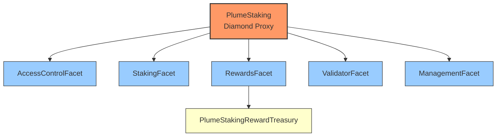

# PlumeStaking

PlumeStaking is a flexible and comprehensive staking system for PLUME tokens that supports multiple validators, reward distribution, and a cooling period for unstaked tokens.

## Architecture

PlumeStaking now uses a Diamond architecture with multiple facets to organize functionality:



- **PlumeStaking (Diamond)**: The main entry point that implements the Diamond standard.
- **AccessControlFacet**: Manages roles and permissions.
- **StakingFacet**: Handles staking and unstaking operations.
- **RewardsFacet**: Manages reward tokens, rates, and distribution.
- **ValidatorFacet**: Handles validator management.
- **ManagementFacet**: Provides administrative functions.
- **PlumeStakingRewardTreasury**: Separate contract for holding and distributing rewards.

## Treasury System

### PlumeStakingRewardTreasury

The protocol uses a dedicated upgradeable treasury contract to securely hold and distribute rewards:

- **Upgradeable Design**: Implements UUPS pattern for upgradeability with proper access control
- **Separation of Concerns**: Dedicated treasury contract for better security and fund management
- **Role-Based Access**: Implements a comprehensive role system:
  - `DISTRIBUTOR_ROLE`: Only the Diamond proxy can distribute rewards
  - `ADMIN_ROLE`: Can add reward tokens and manage other roles
  - `UPGRADER_ROLE`: Can authorize contract upgrades
  - `DEFAULT_ADMIN_ROLE`: Super admin role for initial setup

### Treasury Architecture

The treasury system consists of two main components:

1. **PlumeStakingRewardTreasury**: The main implementation contract
2. **PlumeStakingRewardTreasuryProxy**: ERC1967 proxy that delegates to the implementation

This proxy pattern enables future upgrades while maintaining the same address and state.

### Reward Distribution Flow

1. Users stake their PLUME tokens to validators
2. Rewards accrue over time based on configured reward rates
3. When users claim rewards:
   - The RewardsFacet calculates earned rewards
   - The RewardsFacet (with DISTRIBUTOR_ROLE) calls the treasury
   - The treasury verifies the caller's role and transfers tokens directly to the user

### Treasury Functions

| Function                                           | Description                                                    | Access Control |
| -------------------------------------------------- | -------------------------------------------------------------- | -------------- |
| `initialize(address admin, address distributor)`    | Initialize the treasury with admin and distributor addresses    | Once only      |
| `addRewardToken(address token)`                    | Register a token as a valid reward token                       | ADMIN_ROLE     |
| `distributeReward(address token, uint256 amount, address recipient)` | Distribute rewards to a recipient            | DISTRIBUTOR_ROLE |
| `getRewardTokens()`                                | Get the list of registered reward tokens                       | Public View    |
| `getBalance(address token)`                        | Get the balance of a specific token                            | Public View    |
| `isRewardToken(address token)`                     | Check if a token is registered as a reward token               | Public View    |

### Treasury Events

| Event                                              | Description                                    |
| -------------------------------------------------- | ---------------------------------------------- |
| `RewardTokenAdded(address token)`                  | Emitted when a new reward token is registered  |
| `RewardDistributed(address token, uint256 amount, address recipient)` | Emitted when rewards are distributed |
| `PlumeReceived(address sender, uint256 amount)`    | Emitted when the treasury receives PLUME       |

## Core Functions

### Staking Functions

| Function                                            | Description                                             |
| --------------------------------------------------- | ------------------------------------------------------- |
| `stake(uint16 validatorId)`                         | Stake PLUME tokens to a specific validator              |
| `stakeOnBehalf(uint16 validatorId, address staker)` | Stake on behalf of another user                         |
| `unstake(uint16 validatorId)`                       | Unstake all tokens from a specific validator            |
| `unstake(uint16 validatorId, uint256 amount)`       | Unstake a specific amount of tokens from a validator    |
| `withdraw()`                                        | Withdraw tokens that have completed the cooldown period |

### Reward Functions

| Function                                   | Description                                                                     |
| ------------------------------------------ | ------------------------------------------------------------------------------- |
| `claim(address token)`                     | Claim rewards for a specific token from all validators the user has staked with |
| `claim(address token, uint16 validatorId)` | Claim rewards for a specific token from a specific validator                    |
| `claimAll()`                               | Claim all accumulated rewards from all tokens and all validators                |
| `restakeRewards(uint16 validatorId)`       | Stake native token rewards without withdrawing first                            |

### View Functions

| Function                                          | Description                                                                                      |
| ------------------------------------------------- | ------------------------------------------------------------------------------------------------ |
| `stakingInfo()`                                   | Get general information about the staking contract                                               |
| `stakeInfo(address user)`                         | Get staking information for a specific user                                                      |
| `amountStaked()`                                  | Get the amount of PLUME staked by the caller                                                     |
| `amountCooling()`                                 | Get the amount of PLUME in cooling period for the caller                                         |
| `amountWithdrawable()`                            | Get the amount of PLUME that is withdrawable for the caller                                      |
| `getClaimableReward(address user, address token)` | Get claimable reward amount for a user and token                                                 |
| `getUserValidators(address user)`                 | Get the list of validator IDs a user has staked with                                             |
| `getValidatorInfo(uint16 validatorId)`            | Get information about a validator including total staked amount                                  |
| `getValidatorStats(uint16 validatorId)`           | Get essential validator stats: active status, commission, total staked amount, and stakers count |

### Administrative Functions

| Function                                                          | Description                              |
| ----------------------------------------------------------------- | ---------------------------------------- |
| `addValidator(...)`                                               | Add a new validator to the system        |
| `addRewardToken(address token)`                                   | Add a token to the rewards list          |
| `removeRewardToken(address token)`                                | Remove a token from the rewards list     |
| `setRewardRates(address[] tokens, uint256[] rates)`               | Set reward rates for tokens              |
| `addRewards(address token, uint256 amount)`                       | Add rewards to the pool                  |
| `setValidatorCapacity(uint16 validatorId, uint256 maxCapacity)`   | Set the maximum capacity for a validator |
| `setCooldownInterval(uint256 interval)`                           | Set the cooldown interval                |
| `setMinStakeAmount(uint256 amount)`                               | Set the minimum stake amount             |
| `adminWithdraw(address token, uint256 amount, address recipient)` | Admin function to withdraw tokens        |

### Validator Self-Management Functions

| Function                                                                     | Description                                                                |
| ---------------------------------------------------------------------------- | -------------------------------------------------------------------------- |
| `claimValidatorCommission(uint16 validatorId, address token)`                | Claim commission rewards for a validator                                   |
| `updateValidator(uint16 validatorId, uint8 updateType, bytes calldata data)` | Update validator settings (commission, admin address, or withdraw address) |

The `updateValidator` function replaces the previous separate functions and uses a simple integer to determine the type of update:

```solidity
// Update validator commission to 10%
// updateType 0 = commission update
uint256 newCommission = 1e17; // 10%
bytes memory data = abi.encode(newCommission);
plumeStaking.updateValidator(1, 0, data);

// Update validator admin address
// updateType 1 = admin address update
address newAdminAddress = 0xNewAdminAddress;
bytes memory data = abi.encode(newAdminAddress);
plumeStaking.updateValidator(1, 1, data);

// Update validator withdraw address
// updateType 2 = withdraw address update
address newWithdrawAddress = 0xNewWithdrawAddress;
bytes memory data = abi.encode(newWithdrawAddress);
plumeStaking.updateValidator(1, 2, data);
```

### AddValidator Parameters

The `addValidator` function requires the following parameters:

| Parameter             | Type      | Description                                                                                        |
| --------------------- | --------- | -------------------------------------------------------------------------------------------------- |
| `validatorId`         | `uint16`  | Unique identifier for the validator                                                                |
| `commission`          | `uint256` | Commission rate as a fraction of REWARD_PRECISION (e.g., 5% = 5e16, 10% = 1e17, 20% = 2e17)        |
| `l2AdminAddress`      | `address` | Admin address that can manage the validator (l2Address should be a multisig with Plume Foundation) |
| `l2WithdrawAddress`   | `address` | Address to receive validator commission rewards                                                    |
| `l1ValidatorAddress`  | `string`  | L1 validator address (informational)                                                               |
| `l1AccountAddress`    | `string`  | L1 account address (informational)                                                                 |
| `l1AccountEvmAddress` | `string`  | L1 account address (informational)                                                                 |

**Example:**

```solidity
// Add a validator with 5% commission
plumeStaking.addValidator(
    1,                                                      // validatorId
    5e16,                                                   // commission (5%)
    0xAdminAddress,                                         // l2AdminAddress
    0xWithdrawAddress,                                      // l2WithdrawAddress
    "plumevaloper1zqd0cre4rmk2659h2h4afseemx2amxtqrvmymr",  // l1ValidatorAddress
    "plume1zqd0cre4rmk2659h2h4afseemx2amxtqpmnxy4",         // l1AccountAddress
    0x1234                                                  // l1AccountEvmAddress
);
```

## Events

### Core Staking Events

| Event                                                                                                                   | Description                                           |
| ----------------------------------------------------------------------------------------------------------------------- | ----------------------------------------------------- |
| `Staked(address user, uint16 validatorId, uint256 amount, uint256 fromCooling, uint256 fromParked, uint256 fromWallet)` | Emitted when a user stakes PLUME                      |
| `StakedOnBehalf(address sender, address staker, uint16 validatorId, uint256 amount)`                                    | Emitted when someone stakes on behalf of another user |
| `Unstaked(address user, uint16 validatorId, uint256 amount)`                                                            | Emitted when a user unstakes PLUME                    |
| `Withdrawn(address user, uint256 amount)`                                                                               | Emitted when a user withdraws cooled-down PLUME       |
| `CoolingCompleted(address user, uint256 amount)`                                                                        | Emitted when tokens move from cooling to withdrawable |

### Reward Events

| Event                                                                                         | Description                                           |
| --------------------------------------------------------------------------------------------- | ----------------------------------------------------- |
| `RewardClaimed(address user, address token, uint256 amount)`                                  | Emitted when a user claims a reward                   |
| `RewardClaimedFromValidator(address user, address token, uint16 validatorId, uint256 amount)` | Emitted when a user claims rewards from a validator   |
| `RewardRatesSet(address[] tokens, uint256[] rates)`                                           | Emitted when reward rates are updated                 |
| `RewardsAdded(address token, uint256 amount)`                                                 | Emitted when rewards are added to the pool            |
| `RewardTokenAdded(address token)`                                                             | Emitted when a new token is added to the rewards list |
| `RewardTokenRemoved(address token)`                                                           | Emitted when a token is removed from the rewards list |
| `MaxRewardRateUpdated(address token, uint256 newMaxRate)`                                     | Emitted when the maximum reward rate is updated       |

### Validator Events

| Event                                                                                                                                                                                          | Description                                  |
| ---------------------------------------------------------------------------------------------------------------------------------------------------------------------------------------------- | -------------------------------------------- |
| `ValidatorAdded(uint16 validatorId, uint256 commission, address l2AdminAddress, address l2WithdrawAddress, string l1ValidatorAddress, string l1AccountAddress, uint256 l1AccountEvmAddress)`   | Emitted when a validator is added            |
| `ValidatorUpdated(uint16 validatorId, uint256 commission, address l2AdminAddress, address l2WithdrawAddress, string l1ValidatorAddress, string l1AccountAddress, uint256 l1AccountEvmAddress)` | Emitted when a validator is updated          |
| `ValidatorCommissionClaimed(uint16 validatorId, address token, uint256 amount)`                                                                                                                | Emitted when validator commission is claimed |
| `ValidatorDeactivated(uint16 validatorId)`                                                                                                                                                     | Emitted when a validator is deactivated      |
| `ValidatorActivated(uint16 validatorId)`                                                                                                                                                       | Emitted when a validator is activated        |
| `ValidatorCapacityUpdated(uint16 validatorId, uint256 oldCapacity, uint256 newCapacity)`                                                                                                       | Emitted when validator capacity is updated   |

### Administrative Events

| Event                                                                                                                              | Description                                    |
| ---------------------------------------------------------------------------------------------------------------------------------- | ---------------------------------------------- |
| `MinStakeAmountSet(uint256 amount)`                                                                                                | Emitted when the minimum stake amount is set   |
| `CooldownIntervalSet(uint256 interval)`                                                                                            | Emitted when the cooldown interval is set      |
| `AdminWithdraw(address token, uint256 amount, address recipient)`                                                                  | Emitted when admin withdraws tokens            |
| `TotalAmountsUpdated(uint256 totalStaked, uint256 totalCooling, uint256 totalWithdrawable)`                                        | Emitted when total amounts are updated         |
| `StakeInfoUpdated(address user, uint256 staked, uint256 cooled, uint256 parked, uint256 cooldownEnd, uint256 lastUpdateTimestamp)` | Emitted when admin updates a user's stake info |
| `StakerAdded(address staker)`                                                                                                      | Emitted when admin manually adds a staker      |

## Constants

| Constant           | Value                                        | Description                             |
| ------------------ | -------------------------------------------- | --------------------------------------- |
| `ADMIN_ROLE`       | `