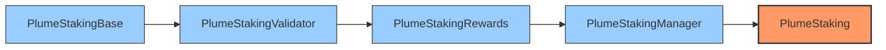
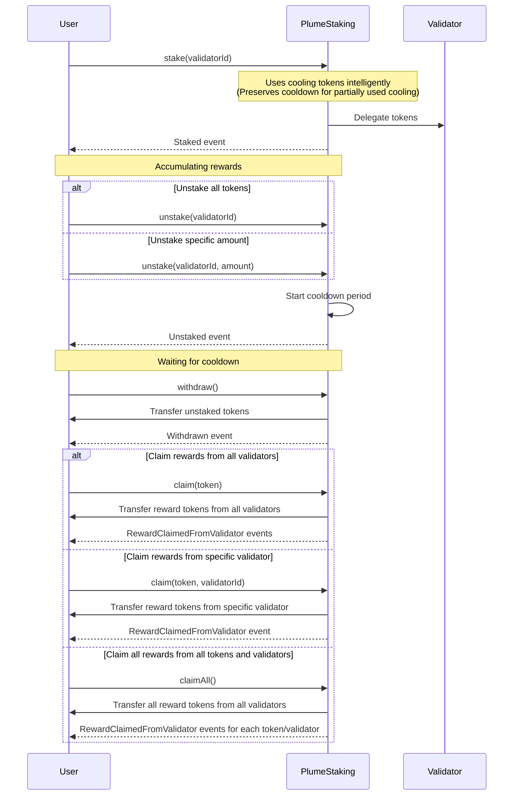

# PlumeStaking

PlumeStaking is a flexible and comprehensive staking system for PLUME tokens that supports multiple validators, reward distribution, and a cooling period for unstaked tokens.

## Architecture

PlumeStaking uses a modular architecture with linear inheritance to organize functionality:



- **PlumeStakingBase**: Core staking functionality and interface implementation
- **PlumeStakingValidator**: Validator-specific operations and management
- **PlumeStakingRewards**: Rewards calculation, distribution, and management
- **PlumeStakingManager**: Administrative functions and system management
- **PlumeStaking**: Main contract entry point, inherits all functionality

## Core Functions

### Staking Functions

| Function | Description |
|----------|-------------|
| `stake(uint16 validatorId)` | Stake PLUME tokens to a specific validator |
| `stakeOnBehalf(uint16 validatorId, address staker)` | Stake on behalf of another user |
| `unstake(uint16 validatorId)` | Unstake all tokens from a specific validator |
| `unstake(uint16 validatorId, uint256 amount)` | Unstake a specific amount of tokens from a validator |
| `withdraw()` | Withdraw tokens that have completed the cooldown period |

### Reward Functions

| Function | Description |
|----------|-------------|
| `claim(address token)` | Claim rewards for a specific token from all validators the user has staked with |
| `claim(address token, uint16 validatorId)` | Claim rewards for a specific token from a specific validator |
| `claimAll()` | Claim all accumulated rewards from all tokens and all validators |
| `restakeRewards(uint16 validatorId)` | Stake native token rewards without withdrawing first |

### View Functions

| Function | Description |
|----------|-------------|
| `stakingInfo()` | Get general information about the staking contract |
| `stakeInfo(address user)` | Get staking information for a specific user |
| `amountStaked()` | Get the amount of PLUME staked by the caller |
| `amountCooling()` | Get the amount of PLUME in cooling period for the caller |
| `amountWithdrawable()` | Get the amount of PLUME that is withdrawable for the caller |
| `getClaimableReward(address user, address token)` | Get claimable reward amount for a user and token |
| `getUserValidators(address user)` | Get the list of validator IDs a user has staked with |

### Administrative Functions

| Function | Description |
|----------|-------------|
| `addValidator(...)` | Add a new validator to the system |
| `addRewardToken(address token)` | Add a token to the rewards list |
| `removeRewardToken(address token)` | Remove a token from the rewards list |
| `setRewardRates(address[] tokens, uint256[] rates)` | Set reward rates for tokens |
| `addRewards(address token, uint256 amount)` | Add rewards to the pool |
| `setValidatorCapacity(uint16 validatorId, uint256 maxCapacity)` | Set the maximum capacity for a validator |
| `setCooldownInterval(uint256 interval)` | Set the cooldown interval |
| `setMinStakeAmount(uint256 amount)` | Set the minimum stake amount |
| `adminWithdraw(address token, uint256 amount, address recipient)` | Admin function to withdraw tokens |

### AddValidator Parameters

The `addValidator` function requires the following parameters:

| Parameter | Type | Description |
|-----------|------|-------------|
| `validatorId` | `uint16` | Unique identifier for the validator |
| `commission` | `uint256` | Commission rate as a fraction of REWARD_PRECISION (e.g., 5% = 5e16, 10% = 1e17, 20% = 2e17) |
| `l2AdminAddress` | `address` | Admin address that can manage the validator |
| `l2WithdrawAddress` | `address` | Address to receive validator commission rewards |
| `l1ValidatorAddress` | `string` | L1 validator address (informational) |
| `l1AccountAddress` | `string` | L1 account address (informational) |

**Example:**

```solidity
// Add a validator with 5% commission
plumeStaking.addValidator(
    1,                              // validatorId
    5e16,                           // commission (5%)
    0xAdminAddress,                 // l2AdminAddress
    0xWithdrawAddress,              // l2WithdrawAddress
    "0x123abc...",                  // l1ValidatorAddress
    "0x456def..."                   // l1AccountAddress
);
```

## Events

### Core Staking Events

| Event | Description |
|-------|-------------|
| `Staked(address user, uint16 validatorId, uint256 amount, uint256 fromCooling, uint256 fromParked, uint256 fromWallet)` | Emitted when a user stakes PLUME |
| `StakedOnBehalf(address sender, address staker, uint16 validatorId, uint256 amount)` | Emitted when someone stakes on behalf of another user |
| `Unstaked(address user, uint16 validatorId, uint256 amount)` | Emitted when a user unstakes PLUME |
| `Withdrawn(address user, uint256 amount)` | Emitted when a user withdraws cooled-down PLUME |
| `CoolingCompleted(address user, uint256 amount)` | Emitted when tokens move from cooling to withdrawable |

### Reward Events

| Event | Description |
|-------|-------------|
| `RewardClaimed(address user, address token, uint256 amount)` | Emitted when a user claims a reward |
| `RewardClaimedFromValidator(address user, address token, uint16 validatorId, uint256 amount)` | Emitted when a user claims rewards from a validator |
| `RewardRatesSet(address[] tokens, uint256[] rates)` | Emitted when reward rates are updated |
| `RewardsAdded(address token, uint256 amount)` | Emitted when rewards are added to the pool |
| `RewardTokenAdded(address token)` | Emitted when a new token is added to the rewards list |
| `RewardTokenRemoved(address token)` | Emitted when a token is removed from the rewards list |
| `MaxRewardRateUpdated(address token, uint256 newMaxRate)` | Emitted when the maximum reward rate is updated |

### Validator Events

| Event | Description |
|-------|-------------|
| `ValidatorAdded(uint16 validatorId, uint256 commission, address l2AdminAddress, address l2WithdrawAddress, string l1ValidatorAddress, string l1AccountAddress)` | Emitted when a validator is added |
| `ValidatorUpdated(uint16 validatorId, uint256 commission, address l2AdminAddress, address l2WithdrawAddress, string l1ValidatorAddress, string l1AccountAddress)` | Emitted when a validator is updated |
| `ValidatorCommissionClaimed(uint16 validatorId, address token, uint256 amount)` | Emitted when validator commission is claimed |
| `ValidatorDeactivated(uint16 validatorId)` | Emitted when a validator is deactivated |
| `ValidatorActivated(uint16 validatorId)` | Emitted when a validator is activated |
| `ValidatorCapacityUpdated(uint16 validatorId, uint256 oldCapacity, uint256 newCapacity)` | Emitted when validator capacity is updated |

### Administrative Events

| Event | Description |
|-------|-------------|
| `MinStakeAmountSet(uint256 amount)` | Emitted when the minimum stake amount is set |
| `CooldownIntervalSet(uint256 interval)` | Emitted when the cooldown interval is set |
| `AdminWithdraw(address token, uint256 amount, address recipient)` | Emitted when admin withdraws tokens |
| `TotalAmountsUpdated(uint256 totalStaked, uint256 totalCooling, uint256 totalWithdrawable)` | Emitted when total amounts are updated |
| `StakeInfoUpdated(address user, uint256 staked, uint256 cooled, uint256 parked, uint256 cooldownEnd, uint256 lastUpdateTimestamp)` | Emitted when admin updates a user's stake info |
| `StakerAdded(address staker)` | Emitted when admin manually adds a staker |

## Constants

| Constant | Value | Description |
|----------|-------|-------------|
| `ADMIN_ROLE` | `keccak256("ADMIN_ROLE")` | Role for administrators |
| `UPGRADER_ROLE` | `keccak256("UPGRADER_ROLE")` | Role for contract upgraders |
| `MAX_REWARD_RATE` | `3171 * 1e9` | Maximum reward rate (~100% APY) |
| `REWARD_PRECISION` | `1e18` | Scaling factor for reward calculations |
| `PLUME` | `0xEeeeeEeeeEeEeeEeEeEeeEEEeeeeEeeeeeeeEEeE` | Address constant for native PLUME token |

## Error Handling

The PlumeStaking system uses custom Solidity errors for efficient gas usage and clear error reporting. Key errors include:

### Core Errors
- `InvalidAmount(uint256 amount)` - Thrown when an invalid amount is provided
- `NoActiveStake()` - Thrown when trying to perform an operation requiring an active stake, but no stake is active
- `ZeroAddress(string parameter)` - Thrown when a zero address is provided for a parameter that cannot be zero
- `TokenDoesNotExist(address token)` - Thrown when trying to perform an operation with a token that doesn't exist
- `InsufficientFunds(uint256 available, uint256 requested)` - Thrown when attempting to withdraw more funds than available

### Validator Errors
- `ValidatorDoesNotExist(uint16 validatorId)` - Thrown when trying to interact with a non-existent validator
- `ValidatorAlreadyExists(uint16 validatorId)` - Thrown when trying to add a validator with an ID that already exists
- `ValidatorInactive(uint16 validatorId)` - Thrown when trying to interact with an inactive validator
- `NotValidatorAdmin(address caller)` - Thrown when a non-admin tries to perform a validator admin operation
- `ValidatorCapacityExceeded()` - Thrown when a validator's capacity would be exceeded by an operation
- `TooManyStakers()` - Thrown when an operation would affect too many stakers at once

### Reward Errors
- `TokenAlreadyExists()` - Thrown when trying to add a token that already exists in the reward token list
- `CommissionTooHigh()` - Thrown when a validator commission exceeds the maximum allowed value
- `RewardRateExceedsMax()` - Thrown when a reward rate exceeds the maximum allowed value
- `NativeTransferFailed()` - Thrown when a native token transfer fails

### Administrative Errors
- `StakerExists(address staker)` - Thrown when attempting to add a staker that already exists
- `AdminTransferFailed()` - Thrown when a native token transfer fails in an admin operation
- `IndexOutOfRange(uint256 index, uint256 length)` - Thrown when an array index is out of bounds
- `InvalidIndexRange(uint256 startIndex, uint256 endIndex)` - Thrown when an index range is invalid

## Staking Behavior

### Smart Cooling Token Usage

When staking PLUME tokens, the system intelligently manages cooling tokens:

- If the user has tokens in cooling state, the system only uses the necessary amount (up to the staking amount)
- The cooldown period is only reset if all cooling tokens are used
- If a user has 50 tokens in cooling and stakes 30 tokens, only 30 are used from cooling, preserving the cooldown period for the remaining 20 tokens
- This provides a better user experience by allowing partial use of cooling tokens without losing cooldown progress on unused tokens

### Partial Unstaking

The system supports partial unstaking:

- Users can unstake a specific amount from a validator using `unstake(validatorId, amount)`
- This provides more flexibility compared to unstaking all tokens at once
- Partially unstaked tokens still go through the cooldown period
- The original `unstake(validatorId)` function remains as a convenience method to unstake all tokens

## Staking Flow



## Getting Started

### Prerequisites

- [Foundry](https://getfoundry.sh/)
- Solidity 0.8.25+

### Installation

```bash
git clone https://github.com/plume/contracts.git
cd contracts/p
forge install
```

### Testing

```bash
forge test
```

### Deployment

To deploy PlumeStaking to a target network:

```bash
forge script script/DeployPlumeStaking.s.sol --rpc-url <rpc-url> --private-key <private-key> --broadcast
```

## License

This project is licensed under the MIT License.