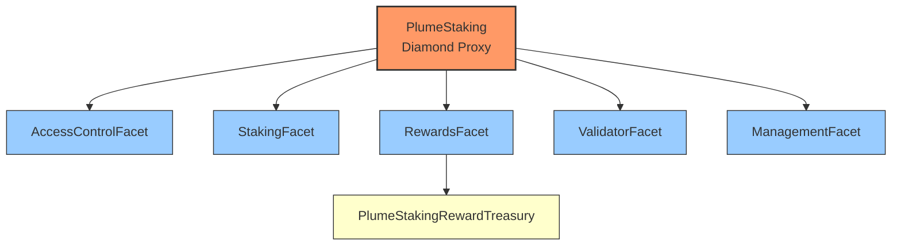
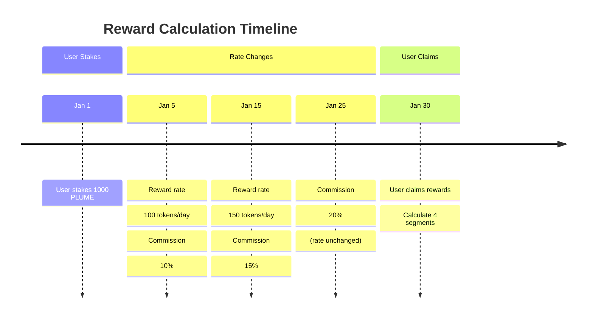
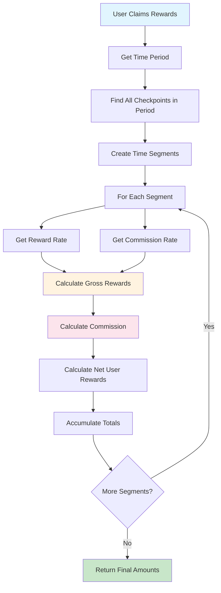

# PlumeStaking

PlumeStaking is a flexible and comprehensive staking system for PLUME tokens that supports multiple validators, reward distribution, and a cooling period for unstaked tokens.

## Architecture

PlumeStaking now uses a Diamond architecture with multiple facets to organize functionality:



- **PlumeStaking (Diamond)**: The main entry point that implements the Diamond standard.
- **AccessControlFacet**: Manages roles and permissions.
- **StakingFacet**: Handles staking and unstaking operations.
- **RewardsFacet**: Manages reward tokens, rates, and distribution.
- **ValidatorFacet**: Handles validator management, including voting and execution of slashing.
- **ManagementFacet**: Provides administrative functions, including cleanup of records for slashed validators.
- **PlumeStakingRewardTreasury**: Separate contract for holding and distributing rewards.

## Slashing Mechanism

The system implements a slashing mechanism with the following key features:
- **Lazy Slashing / Staker-Initiated Penalty Application:** Slashing is a two-step process involving voting by active, non-slashed validators and then execution by an address with `TIMELOCK_ROLE`.
- **100% Penalty:** When a validator is slashed, 100% of their staked and cooling PLUME tokens are effectively burned (removed from circulation by reducing total supply trackers).
- **Voting Requirement:** A unanimous vote from all other active, non-slashed validators is required to slash a validator.
- **No User Recovery for Slashed Funds:** Since the penalty is 100%, users do not recover funds staked with or cooling for a validator that gets slashed.
- **Admin Cleanup:** Administrative functions (`adminClearValidatorRecord`, `adminBatchClearValidatorRecords`) are provided to clean up stale user-validator association records after a validator is slashed and their funds are accounted for as lost.
- **Operational Restrictions for Slashed Validators:**
    - Slashed validators cannot have new stake directed to them.
    - Stakers cannot unstake or restake with a slashed validator.
    - Slashed validators cannot set their commission or request/finalize commission claims.
    - Rewards stop accruing for a slashed validator from the `slashedAtTimestamp`.
- **View Function Adjustments:** View functions like `getUserValidators` and `getUserCooldowns` filter out slashed validators or their associated data.

## Treasury System

### PlumeStakingRewardTreasury

The protocol uses a dedicated upgradeable treasury contract to securely hold and distribute rewards:

- **Upgradeable Design**: Implements UUPS pattern for upgradeability with proper access control
- **Separation of Concerns**: Dedicated treasury contract for better security and fund management
- **Role-Based Access**: Implements a comprehensive role system:
  - `DISTRIBUTOR_ROLE`: Only the Diamond proxy can distribute rewards
  - `ADMIN_ROLE`: Can add reward tokens and manage other roles
  - `UPGRADER_ROLE`: Can authorize contract upgrades
  - `DEFAULT_ADMIN_ROLE`: Super admin role for initial setup

### Treasury Architecture

The treasury system consists of two main components:

1. **PlumeStakingRewardTreasury**: The main implementation contract
2. **PlumeStakingRewardTreasuryProxy**: ERC1967 proxy that delegates to the implementation

This proxy pattern enables future upgrades while maintaining the same address and state.

### Reward Distribution Flow

1. Users stake their PLUME tokens to validators
2. Rewards accrue over time based on configured reward rates
3. When users claim rewards:
   - The RewardsFacet calculates earned rewards
   - The RewardsFacet (with DISTRIBUTOR_ROLE) calls the treasury
   - The treasury verifies the caller's role and transfers tokens directly to the user

### Rewards Calculation Logic


Plume Staking Reward Calculation Logic
Overview
The Plume staking system uses a sophisticated checkpoint-based reward calculation that handles multiple reward tokens, variable reward rates, validator commissions, and historical rate changes. This document explains how rewards are calculated from the ground up.
Core Concepts
1. Multi-Token Rewards

System supports multiple ERC20 tokens + native PLUME as rewards
Each token has independent reward rates and calculations
Currently: 1 reward token, future: up to 2-3 tokens

2. Per-Validator Rates

Each validator can have different reward rates for each token
Rates can change over time via admin functions
Historical rates are preserved using checkpoints

3. Commission System

Validators earn commission (%) on gross rewards generated by their delegators
Commission rates can change over time
Users receive net rewards (gross - commission)

Checkpoint System
The system uses checkpoints to track historical changes in rates:
mermaidgraph TD
    A[Rate Change Event] --> B[Create Checkpoint]
    B --> C[Store: Timestamp, Rate, Cumulative Index]
    C --> D[Use for Historical Calculations]
    
    E[User Claims Rewards] --> F[Find Relevant Checkpoints]
    F --> G[Calculate Rewards per Time Segment]
    G --> H[Apply Commission per Segment]
    H --> I[Sum All Segments]
Checkpoint Structure
soliditystruct RateCheckpoint {
    uint256 timestamp;      // When this rate became active
    uint256 rate;          // Rate in tokens per second per staked token
    uint256 cumulativeIndex; // Accumulated reward per token at this point
}
Reward Calculation Algorithm
Step 1: Time Segmentation
When a user claims rewards, the system divides the time period into segments based on rate changes:



Step 2: Segment-by-Segment Calculation
For each time segment, calculate:

Gross Rewards = User Stake × Rate × Time Duration
Commission = Gross Rewards × Commission Rate
Net User Rewards = Gross Rewards - Commission

Detailed Example
Let's walk through a complete example:
Setup

User: Stakes 1,000 PLUME with Validator A on January 1st
Token: REWARD_TOKEN with 18 decimals
Precision: All rates use REWARD_PRECISION = 1e18

Timeline of Events

```mermaid
gantt
    title Reward Calculation Example
    dateFormat MM-DD
    axisFormat %m-%d
    
    section Staking
    User stakes 1000 PLUME    :milestone, 01-01, 0d
    
    section Rate Changes
    Rate: 100/day, Commission: 10%  :active, 01-05, 01-15
    Rate: 150/day, Commission: 15%  :active, 01-15, 01-25  
    Rate: 150/day, Commission: 20%  :active, 01-25, 01-30
    
    section Claim
    User claims rewards       :milestone, 01-30, 0d
```


Checkpoints Created
Reward Rate Checkpoints (Validator A, REWARD_TOKEN):
```javascript
Checkpoint 0: { timestamp: Jan 5,  rate: 100e18, cumulativeIndex: 0 }
Checkpoint 1: { timestamp: Jan 15, rate: 150e18, cumulativeIndex: 1000e18 }
```
Commission Rate Checkpoints (Validator A):
```javascript
Checkpoint 0: { timestamp: Jan 5,  rate: 0.1e18 }  // 10%
Checkpoint 1: { timestamp: Jan 15, rate: 0.15e18 } // 15%  
Checkpoint 2: { timestamp: Jan 25, rate: 0.2e18 }  // 20%
```
Calculation Process
When user claims on January 30th, the system:
```
1. Identifies Time Segments
Segment 1: Jan 1  → Jan 5  (4 days, no rewards - rate not set yet)
Segment 2: Jan 5  → Jan 15 (10 days, 100/day rate, 10% commission)  
Segment 3: Jan 15 → Jan 25 (10 days, 150/day rate, 15% commission)
Segment 4: Jan 25 → Jan 30 (5 days, 150/day rate, 20% commission)
```
2. Calculates Each Segment
Segment 1 (Jan 1-5): No Rewards

Duration: 4 days
Rate: 0 (no rate set yet)
Gross Rewards: 0
Net Rewards: 0

Segment 2 (Jan 5-15): First Reward Period

Duration: 10 days
User Stake: 1,000 PLUME
Rate: 100 tokens/day per staked token
Commission: 10%

Gross Rewards = 1,000 PLUME × 100 tokens/day × 10 days = 1,000,000 tokens
Commission = 1,000,000 × 10% = 100,000 tokens  
Net User Rewards = 1,000,000 - 100,000 = 900,000 tokens
Segment 3 (Jan 15-25): Rate Increase

Duration: 10 days
Rate: 150 tokens/day per staked token
Commission: 15%

Gross Rewards = 1,000 × 150 × 10 = 1,500,000 tokens
Commission = 1,500,000 × 15% = 225,000 tokens
Net User Rewards = 1,500,000 - 225,000 = 1,275,000 tokens
Segment 4 (Jan 25-30): Commission Increase

Duration: 5 days
Rate: 150 tokens/day (unchanged)
Commission: 20%
```
Gross Rewards = 1,000 × 150 × 5 = 750,000 tokens
Commission = 750,000 × 20% = 150,000 tokens
Net User Rewards = 750,000 - 150,000 = 600,000 tokens
```
3. Final Totals
```
Total Net User Rewards = 0 + 900,000 + 1,275,000 + 600,000 = 2,775,000 tokens
Total Validator Commission = 0 + 100,000 + 225,000 + 150,000 = 475,000 tokens
Total Gross Rewards = 2,775,000 + 475,000 = 3,250,000 tokens
```

Code Implementation
The core calculation happens in `PlumeRewardLogic.calculateRewardsWithCheckpoints()`:

```solidity
function calculateRewardsWithCheckpoints(
    PlumeStakingStorage.Layout storage $,
    address user,
    uint16 validatorId, 
    address token,
    uint256 userStakedAmount
) internal returns (uint256 totalUserRewardDelta, uint256 totalCommissionAmountDelta, uint256 effectiveTimeDelta) {
    
    // 1. Get distinct timestamps (checkpoint boundaries)
    uint256[] memory distinctTimestamps = getDistinctTimestamps(
        $, validatorId, token, lastUserUpdateTime, block.timestamp
    );
    
    // 2. Calculate rewards for each time segment
    for (uint256 k = 0; k < distinctTimestamps.length - 1; ++k) {
        uint256 segmentStart = distinctTimestamps[k];
        uint256 segmentEnd = distinctTimestamps[k + 1];
        
        // Get effective rates for this segment
        uint256 effectiveRewardRate = getEffectiveRewardRateAt($, token, validatorId, segmentStart);
        uint256 effectiveCommissionRate = getEffectiveCommissionRateAt($, validatorId, segmentStart);
        
        // Calculate gross rewards for this segment
        uint256 segmentDuration = segmentEnd - segmentStart;
        uint256 rewardPerTokenIncrease = segmentDuration * effectiveRewardRate;
        uint256 grossRewardForSegment = (userStakedAmount * rewardPerTokenIncrease) / REWARD_PRECISION;
        
        // Apply commission
        uint256 commissionForSegment = (grossRewardForSegment * effectiveCommissionRate) / REWARD_PRECISION;
        uint256 netUserRewardForSegment = grossRewardForSegment - commissionForSegment;
        
        // Accumulate totals
        totalUserRewardDelta += netUserRewardForSegment;
        totalCommissionAmountDelta += commissionForSegment;
    }
}
```

Key Features
1. Precision Handling

All rates scaled by REWARD_PRECISION = 1e18
Prevents precision loss in calculations
Example: 10% commission = 0.1 * 1e18 = 1e17

2. Efficient Checkpoint Lookup

Binary search to find relevant checkpoints
Only processes segments where rates actually changed
Optimized for few rate changes over time

3. Commission Accrual

Validators automatically accrue commission during calculations
Commission stored separately per token
7-day timelock required for commission withdrawals

4. Multi-Token Support

Each token calculated independently
Different rates and checkpoints per token
Batch claiming across all tokens supported



This checkpoint-based system ensures accurate reward calculations even as rates change over time, while maintaining fairness for all users regardless of when they stake or claim rewards.


### Treasury Functions

| Function                                           | Description                                                    | Access Control |
| -------------------------------------------------- | -------------------------------------------------------------- | -------------- |
| `initialize(address admin, address distributor)`    | Initialize the treasury with admin and distributor addresses    | Once only      |
| `addRewardToken(address token)`                    | Register a token as a valid reward token                       | ADMIN_ROLE     |
| `distributeReward(address token, uint256 amount, address recipient)` | Distribute rewards to a recipient            | DISTRIBUTOR_ROLE |
| `getRewardTokens()`                                | Get the list of registered reward tokens                       | Public View    |
| `getBalance(address token)`                        | Get the balance of a specific token                            | Public View    |
| `isRewardToken(address token)`                     | Check if a token is registered as a reward token               | Public View    |

### Treasury Events

| Event                                              | Description                                    |
| -------------------------------------------------- | ---------------------------------------------- |
| `RewardTokenAdded(address token)`                  | Emitted when a new reward token is registered  |
| `RewardDistributed(address token, uint256 amount, address recipient)` | Emitted when rewards are distributed |
| `PlumeReceived(address sender, uint256 amount)`    | Emitted when the treasury receives PLUME       |


## Core Functions (Grouped by Facet)

Functions related to OpenZeppelin's `AccessControl` (like `grantRole`, `revokeRole`, `hasRole`, etc. in `AccessControlFacet`) are standard and omitted here for brevity.

### StakingFacet Functions

| Function                                            | Description                                                                     |
| --------------------------------------------------- | ------------------------------------------------------------------------------- |
| `stake(uint16 validatorId)`                         | (Payable) Stake PLUME tokens to a specific validator. Reverts if validator is slashed/inactive. |
| `stakeOnBehalf(uint16 validatorId, address staker)` | (Payable) Stake PLUME on behalf of another user. Reverts if validator is slashed/inactive.     |
| `restake(uint16 validatorId, uint256 amount)`       | Restake PLUME tokens that are currently in cooling state for a specific validator. Reverts if validator is slashed/inactive. |
| `unstake(uint16 validatorId)`                       | Unstake all PLUME tokens from a specific validator, initiating cooldown. Reverts if validator is slashed.        |
| `unstake(uint16 validatorId, uint256 amount)`       | Unstake a specific amount of PLUME tokens from a validator, initiating cooldown. Reverts if validator is slashed. |
| `withdraw()`                                        | Withdraw PLUME tokens that have completed the cooldown period. Skips slashed validators.                  |
| `restakeRewards(uint16 validatorId)`                | Claim and immediately restake PLUME rewards for a specific validator. Reverts if validator is slashed/inactive.          |
| **View Functions**                                  |                                                                                 |
| `amountStaked()`                                    | Get the amount of PLUME staked by the caller.                                   |
| `amountCooling()`                                   | Get the amount of PLUME in cooling period for the caller (sum across non-slashed validators).                       |
| `amountWithdrawable()`                              | Get the amount of PLUME that is withdrawable (parked) for the caller.                    |
| `stakeInfo(address user)`                           | Get staking information (staked, cooling, parked, etc.) for a specific user.    |
| `totalAmountStaked()`                               | Get the total amount of PLUME staked across the entire system.                  |
| `totalAmountCooling()`                              | Get the total amount of PLUME currently in cooldown across the system.          |
| `totalAmountWithdrawable()`                         | Get the total amount of PLUME currently withdrawable across the system.         |
| `getUserValidatorStake(address user, uint16 validatorId)` | Get the amount staked by a user for a specific validator.                   |
| `getUserCooldowns(address user)`                    | Get a list of active cooldown entries for a user, filtering out slashed validators. |

### RewardsFacet Functions

| Function                                                            | Description                                                                     |
| ------------------------------------------------------------------- | ------------------------------------------------------------------------------- |
| `setTreasury(address treasury)`                                     | Set the address of the `PlumeStakingRewardTreasury` contract.                   |
| `addRewardToken(address token)`                                     | Add a token to the list of recognized reward tokens.                            |
| `removeRewardToken(address token)`                                  | Remove a token from the list of reward tokens.                                  |
| `setRewardRates(address[] tokens, uint256[] rates)`                 | Set the reward emission rates (per second) for multiple tokens. Creates checkpoints, handles slashed validators correctly. |
| `setMaxRewardRate(address token, uint256 newMaxRate)`               | Set the maximum allowed reward rate for a specific token.                       |
| `claim(address token, uint16 validatorId)`                          | Claim rewards for a specific token from a specific validator. Reverts if validator is inactive.                   |
| `claim(address token)`                                              | Claim rewards for a specific token from all active, non-slashed validators the user has staked with. |
| `claimAll()`                                                        | Claim all accumulated rewards for all tokens from all active, non-slashed validators staked with.   |
| **View Functions**                                                  |                                                                                 |
| `earned(address user, address token)`                               | Get the total accumulated rewards for a user/token across all their active, non-slashed validator stakes. |
| `getClaimableReward(address user, address token)`                   | Get the currently claimable reward amount for a user/token across all their active, non-slashed validator stakes. |
| `getRewardTokens()`                                                 | Get the list of registered reward token addresses.                              |
| `getMaxRewardRate(address token)`                                   | Get the maximum reward rate for a specific token.                               |
| `getRewardRate(address token)`                                      | Get the current reward rate for a specific token.                               |
| `tokenRewardInfo(address token)`                                    | Get detailed reward information (rate, index, etc.) for a specific token.       |
| `getRewardRateCheckpointCount(address token)`                       | Get the number of global reward rate checkpoints for a token.                   |
| `getValidatorRewardRateCheckpointCount(uint16 vId, address token)`  | Get the number of validator-specific reward rate checkpoints.                   |
| `getUserLastCheckpointIndex(address user, uint16 vId, address token)` | Get the index of the last reward checkpoint processed for a user/validator/token. |
| `getRewardRateCheckpoint(address token, uint256 index)`             | Get details of a specific global reward rate checkpoint.                        |
| `getValidatorRewardRateCheckpoint(uint16 vId, address token, uint256 index)` | Get details of a specific validator reward rate checkpoint.              |
| `getTreasury()`                                                     | Get the address of the currently configured reward treasury contract.           |
| `getPendingRewardForValidator(address user, uint16 vId, address token)` | Get the pending (claimable) reward amount for a user on a specific validator (considers slash status).   |

### ValidatorFacet Functions

| Function                                                                     | Description                                                                                        |
| ---------------------------------------------------------------------------- | -------------------------------------------------------------------------------------------------- |
| `addValidator(...)`                                                          | Add a new validator to the system (see parameters below).                                          |
| `setValidatorCapacity(uint16 validatorId, uint256 maxCapacity)`              | Set the maximum staking capacity for a validator. Reverts if validator inactive/slashed.                                                  |
| `setValidatorStatus(uint16 validatorId, bool active)`                        | Activate or deactivate a validator. Cannot activate a slashed validator.                                                                |
| `setValidatorCommission(uint16 validatorId, uint256 commission)`             | Update the commission rate for a validator. Reverts if validator inactive/slashed.                                                        |
| `setValidatorAddresses(uint16 vId, ...)`                                     | Update the admin and withdrawal addresses for a validator. Reverts if validator inactive/slashed.                                 |
| `requestCommissionClaim(uint16 validatorId, address token)`                | Request commission claim (starts timelock). Reverts if validator inactive/slashed. Called by validator admin. |
| `finalizeCommissionClaim(uint16 validatorId, address token)`               | Finalize commission claim after timelock. Reverts if validator inactive/slashed. Called by validator admin. |
| `voteToSlashValidator(uint16 maliciousValidatorId, uint256 voteExpiration)` | Cast a vote by an active, non-slashed validator admin to slash another active, non-slashed validator. |
| `slashValidator(uint16 validatorId)`                                         | Execute the slashing process for a validator if unanimous vote from other active, non-slashed validators is met. Callable by `TIMELOCK_ROLE`. Marks validator slashed, inactive, burns stake & cooled amounts. |
| `forceSettleValidatorCommission(uint16 validatorId)`                         | Manually triggers settlement of accrued commission for a validator.                                |
| **View Functions**                                                           |                                                                                                    |
| `getValidatorInfo(uint16 validatorId)`                                       | Get detailed information about a specific validator (includes `slashed` and `slashedAtTimestamp`).                                               |
| `getValidatorStats(uint16 validatorId)`                                      | Get essential stats (status, commission, stake, stakers) for a validator.                      |
| `getUserValidators(address user)`                                            | Get the list of non-slashed validator IDs a user has (or had) an association with.               |
| `getAccruedCommission(uint16 validatorId, address token)`                    | View the currently accrued (unclaimed) commission for a validator and token (considers slash status).                     |
| `getValidatorsList()`                                                        | Get a list of all registered validators and their core data.                                     |
| `getActiveValidatorCount()`                                                  | Get the number of currently active (and not slashed) validators.                                                     |
| `getSlashVoteCount(uint16 validatorId)`                                      | Gets the current number of active, unexpired slash votes against a validator.                  |

### ManagementFacet Functions

| Function                                                          | Description                                                                              |
| ----------------------------------------------------------------- | ---------------------------------------------------------------------------------------- |
| `setMinStakeAmount(uint256 amount)`                               | Set the minimum PLUME amount required for a user to stake.                               |
| `setCooldownInterval(uint256 interval)`                           | Set the duration (in seconds) of the unstaking cooldown period.                          |
| `adminWithdraw(address token, uint256 amount, address recipient)` | Admin function to withdraw tokens directly from the *staking contract* (not the treasury). |
| `setMaxSlashVoteDuration(uint256 duration)`                       | Set the maximum duration (in seconds) a slash vote remains valid.                        |
| `setMaxAllowedValidatorCommission(uint256 newMaxRate)`            | Set the system-wide maximum allowed commission rate for any validator (max 50%).         |
| `adminClearValidatorRecord(address user, uint16 slashedValidatorId)`| Admin function to clear a user's stake/cooldown records for a specific *slashed* validator. |
| `adminBatchClearValidatorRecords(address[] users, uint16 slashedValidatorId)` | Admin function to batch clear records for multiple users for a specific *slashed* validator. |
| **View Functions**                                                |                                                                                          |
| `getMinStakeAmount()`                                             | Get the currently configured minimum stake amount.                                       |
| `getCooldownInterval()`                                           | Get the currently configured cooldown interval duration.                                 |

### AddValidator Parameters

| Parameter             | Type      | Description                                                                                        |
| --------------------- | --------- | -------------------------------------------------------------------------------------------------- |
| `validatorId`         | `uint16`  | Unique identifier for the validator                                                                |
| `commission`          | `uint256` | Commission rate as a fraction of `PlumeStakingStorage.REWARD_PRECISION` (e.g., 5% = 5e16). Must be <= `maxAllowedValidatorCommission`.        |
| `l2AdminAddress`      | `address` | Admin address that can manage the validator (l2Address should be a multisig with Plume Foundation) |
| `l2WithdrawAddress`   | `address` | Address to receive validator commission rewards                                                    |
| `l1ValidatorAddress`  | `string`  | L1 validator address (informational)                                                               |
| `l1AccountAddress`    | `string`  | L1 account address (informational)                                                                 |
| `l1AccountEvmAddress` | `address` | EVM address of account on L1 (informational)                                                       |
| `maxCapacity`         | `uint256` | Maximum staking capacity of the validator                                                          |

**Example:**

```solidity
// Add a validator with 5% commission
plumeStaking.addValidator(
    1,                                                      // validatorId
    5e16,                                                   // commission (5%)
    0xAdminAddress,                                         // l2AdminAddress
    0xWithdrawAddress,                                      // l2WithdrawAddress
    "plumevaloper1zqd0cre4rmk2659h2h4afseemx2amxtqrvmymr",  // l1ValidatorAddress
    "plume1zqd0cre4rmk2659h2h4afseemx2amxtqpmnxy4",         // l1AccountAddress
    0x1234,                                                 // l1AccountEvmAddress
    1000000e18                                              // maxCapacity (1 million PLUME)
);
```

## Events

### Core Staking Events

| Event                                                                                                                   | Description                                                            |
| ----------------------------------------------------------------------------------------------------------------------- | ---------------------------------------------------------------------- |
| `Staked(address user, uint16 validatorId, uint256 amount, uint256 fromCooling, uint256 fromParked, uint256 pendingRewards)` | Emitted when a user stakes PLUME. Includes breakdown of source funds.  |
| `StakedOnBehalf(address sender, address staker, uint16 validatorId, uint256 amount)`                                    | Emitted when someone stakes on behalf of another user.                 |
| `Unstaked(address user, uint16 validatorId, uint256 amount)`                                                            | Emitted when a user initiates unstaking (starts cooldown).             |
| `CooldownStarted(address staker, uint16 validatorId, uint256 amount, uint256 cooldownEnd)`                              | Emitted when an unstake action successfully starts the cooldown timer. |
| `Withdrawn(address staker, uint256 amount)`                                                                             | Emitted when a user withdraws PLUME that completed cooldown.           |
| `RewardsRestaked(address staker, uint16 validatorId, uint256 amount)`                                                   | Emitted when PLUME rewards are claimed and immediately restaked.       |

### Reward Events

| Event                                                                                         | Description                                                                      |
| --------------------------------------------------------------------------------------------- | -------------------------------------------------------------------------------- |
| `RewardTokenAdded(address token)`                                                             | Emitted when a new token is added to the rewards list (in Staking contract).     |
| `RewardTokenRemoved(address token)`                                                           | Emitted when a token is removed from the rewards list (in Staking contract).     |
| `RewardRatesSet(address[] tokens, uint256[] rates)`                                           | Emitted when reward rates are updated.                                           |
| `MaxRewardRateUpdated(address token, uint256 newMaxRate)`                                     | Emitted when the maximum reward rate is updated for a single token.              |
| `RewardRateCheckpointCreated(address token, uint16 validatorId, uint256 rate, uint256 timestamp, uint256 index, uint256 cumulativeIndex)`  | Emitted when a validator-specific reward rate checkpoint is created.             |
| `RewardClaimed(address user, address token, uint256 amount)`                                  | Emitted when a user claims rewards aggregated across all validators.             |
| `RewardClaimedFromValidator(address user, address token, uint16 validatorId, uint256 amount)` | Emitted when a user claims rewards from a specific validator.                    |
| `TreasurySet(address treasury)`                                                               | Emitted when the reward treasury contract address is updated.                    |

### Validator Events

| Event                                                                                                                                                                                          | Description                                                                            |
| ---------------------------------------------------------------------------------------------------------------------------------------------------------------------------------------------- | -------------------------------------------------------------------------------------- |
| `ValidatorAdded(uint16 vId, uint256 commission, address l2Admin, address l2Withdraw, string l1Val, string l1Acc, address l1AccEvm)`                                                           | Emitted when a validator is added.                                                     |
| `ValidatorUpdated(uint16 vId, uint256 commission, address l2Admin, address l2Withdraw, string l1Val, string l1Acc, address l1AccEvm)`                                                         | Emitted when a validator's core details are updated.                                   |
| `ValidatorStatusUpdated(uint16 validatorId, bool active, bool slashed)`                                                                                                                        | Emitted when a validator's active or slashed status changes.                           |
| `ValidatorCommissionSet(uint16 validatorId, uint256 oldCommission, uint256 newCommission)`                                                                                                     | Emitted when a validator's commission rate is changed via `setValidatorCommission`.    |
| `ValidatorAddressesSet(uint16 vId, address oldL2Admin, address newL2Admin, address oldL2Withdraw, address newL2Withdraw, string oldL1Val, string newL1Val, string oldL1Acc, string newL1Acc, address oldL1AccEvm, address newL1AccEvm)` | Emitted when a validator's admin or withdraw addresses are changed.                    |
| `ValidatorCapacityUpdated(uint16 validatorId, uint256 oldCapacity, uint256 newCapacity)`                                                                                                       | Emitted when validator capacity is updated.                                            |
| `ValidatorCommissionClaimed(uint16 validatorId, address token, uint256 amount)`                                                                                                                | Emitted when validator commission is claimed.                                          |
| `SlashVoteCast(uint16 targetValidatorId, uint16 voterValidatorId, uint256 voteExpiration)`                                                                                                    | Emitted when a validator admin casts a vote to slash another validator.                |
| `ValidatorSlashed(uint16 validatorId, address slasher, uint256 penaltyAmount)`                                                                                                                | Emitted when a validator is successfully slashed. `penaltyAmount` is the total stake + cooled amount lost/burned. |
| `ValidatorCommissionCheckpointCreated(uint16 indexed validatorId, uint256 rate, uint256 timestamp)`                                                                                             | Emitted when a validator commission rate checkpoint is created.                         |

### Administrative Events

| Event                                                                                                                              | Description                                                                            |
| ---------------------------------------------------------------------------------------------------------------------------------- | -------------------------------------------------------------------------------------- |
| `MinStakeAmountSet(uint256 amount)`                                                                                                | Emitted when the global minimum stake amount is set via `setMinStakeAmount`.           |
| `CooldownIntervalSet(uint256 interval)`                                                                                            | Emitted when the global cooldown interval is set via `setCooldownInterval`.            |
| `AdminWithdraw(address token, uint256 amount, address recipient)`                                                                  | Emitted when admin withdraws tokens from the staking contract via `adminWithdraw`.     |
| `MaxSlashVoteDurationSet(uint256 duration)`                                                                                        | Emitted when the maximum duration for slash votes is set.                              |
| `MaxAllowedValidatorCommissionSet(uint256 oldMaxRate, uint256 newMaxRate)`                                                         | Emitted when the system-wide maximum allowed validator commission is set.              |
| `AdminClearedSlashedStake(address indexed user, uint16 indexed slashedValidatorId, uint256 amountCleared)`                        | Emitted when admin clears a user's active stake from a slashed validator.             |
| `AdminClearedSlashedCooldown(address indexed user, uint16 indexed slashedValidatorId, uint256 amountCleared)`                     | Emitted when admin clears a user's cooled funds from a slashed validator.             |

## Errors

This section lists custom errors defined in `PlumeErrors.sol`.

| Error                                           | Description                                                                       |
| ----------------------------------------------- | --------------------------------------------------------------------------------- |
| `InvalidAmount(uint256 amount)`                 | Generic error for an invalid amount provided.                                     |
| `NoActiveStake()`                               | User has no active stake for the operation requested.                             |
| `ZeroAddress(string parameter)`                 | A required address parameter was `address(0)`.                                    |
| `TokenDoesNotExist(address token)`              | The specified token is not recognized or registered.                              |
| `TransferError()`                               | Generic error during a token transfer.                                            |
| `CooldownPeriodNotEnded()`                      | Attempt to withdraw or restake before cooldown finished.                          |
| `StakeAmountTooSmall(uint256 provided, uint256 min)` | Provided stake amount is less than the minimum required.                      |
| `InsufficientCooldownBalance(uint256 available, uint256 requested)` | Trying to restake more from cooldown than available.           |
| `NoRewardsToRestake()`                          | Called `restakeRewards` but user has no claimable PLUME rewards.                  |
| `ValidatorDoesNotExist(uint16 validatorId)`     | The specified validator ID does not exist.                                        |
| `ValidatorAlreadyExists(uint16 validatorId)`    | Trying to add a validator ID that already exists.                                 |
| `ValidatorInactive(uint16 validatorId)`         | Operation requires an active validator, but it's inactive.                      |
| `NotValidatorAdmin(address caller)`             | Caller does not have administrative privileges for the validator.               |
| `ExceedsValidatorCapacity(uint16 vId, uint256 current, uint256 max, uint256 requested)` | Detailed capacity exceeded error.         |
| `ValidatorPercentageExceeded()`                 | Staking would exceed the maximum percentage of total stake allowed per validator. |
| `TokenAlreadyExists()`                          | Trying to add a reward token that already exists.                                 |
| `ArrayLengthMismatch()`                         | Provided arrays (e.g., tokens and rates) have different lengths.                  |
| `EmptyArray()`                                  | Provided array cannot be empty for the operation.                                 |
| `CommissionExceedsMaxAllowed(uint256 requested, uint256 maxAllowed)` | Validator commission exceeds system-wide maximum allowed rate.      |
| `InvalidMaxCommissionRate(uint256 requested, uint256 limit)` | Attempt to set max allowed commission > 50%.                       |
| `RewardRateExceedsMax()`                        | Trying to set a reward rate higher than the configured maximum rate.              |
| `NativeTransferFailed()`                        | Transfer of native PLUME failed.                                                  |
| `InsufficientFunds(uint256 available, uint256 requested)` | Generic insufficient funds error.                                               |
| `AdminTransferFailed()`                         | Admin withdrawal operation failed.                                                |
| `SlashVoteDurationTooLong()`                    | Specified slash vote expiration is too far in the future or duration not set.     |
| `CannotVoteForSelf()`                           | Validator admin attempted to vote to slash their own validator.                   |
| `AlreadyVotedToSlash(uint16 target, uint16 voter)` | Voter has already cast an active slash vote for this target.                  |
| `ValidatorAlreadySlashed(uint16 validatorId)`   | Target validator has already been slashed.                                        |
| `UnanimityNotReached(uint256 votes, uint256 required)` | Slash quorum (all other active non-slashed validators) not met.             |
| `SlashVoteExpired(uint16 target, uint16 voter)` | The slash vote being referenced has expired.                                      |
| `AdminAlreadyAssigned(address admin)`           | The L2 admin address is already assigned to another validator.                    |
| `TreasuryNotSet()`                              | The reward treasury address has not been configured.                              |
| `InternalInconsistency(string message)`         | Indicates an unexpected internal state error.                                     |
| `PendingClaimExists(uint16 validatorId, address token)` | A commission claim is already pending for this validator/token.                |
| `NoPendingClaim(uint16 validatorId, address token)`   | No pending commission claim found to finalize for this validator/token.          |
| `ClaimNotReady(uint16 validatorId, address token, uint256 readyTimestamp)` | Commission claim timelock has not yet passed.           |
| `CooldownTooShortForSlashVote(uint256 newCooldown, uint256 currentMaxSlashVote)` | Cooldown interval must be longer than max slash vote duration. |
| `SlashVoteDurationTooLongForCooldown(uint256 newMaxSlashVote, uint256 currentCooldown)` | Max slash vote duration must be shorter than cooldown interval. |
| `InvalidInterval(uint256 interval)`             | Provided interval (e.g., for cooldown or slash vote duration) is invalid (likely 0). |
| `ActionOnSlashedValidatorError(uint16 validatorId)` | User/Admin action attempted on a validator that has been slashed.                 |
| `ValidatorNotSlashed(uint16 validatorId)`       | Admin action (like `adminClearValidatorRecord`) attempted on a validator that is not slashed. |

## Constants

| Constant           | Value                                        | Description                             |
| ------------------ | -------------------------------------------- | --------------------------------------- |
| `ADMIN_ROLE`       | `keccak256("ADMIN_ROLE")`                    | Role with administrative privileges across the system. Can manage reward tokens, validators, system parameters, and other roles. |
| `UPGRADER_ROLE`     | `keccak256("UPGRADER_ROLE")`                   | Role with permission to upgrade the contract (diamondCut). |
| `VALIDATOR_ROLE`   | `keccak256("VALIDATOR_ROLE")`                | Role for managing global validator settings (e.g., adding validators). Specific validator actions are controlled by validator admins. |
| `REWARD_MANAGER_ROLE`| `keccak256("REWARD_MANAGER_ROLE")`             | Role for managing reward settings and distribution (e.g., setting rates, adding/removing reward tokens). |
| `TIMELOCK_ROLE`    | `keccak256("TIMELOCK_ROLE")`                 | Role for executing time-locked actions like finalizing slashing or setting critical parameters. |

## Spin and Raffle specific:

### .env file
```
RPC_URL="https://phoenix-rpc.plumenetwork.xyz"
PRIVATE_KEY=<DEPLOY_WALLET_PRIVATE_KEY>

SPIN_PROXY_ADDRESS=<NEEDED_FOR_UPGRADE>
RAFFLE_PROXY_ADDRESS=<NEEDED_FOR_UPGRADE>

SUPRA_ROUTER_ADDRESS=0xE1062AC81e76ebd17b1e283CEed7B9E8B2F749A5
SUPRA_DEPOSIT_CONTRACT_ADDRESS=0x6DA36159Fe94877fF7cF226DBB164ef7f8919b9b
SUPRA_GENERATOR_CONTRACT_ADDRESS=0x8cC8bbE991d8B4371551B4e666Aa212f9D5f165e
DATETIME_ADDRESS=0x06a40Ec10d03998634d89d2e098F079D06A8FA83
BLOCKSCOUT_URL=https://phoenix-explorer.plumenetwork.xyz/api?
```

### Build
```
forge clean && forge build --via-ir --build-info
```

### Deploy (including the Supra whitelisting and added Role Creation)  

Run the command below, and then after you'll want to verify the contracts.  The output of the deploy scripts explains the verification command.

```
source .env && forge script script/DeploySpinRaffleContracts.s.sol --rpc-url https://phoenix-rpc.plumenetwork.xyz --broadcast --via-ir
```

### Upgrade (whichever you want to upgrade or both)

```
source .env && forge script script/UpgradeSpinContract.s.sol     --rpc-url https://phoenix-rpc.plumenetwork.xyz     --broadcast     --via-ir
source .env && forge script script/UpgradeRaffleContract.s.sol     --rpc-url https://phoenix-rpc.plumenetwork.xyz     --broadcast     --via-ir
```

### Next steps to launch Spin and Raffle

```
 - Raffle: addPrize() -- set up the prizes
 - Spin: setCampaignStartDate() -- set to start time for weekbased date calculations
 - Spin: setEnabledSpin(true)
```
