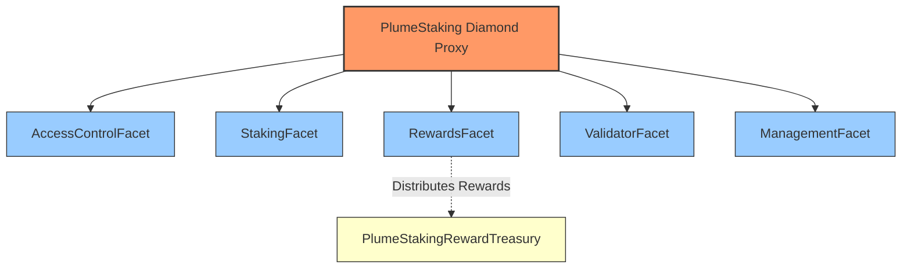
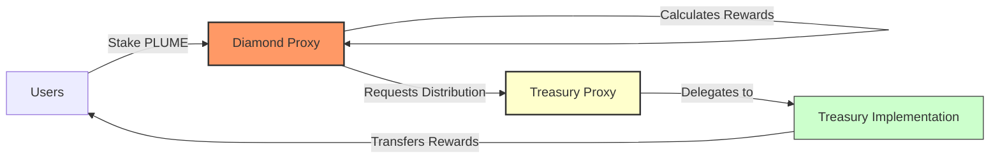
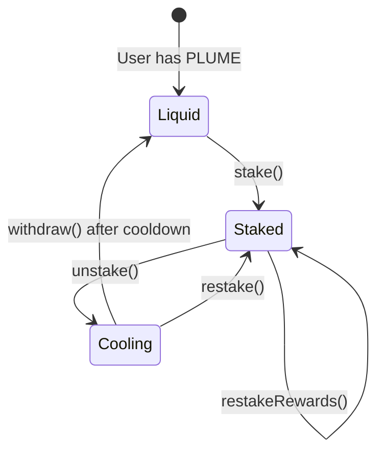
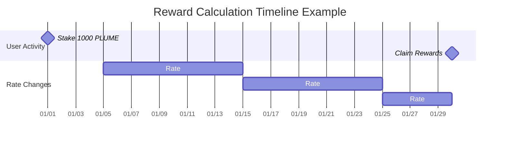
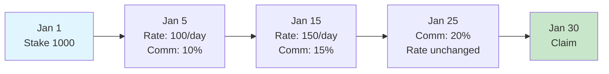
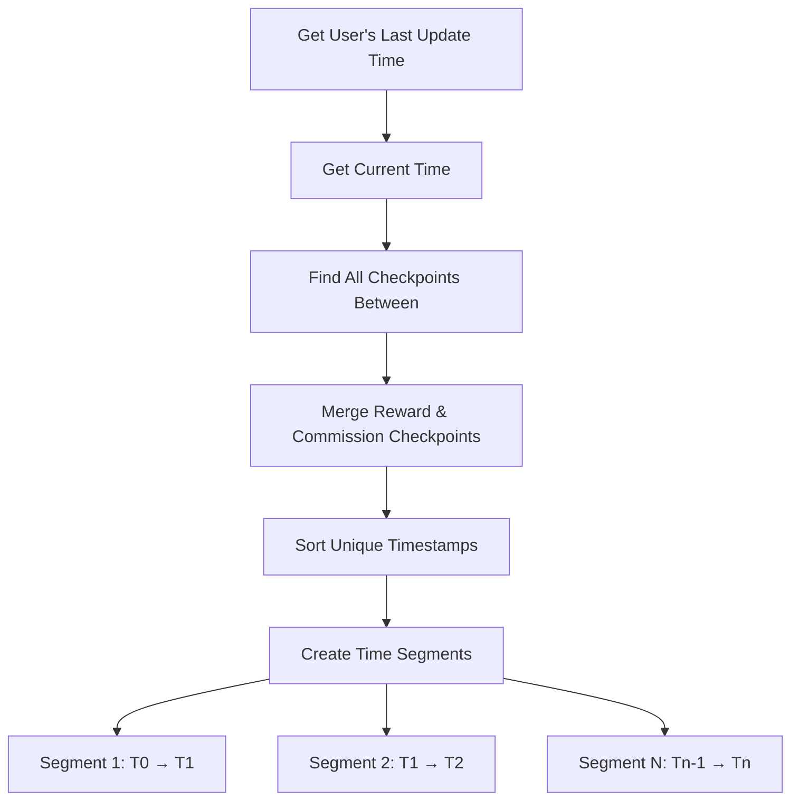
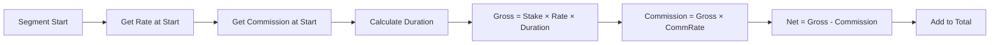
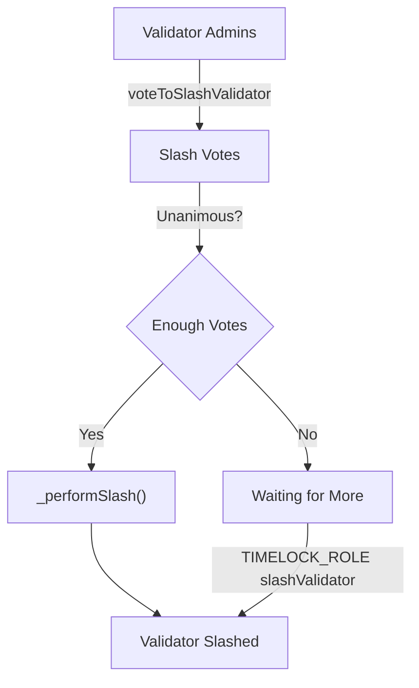
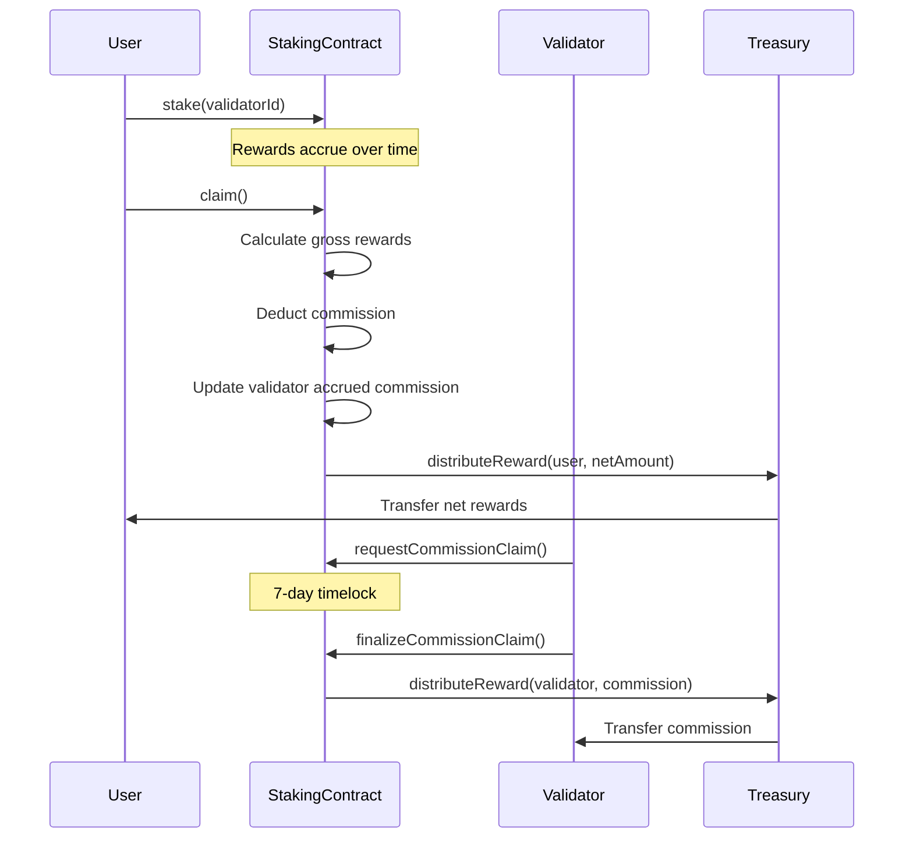

# PlumeStaking and Spin/Raffle Contracts

> [!NOTE]
> **Plume Staking is now live on Plume!**
> Try it out here: [https://staking.plume.org/](https://staking.plume.org/)

## Table of Contents

1. [PlumeStaking System](#plumestaking-system)
   - [Overview](#overview)
   - [Architecture](#architecture)
     - [Diamond Pattern Implementation](#diamond-pattern-implementation)
     - [Treasury System](#treasury-system)
   - [Core Concepts](#core-concepts)
     - [Staking Mechanism](#staking-mechanism)
     - [Reward Distribution](#reward-distribution)
     - [Slashing Mechanism](#slashing-mechanism)
     - [Commission System](#commission-system)
   - [Contract Reference](#contract-reference)
     - [StakingFacet](#stakingfacet)
     - [RewardsFacet](#rewardsfacet)
     - [ValidatorFacet](#validatorfacet)
     - [ManagementFacet](#managementfacet)
     - [AccessControlFacet](#accesscontrolfacet)
   - [Events Reference](#events-reference)
   - [Errors Reference](#errors-reference)
   - [Constants and Roles](#constants-and-roles)
2. [Testing](#testing)
   - [Running Tests](#running-tests)
   - [Gas Considerations](#gas-considerations)
3. [Spin and Raffle Contracts](#spin-and-raffle-contracts)
   - [Environment Setup](#environment-setup)
   - [Build Instructions](#build-instructions)
   - [Deployment Guide](#deployment-guide)
   - [Upgrade Process](#upgrade-process)
   - [Launch Steps](#launch-steps)

---

## PlumeStaking System

### High-Level Architecture Overview

PlumeStaking is a Diamond proxy-based staking system that separates concerns across multiple facets. The system implements a delegated proof-of-stake mechanism where users stake PLUME tokens to validators and earn rewards in multiple ERC20 tokens.

**Core Design Principles:**
- **Diamond Pattern (EIP-2535)**: Modular architecture allowing selective upgrades without full redeployment
- **Checkpoint-Based Rewards**: Historical rate tracking enables accurate reward calculations across rate changes
- **Validator-Specific Accounting**: Each validator maintains independent reward rates and commission structures
- **Lazy Evaluation**: Rewards calculated on-demand rather than continuously updated
- **Separate Treasury**: Reward funds custody isolated from staking logic

**Key Mechanics:**
1. Users stake PLUME to validators, earning rewards based on validator-specific emission rates
2. Validators earn commission on generated rewards (configurable per validator, max 50%)
3. Unstaking initiates a cooldown period before funds become withdrawable
4. Slashing requires unanimous vote from all other active validators
5. All reward distributions flow through a separate treasury contract

**Initialization:**
```solidity
// After Diamond deployment, initialize PlumeStaking
plumeStaking.initializePlume(initialOwner, minStake, cooldown, maxSlashVoteDuration, maxValidatorCommission)

// Initialize AccessControlFacet
accessControlFacet.initializeAccessControl()
```

### Architecture

#### Diamond Pattern Implementation

PlumeStaking uses the EIP-2535 Diamond standard to organize functionality into modular facets:



**Facet Responsibilities:**
- **AccessControlFacet**: OpenZeppelin AccessControl implementation
- **StakingFacet**: stake(), unstake(), withdraw(), restake(), restakeRewards()
- **RewardsFacet**: Reward calculation, distribution, treasury integration
- **ValidatorFacet**: Validator lifecycle, slashing, commission management
- **ManagementFacet**: System parameters, admin functions

#### Treasury System

The protocol separates fund custody from staking logic using a dedicated treasury contract:



**Treasury Implementation:**
- UUPS upgradeable proxy pattern
- Role-based access (only Diamond can distribute)
- Multi-token support
- Direct transfers to users

### Core Concepts

#### Staking Mechanism

Staking lifecycle:



**Implementation Details:**
- Global minimum stake amount check
- Per-validator capacity limits
- Validator must be active and not slashed
- stake() accepts msg.value, stakeOnBehalf() allows third-party staking
- Cooldown period prevents immediate withdrawals after unstaking

#### Reward Calculation System

The reward system uses a sophisticated checkpoint-based mechanism to handle variable rates, validator-specific multipliers, and commission deductions.

##### Core Components

**1. Validator-Level Rate Tracking**
The system tracks reward rates exclusively at the validator level. When a reward token is added or its rate is updated via `setRewardRates`, a rate checkpoint is created for *every* active validator. This ensures all reward calculations are based on a specific validator's rate history.

**2. Checkpoint Structure**
```solidity
struct RateCheckpoint {
    uint256 timestamp;       // When rate changed
    uint256 rate;           // New rate (tokens/second/staked token)
    uint256 cumulativeIndex; // Accumulated rewards up to this point
}
```

**3. Key Storage Mappings**
- `validatorRewardRateCheckpoints[validatorId][token]`: Rate history
- `validatorCommissionCheckpoints[validatorId]`: Commission history
- `validatorRewardPerTokenCumulative[validatorId][token]`: Accumulated rewards
- `userValidatorRewardPerTokenPaid[user][validatorId][token]`: User's last settled index

##### Calculation Algorithm

**Step 1: Time Segmentation**

When calculating rewards, the system identifies all rate change points:



**Step 2: Segment Processing**

For each time segment between checkpoints:

```
Segment Gross Reward = Stake × Rate × Duration
Segment Commission = Gross Reward × Commission Rate
Segment Net Reward = Gross Reward - Commission
```

**Step 3: Mathematical Formula**

For a user with stake `S` over time period `[t₀, t₁]`:

```
Total Net Reward = Σᵢ [Sᵢ × Rᵢ × Δtᵢ × (1 - Cᵢ)]

Where:
- i = each time segment
- Sᵢ = stake amount in segment i
- Rᵢ = reward rate in segment i
- Δtᵢ = duration of segment i
- Cᵢ = commission rate in segment i
```

##### Detailed Calculation Example

**Setup:**
- User stakes 1,000 PLUME on January 1st
- REWARD_TOKEN with 18 decimals
- All rates use REWARD_PRECISION = 1e18

**Timeline:**



**Checkpoint Creation:**

```javascript
// Reward Rate Checkpoints
Checkpoint 0: { 
    timestamp: Jan 5, 
    rate: 100e18,     // 100 tokens/day/staked token
    cumulativeIndex: 0 
}
Checkpoint 1: { 
    timestamp: Jan 15, 
    rate: 150e18, 
    cumulativeIndex: 1000e18  // Accumulated from previous segment
}

// Commission Checkpoints
Checkpoint 0: { timestamp: Jan 5,  rate: 0.1e18 }   // 10%
Checkpoint 1: { timestamp: Jan 15, rate: 0.15e18 }  // 15%
Checkpoint 2: { timestamp: Jan 25, rate: 0.2e18 }   // 20%
```

**Calculation Process:**

| Segment | Duration | Rate | Stake | Gross Rewards | Commission | Net Rewards |
|---------|----------|------|-------|---------------|------------|-------------|
| Jan 1-5 | 4 days | 0 | 1,000 | 0 | 0% | 0 |
| Jan 5-15 | 10 days | 100/day | 1,000 | 1,000,000 | 10% (100,000) | 900,000 |
| Jan 15-25 | 10 days | 150/day | 1,000 | 1,500,000 | 15% (225,000) | 1,275,000 |
| Jan 25-30 | 5 days | 150/day | 1,000 | 750,000 | 20% (150,000) | 600,000 |
| **Total** | | | | **3,250,000** | **475,000** | **2,775,000** |

##### Implementation Details

**1. Finding Relevant Checkpoints (Binary Search)**

```solidity
function findCheckpointIndex(checkpoints, timestamp) {
    uint256 low = 0;
    uint256 high = checkpoints.length - 1;
    
    while (low <= high) {
        uint256 mid = (low + high) / 2;
        if (checkpoints[mid].timestamp <= timestamp) {
            if (mid == high || checkpoints[mid + 1].timestamp > timestamp) {
                return mid;  // Found the right checkpoint
            }
            low = mid + 1;
        } else {
            high = mid - 1;
        }
    }
    return 0;
}
```

> *Note: The function above is a simplified example for illustrative purposes. The actual implementation in `src/lib/PlumeRewardLogic.sol` is more robust and uses specialized functions such as `findRewardRateCheckpointIndexAtOrBefore` and `findCommissionCheckpointIndexAtOrBefore` to handle edge cases.*

**2. Time Segment Generation**



**3. Per-Segment Calculation Flow**



**4. Precision Handling**

All calculations use REWARD_PRECISION (1e18) to maintain accuracy:

```solidity
// Rate stored as tokens per second with 1e18 precision
uint256 ratePerSecond = 100e18 / 86400;  // 100 tokens/day

// Calculation preserves precision
uint256 rewardPerToken = duration * ratePerSecond;
uint256 grossReward = (stake * rewardPerToken) / REWARD_PRECISION;
```

##### Edge Cases

**1. Validator Slashing**
- Rewards stop accruing at slashedAtTimestamp
- Existing unclaimed rewards remain claimable
- No new rewards after slash time

**2. Mid-Stake Rate Changes**
- New stakers start earning from their stake timestamp
- Rate changes don't affect past earnings
- Checkpoint index tracking prevents double-claiming

**3. Zero Rates**
- Supported for pausing rewards
- Checkpoints still created for consistency
- Previous rewards remain claimable

##### Gas Optimization

**1. Checkpoint Efficiency**
- Binary search reduces lookup from O(n) to O(log n)
- Checkpoints only created on rate changes
- User checkpoint indices tracked to avoid re-processing

**2. Batch Operations**
- `claimAll()` processes all tokens in one transaction
- Validator commission settled across all tokens simultaneously
- Single update for all user rewards per validator

This checkpoint-based system ensures perfect accuracy regardless of when users claim, while maintaining gas efficiency through optimized data structures and algorithms.

#### Reward Token Lifecycle & Historical Tokens

Plume supports adding and removing reward tokens without disrupting historical reward accuracy:

- **Adding a token** (`addRewardToken`) immediately pushes the token into `rewardTokens`, marks it `isRewardToken=true`, and creates an *initial* reward-rate checkpoint for **every validator** at the chosen `initialRate`.  The token is also appended to the immutable `historicalRewardTokens` list.
- **Removing a token** (`removeRewardToken`) does **not** delete checkpoints. Instead it:
  1. Records `tokenRemovalTimestamps[token] = block.timestamp` so future calculations cap at this moment.
  2. Forces a final **zero-rate checkpoint** for each validator, guaranteeing no further accrual.
  3. Leaves all historical checkpoints intact so users can still claim previously-earned rewards.
- Users can therefore continue to claim even after a token is no longer active.  View/claim helpers automatically fall back to historical calculations when `isRewardToken[token] == false` but `isHistoricalRewardToken[token] == true`.
- Administrative helpers exist to *manually* add or remove entries from the historical list (`addHistoricalRewardToken`, `removeHistoricalRewardToken`).  These functions were used to migrate the contract state from v1 to v2 version. 
- The events `HistoricalRewardTokenAdded` / `HistoricalRewardTokenRemoved` capture these changes for off-chain indexers.

#### Slashing Mechanism

Slashing is driven by **unanimous votes** from *all other active validators* and can execute in two ways:

1. **Auto-Slash (preferred)** – when the last required validator casts its vote via `voteToSlashValidator`, the contract immediately calls the internal `_performSlash` and the validator is slashed in the *same* transaction. No privileged role is needed.
2. **Timed Slash** – if unanimity was reached but the auto-slash failed (e.g., a re-org removed a vote) anyone with `TIMELOCK_ROLE` may call `slashValidator` to perform the slash once the vote set is valid.



Key details:
- **Vote Expiry:** Each vote carries an `expiration` ≤ `maxSlashVoteDurationInSeconds`. Expired votes are cleaned up automatically by `_cleanupExpiredVotes` (invoked in voting & slashing paths).
- **Eligibility:** Only *active & non-slashed* validators may vote; a validator cannot vote to slash itself.
- **Cooldown Safety:** Admins must ensure `cooldownInterval > maxSlashVoteDuration` (enforced by `setCooldownInterval`). This guarantees users can always withdraw if a slash fails to pass.
- **Commission & Rewards:** Upon slashing, all stake & cooling amounts are burned; reward & commission accrual stops at `slashedAtTimestamp`.
- **Post-Slash Cleanup:** Users cannot recover losses, so admins use `adminClearValidatorRecord` / `adminBatchClearValidatorRecords` to erase orphaned state.

##### Effects of a Successful Slash

When `_performSlash` runs, the contract immediately:

1. **Burns 100 % of the validator’s stake and cooling balances.**  Both `validatorTotalStaked` and `validatorTotalCooling` are zeroed and the global aggregates (`totalStaked`, `totalCooling`) are reduced accordingly.
2. **Marks the validator as `slashed = true` and `active = false`.**  A `slashedAtTimestamp` is stored; reward logic caps accrual at this timestamp for all future calculations.
3. **Stops Reward & Commission Accrual.**  Reward‐rate calculations reference `slashedAtTimestamp`, so no new rewards or commission can accumulate after the slash block.
4. **Clears the stakers list and voting records** to prevent further interactions or double-slashing.
5. **Emits `ValidatorSlashed` and `ValidatorStatusUpdated` events** with the total stake+cooling amount burned so off-chain indexers can reconcile supply changes.

After these state changes, affected users must rely on the admin cleanup functions to remove now-irrecoverable records tied to the slashed validator.

#### Commission System

Validator commission flow:



**Implementation:**
- Each validator keeps its **own** commission checkpoint history.  To defend against unbounded growth:
  •  `setMaxCommissionCheckpoints` caps the length (default 500).  Attempts to exceed revert with `MaxCommissionCheckpointsExceeded`.<br>  •  Admins can **prune** old data via `pruneCommissionCheckpoints` / `pruneRewardRateCheckpoints` (gas-heavy, irreversible).  Successful pruning emits `CommissionCheckpointsPruned` or `RewardRateCheckpointsPruned` respectively.
- 7-day timelock on withdrawals (COMMISSION_CLAIM_TIMELOCK)
- forceSettleValidatorCommission() for manual settlement

**Force Settlement Mechanism:**

```solidity
function forceSettleValidatorCommission(uint16 validatorId) external
```

- Permissionless function to trigger commission settlement
- Iterates all reward tokens and calculates accrued commission
- Updates validator's commission balance
- Gas costs borne by caller
- Useful before commission rate changes or validator updates

### Contract Reference

#### StakingFacet

Core staking operations and user balance management.

##### Write Functions

| Function | Description | Requirements |
|----------|-------------|--------------|
| `stake(uint16 validatorId)` | Stake PLUME tokens to a validator | - Payable (msg.value = stake amount)<br>- Validator must be active<br>- Validator not slashed<br>- Amount ≥ minimum stake<br>- Validator has capacity |
| `stakeOnBehalf(uint16 validatorId, address staker)` | Stake PLUME for another user | Same as stake() |
| `unstake(uint16 validatorId)` | Unstake all tokens from a validator | - Has stake with validator<br>- Validator not slashed<br>- Starts cooldown period |
| `unstake(uint16 validatorId, uint256 amount)` | Unstake specific amount | - Has sufficient stake<br>- Validator not slashed<br>- Starts cooldown period |
| `restake(uint16 validatorId, uint256 amount)` | Move cooling tokens back to staked | - Has cooling tokens<br>- Validator active<br>- Validator not slashed |
| `withdraw()` | Withdraw tokens after cooldown | - Has completed cooldowns<br>- Automatically skips slashed validators |
| `restakeRewards(uint16 validatorId)` | Claim and restake PLUME rewards | - Has PLUME rewards<br>- PLUME token must be an active reward token<br>- Transfers rewards from Treasury to back new stake<br>- Validator active<br>- Validator not slashed |

##### View Functions

| Function | Returns | Description |
|----------|---------|-------------|
| `amountStaked()` | `uint256` | Total PLUME staked by caller |
| `amountCooling()` | `uint256` | Total PLUME in cooldown (excludes slashed validators) |
| `amountWithdrawable()` | `uint256` | PLUME ready to withdraw |
| `stakeInfo(address user)` | `StakeInfo struct` | Complete staking information for user |
| `totalAmountStaked()` | `uint256` | System-wide staked PLUME |
| `totalAmountCooling()` | `uint256` | System-wide cooling PLUME |
| `totalAmountWithdrawable()` | `uint256` | System-wide withdrawable PLUME |
| `getUserValidatorStake(address, uint16)` | `uint256` | User's stake with specific validator |
| `getUserCooldowns(address)` | `CooldownEntry[]` | Active cooldowns (excludes slashed validators) |

#### RewardsFacet

Reward token management and distribution system.

##### Write Functions

| Function | Description | Access Control |
|----------|-------------|----------------|
| `setTreasury(address treasury)` | Set reward treasury address | REWARD_MANAGER_ROLE |
| `addRewardToken(address token, uint256 initialRate, uint256 maxRate)` | Add new reward token and set its initial rate for all validators | REWARD_MANAGER_ROLE |
| `removeRewardToken(address token)` | Remove reward token and create a final zero-rate checkpoint | REWARD_MANAGER_ROLE |
| `setRewardRates(address[] tokens, uint256[] rates)` | Set emission rates for multiple tokens, creating new checkpoints for all validators | REWARD_MANAGER_ROLE |
| `setMaxRewardRate(address token, uint256 rate)` | Set maximum rate limit for a token | REWARD_MANAGER_ROLE |
| `claim(address token, uint16 validatorId)` | Claim rewards for a specific token from a specific validator | Public |
| `claim(address token)` | Claim from all validators | Public |
| `claimAll()` | Claim all tokens from all validators | Public |

##### View Functions

| Function | Returns | Description |
|----------|---------|-------------|
| `earned(address user, address token)` | `uint256` | Total accumulated rewards across validators |
| `getClaimableReward(address user, address token)` | `uint256` | Currently claimable amount |
| `getRewardTokens()` | `address[]` | List of reward tokens |
| `getMaxRewardRate(address token)` | `uint256` | Maximum allowed rate |
| `getRewardRate(address token)` | `uint256` | Current emission rate |
| `tokenRewardInfo(address token)` | `RewardInfo struct` | Detailed token information |
| `getTreasury()` | `address` | Current treasury address |
| `getPendingRewardForValidator(address, uint16, address)` | `uint256` | Pending rewards for specific validator |

#### ValidatorFacet

Validator lifecycle management and slashing operations.

##### Write Functions

| Function | Description | Access Control |
|----------|-------------|----------------|
| `addValidator(uint16 validatorId, uint256 commission, address l2AdminAddress, ... , uint256 maxCapacity)` | Register new validator | VALIDATOR_ROLE |
| `setValidatorCapacity(uint16, uint256)` | Update staking capacity | VALIDATOR_ROLE |
| `setValidatorStatus(uint16, bool)` | Activate/deactivate validator | VALIDATOR_ROLE |
| `setValidatorCommission(uint16 validatorId, uint256 newCommission)` | Update commission rate for a validator | Validator Admin |
| `setValidatorAddresses(uint16, ...)` | Update admin/withdraw addresses. Admin changes initiate a two-step transfer. | Validator Admin |
| `acceptAdmin(uint16 validatorId)` | Accept pending admin role and complete two-step validator admin transfer | Pending Admin |
| `requestCommissionClaim(uint16 validatorId, address token)` | Start commission claim timelock for a specific token | Validator Admin |
| `finalizeCommissionClaim(uint16 validatorId, address token)` | Complete commission claim after timelock | Validator Admin |
| `voteToSlashValidator(uint16, uint256)` | Vote to slash another validator | Validator Admin |
| `slashValidator(uint16)` | Execute slashing if unanimity already reached (fallback) | TIMELOCK_ROLE |
| `cleanupExpiredVotes(uint16)` | Remove expired votes and return current valid count | Public |
| `forceSettleValidatorCommission(uint16)` | Manually settle accrued commission | Public |

##### View Functions

| Function | Returns | Description |
|----------|---------|-------------|
| `getValidatorInfo(uint16)` | `ValidatorInfo struct` | Complete validator details including slash status |
| `getValidatorStats(uint16)` | `ValidatorStats struct` | Key metrics for validator |
| `getUserValidators(address)` | `uint16[]` | Validators user has staked with (excludes slashed) |
| `getAccruedCommission(uint16, address)` | `uint256` | Unclaimed commission amount |
| `getValidatorsList()` | `ValidatorData[]` | All validators with core data |
| `getActiveValidatorCount()` | `uint256` | Number of active, non-slashed validators |
| `getSlashVoteCount(uint16)` | `uint256` | Current votes to slash validator |

#### ManagementFacet

System parameter configuration and administrative functions.

##### Write Functions

| Function | Description | Access Control |
|----------|-------------|----------------|
| `setMinStakeAmount(uint256)` | Set minimum stake requirement | ADMIN_ROLE |
| `setCooldownInterval(uint256)` | Set unstaking cooldown duration | ADMIN_ROLE |
| `adminWithdraw(address, uint256, address)` | Emergency fund withdrawal | TIMELOCK_ROLE |
| `setMaxSlashVoteDuration(uint256)` | Set vote expiration time | ADMIN_ROLE |
| `setMaxAllowedValidatorCommission(uint256)` | Set system-wide commission cap | ADMIN_ROLE |
| `adminClearValidatorRecord(address, uint16)` | Clear slashed validator records | ADMIN_ROLE |
| `adminBatchClearValidatorRecords(address[], uint16)` | Batch clear records | ADMIN_ROLE |
| `setMaxCommissionCheckpoints(uint16)` | Set max commission checkpoints per validator | ADMIN_ROLE |
| `setMaxValidatorPercentage(uint256)` | Set max % of total stake a validator can hold | ADMIN_ROLE |
| `pruneCommissionCheckpoints(uint16, uint256)` | Prune oldest commission checkpoints | ADMIN_ROLE |
| `pruneRewardRateCheckpoints(uint16, address, uint256)` | Prune oldest reward rate checkpoints | ADMIN_ROLE |
| `addHistoricalRewardToken(address)` | Add token to historical reward list (non-active) | ADMIN_ROLE |
| `removeHistoricalRewardToken(address)` | Remove token from historical reward list | ADMIN_ROLE |

##### View Functions

| Function | Returns | Description |
|----------|---------|-------------|
| `getMinStakeAmount()` | `uint256` | Current minimum stake |
| `getCooldownInterval()` | `uint256` | Current cooldown duration |

#### AccessControlFacet

OpenZeppelin AccessControl implementation.

##### Initialization

```solidity
// Must be called after facet deployment
accessControlFacet.initializeAccessControl()
```

Grants DEFAULT_ADMIN_ROLE and ADMIN_ROLE to caller, sets up role hierarchy.

### Events Reference

#### Staking Events

| Event | Emitted When | Parameters |
|-------|--------------|------------|
| `Staked` | User stakes tokens | `user`, `validatorId`, `amount`, `fromCooling`, `fromParked`, `pendingRewards` |
| `StakedOnBehalf` | Staking for another user | `sender`, `staker`, `validatorId`, `amount` |
| `Unstaked` | Unstaking initiated | `user`, `validatorId`, `amount` |
| `CooldownStarted` | Cooldown period begins | `staker`, `validatorId`, `amount`, `cooldownEnd` |
| `Withdrawn` | Tokens withdrawn after cooldown | `staker`, `amount` |
| `RewardsRestaked` | Rewards claimed and restaked | `staker`, `validatorId`, `amount` |

#### Reward Events

| Event | Emitted When | Parameters |
|-------|--------------|------------|
| `RewardTokenAdded` | New reward token registered | `token` |
| `RewardTokenRemoved` | Reward token removed | `token` |
| `RewardRatesSet` | Emission rates updated | `tokens[]`, `rates[]` |
| `MaxRewardRateUpdated` | Maximum rate changed | `token`, `newMaxRate` |
| `RewardRateCheckpointCreated` | Rate checkpoint created | `token`, `validatorId`, `rate`, `timestamp`, `index`, `cumulativeIndex` |
| `RewardClaimed` | User claims rewards | `user`, `token`, `amount` |
| `RewardClaimedFromValidator` | Rewards claimed from specific validator | `user`, `token`, `validatorId`, `amount` |
| `TreasurySet` | Treasury address updated | `treasury` |

#### Validator Events

| Event | Emitted When | Parameters |
|-------|--------------|------------|
| `ValidatorAdded` | New validator registered | `validatorId`, `commission`, `l2Admin`, `l2Withdraw`, `l1Val`, `l1Acc`, `l1AccEvm` |
| `ValidatorUpdated` | Validator details modified | Same as ValidatorAdded |
| `ValidatorStatusUpdated` | Active/slash status changed | `validatorId`, `active`, `slashed` |
| `ValidatorCommissionSet` | Commission rate updated | `validatorId`, `oldCommission`, `newCommission` |
| `ValidatorAddressesSet` | Admin/withdraw addresses changed | All old and new addresses |
| `ValidatorCapacityUpdated` | Capacity limit changed | `validatorId`, `oldCapacity`, `newCapacity` |
| `ValidatorCommissionClaimed` | Commission withdrawn | `validatorId`, `token`, `amount` |
| `SlashVoteCast` | Vote to slash submitted | `targetValidatorId`, `voterValidatorId`, `voteExpiration` |
| `ValidatorSlashed` | Validator slashed | `validatorId`, `slasher`, `penaltyAmount` |
| `ValidatorCommissionCheckpointCreated` | Commission checkpoint created | `validatorId`, `rate`, `timestamp` |

#### Administrative Events

| Event | Emitted When | Parameters |
|-------|--------------|------------|
| `MinStakeAmountSet` | Minimum stake updated | `amount` |
| `CooldownIntervalSet` | Cooldown duration updated | `interval` |
| `AdminWithdraw` | Emergency withdrawal | `token`, `amount`, `recipient` |
| `MaxSlashVoteDurationSet` | Vote expiration updated | `duration` |
| `MaxAllowedValidatorCommissionSet` | Commission cap updated | `oldMaxRate`, `newMaxRate` |
| `AdminClearedSlashedStake` | Slashed stake cleared by admin | `user`, `slashedValidatorId`, `amountCleared` |
| `AdminClearedSlashedCooldown` | Slashed cooldown cleared by admin | `user`, `slashedValidatorId`, `amountCleared` |
| `MaxCommissionCheckpointsSet` | Max commission checkpoints updated | `newLimit` |
| `CommissionCheckpointsPruned` | Old commission checkpoints pruned | `validatorId`, `count` |
| `RewardRateCheckpointsPruned` | Old reward rate checkpoints pruned | `validatorId`, `token`, `count` |
| `HistoricalRewardTokenAdded` | Token added to historical list | `token` |
| `HistoricalRewardTokenRemoved` | Token removed from historical list | `token` |
| `AdminProposed` | New validator admin proposed | `validatorId`, `proposedAdmin` |

### Errors Reference

#### Critical Errors

| Error | Thrown When |
|-------|-------------|
| `ValidatorDoesNotExist(uint16)` | Invalid validator ID |
| `ValidatorInactive(uint16)` | Validator not active |
| `ValidatorAlreadySlashed(uint16)` | Validator already slashed |
| `ActionOnSlashedValidatorError(uint16)` | Operation on slashed validator |
| `NotValidatorAdmin(address)` | Caller not validator admin |
| `Unauthorized(address, bytes32)` | Missing required role |
| `TreasuryNotSet()` | Treasury not configured |

#### Staking Errors

| Error | Thrown When |
|-------|-------------|
| `InvalidAmount(uint256)` | Zero or invalid amount |
| `NoActiveStake()` | No stake to unstake |
| `StakeAmountTooSmall(uint256, uint256)` | Below minimum stake |
| `InsufficientFunds(uint256, uint256)` | Insufficient balance |
| `CooldownPeriodNotEnded()` | Cooldown not complete |
| `NoRewardsToRestake()` | No rewards available |
| `ExceedsValidatorCapacity(uint16, uint256, uint256, uint256)` | Over validator capacity |
| `ValidatorPercentageExceeded()` | Over 33% total stake |

#### Commission/Reward Errors

| Error | Thrown When |
|-------|-------------|
| `CommissionExceedsMaxAllowed(uint256, uint256)` | Commission > max allowed |
| `InvalidMaxCommissionRate(uint256, uint256)` | Max rate > 50% |
| `PendingClaimExists(uint16, address)` | Claim already pending |
| `NoPendingClaim(uint16, address)` | No claim to finalize |
| `ClaimNotReady(uint16, address, uint256)` | Timelock not passed |
| `TokenDoesNotExist(address)` | Unknown reward token |
| `RewardRateExceedsMax()` | Rate > max allowed |

#### Slashing Errors

| Error | Thrown When |
|-------|-------------|
| `SlashVoteDurationTooLong()` | Vote expiration > max |
| `CannotVoteForSelf()` | Self-voting attempt |
| `AlreadyVotedToSlash(uint16, uint16)` | Duplicate vote |
| `UnanimityNotReached(uint256, uint256)` | Missing votes |
| `SlashVoteExpired(uint16, uint16)` | Vote expired |
| `CooldownTooShortForSlashVote(uint256, uint256)` | cooldownInterval ≤ maxSlashVoteDuration |
| `SlashVoteDurationTooLongForCooldown(uint256, uint256)` | Proposed vote duration ≥ cooldownInterval |
| `SlashVoteDurationExceedsCommissionTimelock(uint256, uint256)` | Proposed vote duration ≥ commission timelock |
| `NotPendingAdmin(address,uint16)` | Caller tries to accept admin without being the pending admin |
| `NoPendingAdmin(uint16)` | acceptAdmin called with no pending admin |

See PlumeErrors.sol for complete list.

### Constants and Roles

#### System Roles

| Role | Purpose | Key Permissions |
|------|---------|-----------------|
| `ADMIN_ROLE` | System administration | - Manage all other roles<br>- Set system parameters<br>- Emergency functions<br>- Clear slashed records |
| `UPGRADER_ROLE` | Contract upgrades | - Execute diamondCut<br>- Upgrade facets |
| `VALIDATOR_ROLE` | Validator management | - Add validators<br>- Set capacities<br>- Update statuses |
| `REWARD_MANAGER_ROLE` | Reward configuration | - Set reward rates<br>- Manage tokens<br>- Configure treasury |
| `TIMELOCK_ROLE` | Time-sensitive operations | - Execute slashing<br>- Set cooldown interval |

#### System Constants

| Constant | Value | Usage |
|----------|-------|--------|
| `PLUME_NATIVE` | 0xEeeeeEeeeEeEeeEeEeEeeEEEeeeeEeeeeeeeEEeE | Native PLUME token address |
| `REWARD_PRECISION` | 1e18 | Precision for rate calculations |
| `COMMISSION_CLAIM_TIMELOCK` | 7 days | Validator commission withdrawal delay |
| `STORAGE_SLOT` | keccak256("plume.staking.storage") | Diamond storage location |

---

## Testing

### Running Tests
The core test suite can be run using the following Forge command, which specifically targets the `PlumeStakingDiamond` tests with high verbosity:

```bash
forge test --match-contract PlumeStakingDiamond  -vvvv --via-ir
```

### Gas Considerations

**Notice on Loop Operations:** The PlumeStaking contract's design accounts for the current operational scale. At present, the system operates with 10 validators and one primary reward token. As there are no immediate plans to scale to hundreds of validators or tens of reward tokens, functions that loop through all validators or reward tokens are computationally safe and are not expected to exceed block gas limits under these conditions. Developers should remain mindful of these looping patterns if the system's scale significantly increases in the future.

---

## Spin and Raffle Contracts


More detailed info is available [here](SPIN.md).


### Environment Setup

`.env` configuration:

```bash
# Network
RPC_URL="https://rpc.plume.org"
PRIVATE_KEY=<DEPLOY_WALLET_PRIVATE_KEY>

# Contract Addresses (for upgrades)
SPIN_PROXY_ADDRESS=<NEEDED_FOR_UPGRADE>
RAFFLE_PROXY_ADDRESS=<NEEDED_FOR_UPGRADE>

# Supra Oracle
SUPRA_ROUTER_ADDRESS=0xE1062AC81e76ebd17b1e283CEed7B9E8B2F749A5
SUPRA_DEPOSIT_CONTRACT_ADDRESS=0x6DA36159Fe94877fF7cF226DBB164ef7f8919b9b
SUPRA_GENERATOR_CONTRACT_ADDRESS=0x8cC8bbE991d8B4371551B4e666Aa212f9D5f165e

# Utilities
DATETIME_ADDRESS=0x06a40Ec10d03998634d89d2e098F079D06A8FA83
BLOCKSCOUT_URL=https://explorer.plume.org/api?
```

### Build Instructions

```bash
forge clean && forge build --via-ir --build-info
```

### Deployment Guide

Deploy Spin and Raffle contracts with Supra whitelisting:

```bash
source .env && forge script script/DeploySpinRaffleContracts.s.sol \
    --rpc-url https://rpc.plume.org \
    --broadcast \
    --via-ir
```
Save proxy addresses from deployment output for upgrades.

### Upgrade Process

```bash
# Spin Contract
source .env && forge script script/UpgradeSpinContract.s.sol \
    --rpc-url https://rpc.plume.org \
    --broadcast \
    --via-ir

# Raffle Contract
source .env && forge script script/UpgradeRaffleContract.s.sol \
    --rpc-url https://rpc.plume.org \
    --broadcast \
    --via-ir
```

### Launch Steps

```solidity
// 1. Configure Raffle Prizes
raffle.addPrize(prizeId, prizeDetails);

// 2. Set Campaign Start Date (Spin)
spin.setCampaignStartDate(startTimestamp);

// 3. Enable Spin
spin.setEnabledSpin(true);
```

---

*This documentation is maintained alongside the smart contracts. For the latest updates, please refer to the repository.*
