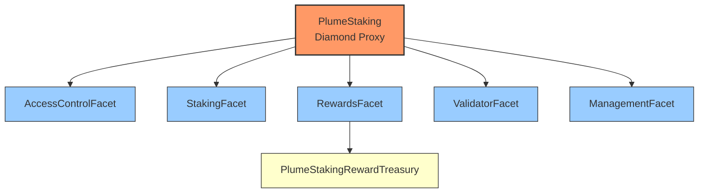

#PlumeS


# PlumeStaking

PlumeStaking is a flexible and comprehensive staking system for PLUME tokens that supports multiple validators, reward distribution, and a cooling period for unstaked tokens.

## Architecture

PlumeStaking now uses a Diamond architecture with multiple facets to organize functionality:



- **PlumeStaking (Diamond)**: The main entry point that implements the Diamond standard.
- **AccessControlFacet**: Manages roles and permissions.
- **StakingFacet**: Handles staking and unstaking operations.
- **RewardsFacet**: Manages reward tokens, rates, and distribution.
- **ValidatorFacet**: Handles validator management.
- **ManagementFacet**: Provides administrative functions.
- **PlumeStakingRewardTreasury**: Separate contract for holding and distributing rewards.

## Treasury System

### PlumeStakingRewardTreasury

The protocol uses a dedicated upgradeable treasury contract to securely hold and distribute rewards:

- **Upgradeable Design**: Implements UUPS pattern for upgradeability with proper access control
- **Separation of Concerns**: Dedicated treasury contract for better security and fund management
- **Role-Based Access**: Implements a comprehensive role system:
  - `DISTRIBUTOR_ROLE`: Only the Diamond proxy can distribute rewards
  - `ADMIN_ROLE`: Can add reward tokens and manage other roles
  - `UPGRADER_ROLE`: Can authorize contract upgrades
  - `DEFAULT_ADMIN_ROLE`: Super admin role for initial setup

### Treasury Architecture

The treasury system consists of two main components:

1. **PlumeStakingRewardTreasury**: The main implementation contract
2. **PlumeStakingRewardTreasuryProxy**: ERC1967 proxy that delegates to the implementation

This proxy pattern enables future upgrades while maintaining the same address and state.

### Reward Distribution Flow

1. Users stake their PLUME tokens to validators
2. Rewards accrue over time based on configured reward rates
3. When users claim rewards:
   - The RewardsFacet calculates earned rewards
   - The RewardsFacet (with DISTRIBUTOR_ROLE) calls the treasury
   - The treasury verifies the caller's role and transfers tokens directly to the user

### Treasury Functions

| Function                                           | Description                                                    | Access Control |
| -------------------------------------------------- | -------------------------------------------------------------- | -------------- |
| `initialize(address admin, address distributor)`    | Initialize the treasury with admin and distributor addresses    | Once only      |
| `addRewardToken(address token)`                    | Register a token as a valid reward token                       | ADMIN_ROLE     |
| `distributeReward(address token, uint256 amount, address recipient)` | Distribute rewards to a recipient            | DISTRIBUTOR_ROLE |
| `getRewardTokens()`                                | Get the list of registered reward tokens                       | Public View    |
| `getBalance(address token)`                        | Get the balance of a specific token                            | Public View    |
| `isRewardToken(address token)`                     | Check if a token is registered as a reward token               | Public View    |

### Treasury Events

| Event                                              | Description                                    |
| -------------------------------------------------- | ---------------------------------------------- |
| `RewardTokenAdded(address token)`                  | Emitted when a new reward token is registered  |
| `RewardDistributed(address token, uint256 amount, address recipient)` | Emitted when rewards are distributed |
| `PlumeReceived(address sender, uint256 amount)`    | Emitted when the treasury receives PLUME       |
| `TokenReceived(address token, address sender, uint256 amount)` | Emitted when the treasury receives ERC20 tokens |


## Core Functions (Grouped by Facet)

Functions related to OpenZeppelin's `AccessControl` (like `grantRole`, `revokeRole`, `hasRole`, etc. in `AccessControlFacet`) are standard and omitted here for brevity.

### StakingFacet Functions

| Function                                            | Description                                                                     |
| --------------------------------------------------- | ------------------------------------------------------------------------------- |
| `stake(uint16 validatorId)`                         | (Payable) Stake PLUME tokens to a specific validator.                           |
| `stakeOnBehalf(uint16 validatorId, address staker)` | (Payable) Stake PLUME on behalf of another user.                                |
| `restake(uint16 validatorId, uint256 amount)`       | Restake PLUME tokens that are currently in cooling or parked state.             |
| `unstake(uint16 validatorId)`                       | Unstake all PLUME tokens from a specific validator, initiating cooldown.        |
| `unstake(uint16 validatorId, uint256 amount)`       | Unstake a specific amount of PLUME tokens from a validator, initiating cooldown. |
| `withdraw()`                                        | Withdraw PLUME tokens that have completed the cooldown period.                  |
| `restakeRewards(uint16 validatorId)`                | Claim and immediately restake PLUME rewards for a specific validator.           |
| **View Functions**                                  |                                                                                 |
| `amountStaked()`                                    | Get the amount of PLUME staked by the caller.                                   |
| `amountCooling()`                                   | Get the amount of PLUME in cooling period for the caller.                       |
| `amountWithdrawable()`                              | Get the amount of PLUME that is withdrawable for the caller.                    |
| `cooldownEndDate()`                                 | Get the timestamp when the caller's current cooldown period ends.               |
| `stakeInfo(address user)`                           | Get staking information (staked, cooling, parked, etc.) for a specific user.    |
| `totalAmountStaked()`                               | Get the total amount of PLUME staked across the entire system.                  |
| `totalAmountCooling()`                              | Get the total amount of PLUME currently in cooldown across the system.          |
| `totalAmountWithdrawable()`                         | Get the total amount of PLUME currently withdrawable across the system.         |
| `totalAmountClaimable(address user, address token)` | Get the total claimable reward amount for a user and token across all validators. |
| `getUserValidatorStake(address user, uint16 validatorId)` | Get the amount staked by a user for a specific validator.                   |

### RewardsFacet Functions

| Function                                                            | Description                                                                     |
| ------------------------------------------------------------------- | ------------------------------------------------------------------------------- |
| `setTreasury(address treasury)`                                     | Set the address of the `PlumeStakingRewardTreasury` contract.                   |
| `addRewardToken(address token)`                                     | Add a token to the list of recognized reward tokens.                            |
| `removeRewardToken(address token)`                                  | Remove a token from the list of reward tokens.                                  |
| `setRewardRates(address[] tokens, uint256[] rates)`                 | Set the reward emission rates (per second) for multiple tokens.                 |
| `setMaxRewardRate(address token, uint256 newMaxRate)`               | Set the maximum allowed reward rate for a specific token.                       |
| `addRewards(address token, uint256 amount)`                         | **(Deprecated/Internal Use?)** Adds reward tokens (likely requires pre-approval).|
| `claim(address token, uint16 validatorId)`                          | Claim rewards for a specific token from a specific validator.                   |
| `claim(address token)`                                              | Claim rewards for a specific token from all validators the user has staked with. |
| `claimAll()`                                                        | Claim all accumulated rewards for all tokens from all validators staked with.   |
| **View Functions**                                                  |                                                                                 |
| `earned(address user, address token)`                               | Get the total accumulated (including potentially future) rewards for a user/token. |
| `getClaimableReward(address user, address token)`                   | Get the currently claimable reward amount for a user/token across all validators. |
| `getRewardTokens()`                                                 | Get the list of registered reward token addresses.                              |
| `getMaxRewardRate(address token)`                                   | Get the maximum reward rate for a specific token.                               |
| `getRewardRate(address token)`                                      | Get the current reward rate for a specific token.                               |
| `tokenRewardInfo(address token)`                                    | Get detailed reward information (rate, index, etc.) for a specific token.       |
| `getRewardRateCheckpointCount(address token)`                       | Get the number of global reward rate checkpoints for a token.                   |
| `getValidatorRewardRateCheckpointCount(uint16 vId, address token)`  | Get the number of validator-specific reward rate checkpoints.                   |
| `getUserLastCheckpointIndex(address user, address token, uint16 vId)` | Get the index of the last reward checkpoint processed for a user/validator/token. |
| `getRewardRateCheckpoint(address token, uint256 index)`             | Get details of a specific global reward rate checkpoint.                        |
| `getValidatorRewardRateCheckpoint(uint16 vId, address token, uint256 index)` | Get details of a specific validator reward rate checkpoint.              |
| `getTreasury()`                                                     | Get the address of the currently configured reward treasury contract.           |
| `getPendingRewardForValidator(address user, address token, uint16 vId)` | Get the pending (claimable) reward amount for a user on a specific validator.   |

### ValidatorFacet Functions

| Function                                                                     | Description                                                                                        |
| ---------------------------------------------------------------------------- | -------------------------------------------------------------------------------------------------- |
| `addValidator(...)`                                                          | Add a new validator to the system (see parameters below).                                          |
| `setValidatorCapacity(uint16 validatorId, uint256 maxCapacity)`              | Set the maximum staking capacity for a validator.                                                  |
| `setValidatorStatus(uint16 validatorId, bool active)`                        | Activate or deactivate a validator.                                                                |
| `setValidatorCommission(uint16 validatorId, uint256 commission)`             | Update the commission rate for a validator.                                                        |
| `setValidatorAddresses(uint16 vId, address l2AdminAddress, address l2WithdrawAddress)` | Update the admin and withdrawal addresses for a validator.                                 |
| `claimValidatorCommission(uint16 validatorId, address token)`                | Claim accumulated commission rewards for a specific token. Called by validator admin/withdraw addr. |
| `voteToSlashValidator(uint16 maliciousValidatorId, uint256 voteExpiration)` | Cast a vote to slash a potentially malicious validator (requires caller to be validator admin).    |
| `slashValidator(uint16 validatorId)`                                         | Execute the slashing process for a validator if quorum and conditions are met.                   |
| **View Functions**                                                           |                                                                                                    |
| `getValidatorInfo(uint16 validatorId)`                                       | Get detailed information about a specific validator.                                               |
| `getValidatorStats(uint16 validatorId)`                                      | Get essential stats (status, commission, stake, stakers) for a validator.                      |
| `getUserValidators(address user)`                                            | Get the list of validator IDs a user has staked with.                                              |
| `getAccruedCommission(uint16 validatorId, address token)`                    | View the currently accrued (unclaimed) commission for a validator and token.                     |
| `getValidatorsList()`                                                        | Get a list of all registered validators and their core data.                                     |
| `getActiveValidatorCount()`                                                  | Get the number of currently active validators.                                                     |

### ManagementFacet Functions

| Function                                                          | Description                                                                              |
| ----------------------------------------------------------------- | ---------------------------------------------------------------------------------------- |
| `setMinStakeAmount(uint256 amount)`                               | Set the minimum PLUME amount required for a user to stake.                               |
| `setCooldownInterval(uint256 interval)`                           | Set the duration (in seconds) of the unstaking cooldown period.                          |
| `adminWithdraw(address token, uint256 amount, address recipient)` | Admin function to withdraw tokens directly from the *staking contract* (not the treasury). |
| `setMaxSlashVoteDuration(uint256 duration)`                       | Set the maximum duration (in seconds) a slash vote remains valid.                        |
| `adminCorrectUserStakeInfo(address user)`                         | Admin function to recalculate and potentially correct a user's internal stake tracking.  |
| **View Functions**                                                |                                                                                          |
| `getMinStakeAmount()`                                             | Get the currently configured minimum stake amount.                                       |
| `getCooldownInterval()`                                           | Get the currently configured cooldown interval duration.                                 |

### AddValidator Parameters

The `addValidator` function requires the following parameters:

| Parameter             | Type      | Description                                                                                        |
| --------------------- | --------- | -------------------------------------------------------------------------------------------------- |
| `validatorId`         | `uint16`  | Unique identifier for the validator                                                                |
| `commission`          | `uint256` | Commission rate as a fraction of REWARD_PRECISION (e.g., 5% = 5e16, 10% = 1e17, 20% = 2e17)        |
| `l2AdminAddress`      | `address` | Admin address that can manage the validator (l2Address should be a multisig with Plume Foundation) |
| `l2WithdrawAddress`   | `address` | Address to receive validator commission rewards                                                    |
| `l1ValidatorAddress`  | `string`  | L1 validator address (informational)                                                               |
| `l1AccountAddress`    | `string`  | L1 account address (informational)                                                                 |
| `l1AccountEvmAddress` | `address` | EVM address of account on L1 (informational)                                                       |
| `maxCapacity`         | `uint256` | Maximum staking capacity of the validator                                                          |

**Example:**

```solidity
// Add a validator with 5% commission
plumeStaking.addValidator(
    1,                                                      // validatorId
    5e16,                                                   // commission (5%)
    0xAdminAddress,                                         // l2AdminAddress
    0xWithdrawAddress,                                      // l2WithdrawAddress
    "plumevaloper1zqd0cre4rmk2659h2h4afseemx2amxtqrvmymr",  // l1ValidatorAddress
    "plume1zqd0cre4rmk2659h2h4afseemx2amxtqpmnxy4",         // l1AccountAddress
    0x1234,                                                 // l1AccountEvmAddress
    1000000e18                                              // maxCapacity (1 million PLUME)
);
```

## Events

### Core Staking Events

| Event                                                                                                                   | Description                                                            |
| ----------------------------------------------------------------------------------------------------------------------- | ---------------------------------------------------------------------- |
| `Staked(address user, uint16 validatorId, uint256 amount, uint256 fromCooling, uint256 fromParked, uint256 fromWallet)` | Emitted when a user stakes PLUME. Includes breakdown of source funds.  |
| `StakedOnBehalf(address sender, address staker, uint16 validatorId, uint256 amount)`                                    | Emitted when someone stakes on behalf of another user.                 |
| `Unstaked(address user, uint16 validatorId, uint256 amount)`                                                            | Emitted when a user initiates unstaking (starts cooldown).             |
| `CooldownStarted(address staker, uint16 validatorId, uint256 amount, uint256 cooldownEnd)`                              | Emitted when an unstake action successfully starts the cooldown timer. |
| `TokensParked(address staker, uint16 validatorId, uint256 amount)`                                                      | Emitted when tokens are moved to a 'parked' state (e.g. during restake).|
| `CoolingCompleted(address staker, uint256 amount)`                                                                      | Emitted when tokens finish cooldown and become withdrawable.           |
| `Withdrawn(address staker, uint256 amount)`                                                                             | Emitted when a user withdraws PLUME that completed cooldown.           |
| `RewardsRestaked(address staker, uint16 validatorId, uint256 amount)`                                                   | Emitted when PLUME rewards are claimed and immediately restaked.       |
| `ParkedRestaked(address user, uint16 validatorId, uint256 amount)`                                                      | Emitted when parked tokens are restaked.                               |
| `ForceUnstaked(address staker, uint16 validatorId, uint256 amount)`                                                     | Emitted when an admin forces an unstake action (e.g., validator removal).|

### Reward Events

| Event                                                                                         | Description                                                                      |
| --------------------------------------------------------------------------------------------- | -------------------------------------------------------------------------------- |
| `RewardTokenAdded(address token)`                                                             | Emitted when a new token is added to the rewards list (in Staking contract).     |
| `RewardTokenRemoved(address token)`                                                           | Emitted when a token is removed from the rewards list (in Staking contract).     |
| `RewardRatesSet(address[] tokens, uint256[] rates)`                                           | Emitted when reward rates are updated.                                           |
| `MaxRewardRatesSet(address[] tokens, uint256[] maxRates)`                                     | Emitted when maximum reward rates are set for multiple tokens.                   |
| `MaxRewardRateUpdated(address token, uint256 newMaxRate)`                                     | Emitted when the maximum reward rate is updated for a single token.              |
| `RewardRateCheckpointCreated(address token, uint256 index, uint256 timestamp, uint256 rate)`  | Emitted when a global reward rate checkpoint is created.                         |
| `RewardsAdded(address token, uint256 amount)`                                                 | Emitted when reward tokens are added (potentially related to `addRewards` fn). |
| `RewardClaimed(address user, address token, uint256 amount)`                                  | Emitted when a user claims rewards aggregated across all validators.             |
| `RewardClaimedFromValidator(address user, address token, uint16 validatorId, uint256 amount)` | Emitted when a user claims rewards from a specific validator.                    |
| `AdminWithdrewUserRewards(address user, address token, uint256 amount)`                       | Emitted when an admin withdraws rewards on behalf of a user (if implemented).    |
| `TreasurySet(address treasury)`                                                               | Emitted when the reward treasury contract address is updated.                    |

### Validator Events

| Event                                                                                                                                                                                          | Description                                                                            |
| ---------------------------------------------------------------------------------------------------------------------------------------------------------------------------------------------- | -------------------------------------------------------------------------------------- |
| `ValidatorAdded(uint16 vId, uint256 commission, address l2Admin, address l2Withdraw, string l1Val, string l1Acc, address l1AccEvm)`                                                           | Emitted when a validator is added.                                                     |
| `ValidatorUpdated(uint16 vId, uint256 commission, address l2Admin, address l2Withdraw, string l1Val, string l1Acc, address l1AccEvm)`                                                         | Emitted when a validator's core details are updated.                                   |
| `ValidatorStatusUpdated(uint16 validatorId, bool active, bool slashed)`                                                                                                                        | Emitted when a validator's active or slashed status changes.                           |
| `ValidatorCommissionSet(uint16 validatorId, uint256 oldCommission, uint256 newCommission)`                                                                                                     | Emitted when a validator's commission rate is changed via `setValidatorCommission`.    |
| `ValidatorAddressesSet(uint16 validatorId, address oldAdmin, address newAdmin, address oldWithdraw, address newWithdraw)`                                                                      | Emitted when a validator's admin or withdraw addresses are changed.                    |
| `ValidatorCapacityUpdated(uint16 validatorId, uint256 oldCapacity, uint256 newCapacity)`                                                                                                       | Emitted when validator capacity is updated.                                            |
| `ValidatorCommissionClaimed(uint16 validatorId, address token, uint256 amount)`                                                                                                                | Emitted when validator commission is claimed.                                          |
| `ValidatorStakersRewardsUpdated(uint16 validatorId, uint256 startIndex, uint256 endIndex)`                                                                                                     | Emitted during reward updates affecting multiple stakers of a validator.             |
| `ValidatorDeactivated(uint16 validatorId)`                                                                                                                                                     | Emitted when a validator is deactivated via `setValidatorStatus`.                      |
| `ValidatorActivated(uint16 validatorId)`                                                                                                                                                       | Emitted when a validator is activated via `setValidatorStatus`.                        |
| `ValidatorRemoved(uint16 validatorId)`                                                                                                                                                         | Emitted if a validator removal mechanism exists and is triggered.                      |
| `SlashVoteCast(uint16 targetValidatorId, uint16 voterValidatorId, uint256 voteExpiration)`                                                                                                    | Emitted when a validator admin casts a vote to slash another validator.                |
| `ValidatorSlashed(uint16 validatorId, address slasher, uint256 penaltyAmount)`                                                                                                               | Emitted when a validator is successfully slashed.                                        |
| `EmergencyFundsTransferred(uint16 validatorId, address token, uint256 amount, address recipient)`                                                                                              | Emitted during an emergency withdrawal scenario for a validator.                       |
| `ValidatorEmergencyTransfer(uint16 validatorId, address token, uint256 amount, address recipient)`                                                                                             | Related to emergency fund transfers for a specific validator.                        |


### Administrative Events

| Event                                                                                                                              | Description                                                                            |
| ---------------------------------------------------------------------------------------------------------------------------------- | -------------------------------------------------------------------------------------- |
| `MinStakeAmountSet(uint256 amount)`                                                                                                | Emitted when the global minimum stake amount is set via `setMinStakeAmount`.           |
| `MinStakeAmountUpdated(uint256 oldAmount, uint256 newAmount)`                                                                      | (Alternative naming convention) Emitted when the minimum stake amount is updated.        |
| `CooldownIntervalSet(uint256 interval)`                                                                                            | Emitted when the global cooldown interval is set via `setCooldownInterval`.            |
| `CooldownIntervalUpdated(uint256 oldInterval, uint256 newInterval)`                                                                | (Alternative naming convention) Emitted when the cooldown interval is updated.         |
| `AdminWithdraw(address token, uint256 amount, address recipient)`                                                                  | Emitted when admin withdraws tokens from the staking contract via `adminWithdraw`.     |
| `MaxSlashVoteDurationSet(uint256 duration)`                                                                                        | Emitted when the maximum duration for slash votes is set.                              |
| `MaxValidatorCommissionUpdated(uint256 oldMaxCommission, uint256 newMaxCommission)`                                                | Emitted if a global maximum validator commission setting is updated.                   |
| `MaxValidatorPercentageUpdated(uint256 oldPercentage, uint256 newPercentage)`                                                      | Emitted if a global max % stake per validator setting is updated.                        |
| `TotalAmountsUpdated(uint256 totalStaked, uint256 totalCooling, uint256 totalWithdrawable)`                                        | Emitted periodically or on major changes to global staked/cooling/withdrawable totals. |
| `PartialTotalAmountsUpdated(uint256 changeStaked, uint256 changeCooling, uint256 changeWithdrawable)`                              | Emitted to reflect incremental changes in total amounts.                               |
| `StakeInfoUpdated(address user, uint256 staked, uint256 cooled, uint256 parked, uint256 cooldownEnd, uint256 lastUpdateTimestamp)` | Emitted when a user's core staking details are updated internally.                     |
| `AdminStakeCorrection(address user, uint256 oldTotalStake, uint256 newTotalStake)`                                                 | Emitted when an admin corrects a user's staked amount via `adminCorrectUserStakeInfo`. |
| `StakerAdded(address staker)`                                                                                                      | Emitted if an admin manually adds a staker record (less common).                       |
| `NativeTokenDeposited(address sender, uint256 amount)`                                                                             | Emitted when the staking contract receives native PLUME via fallback/receive.          |
| `TransferFailed(address token, address recipient, uint256 amount)`                                                                 | Emitted if an internal token transfer fails.                                           |

## Errors

This section lists custom errors defined in `PlumeErrors.sol`.

| Error                                           | Description                                                                       |
| ----------------------------------------------- | --------------------------------------------------------------------------------- |
| `InvalidAmount(uint256 amount)`                 | Generic error for an invalid amount provided.                                     |
| `NoActiveStake()`                               | User has no active stake for the operation requested.                             |
| `ZeroAddress(string parameter)`                 | A required address parameter was `address(0)`.                                    |
| `TokenDoesNotExist(address token)`              | The specified token is not recognized or registered.                              |
| `TransferError()`                               | Generic error during a token transfer.                                            |
| `TokensInCoolingPeriod()`                       | Operation failed because user has tokens still in the cooling period.             |
| `CooldownPeriodNotEnded()`                      | Attempt to withdraw or restake before cooldown finished.                          |
| `StakeAmountTooSmall(uint256 provided, uint256 min)` | Provided stake amount is less than the minimum required.                      |
| `InsufficientCooldownBalance(uint256 available, uint256 requested)` | Trying to restake more from cooldown than available.           |
| `InsufficientCooledAndParkedBalance(uint256 available, uint256 requested)` | Trying to restake more from cooled+parked than available. |
| `NoRewardsToRestake()`                          | Called `restakeRewards` but user has no claimable PLUME rewards.                  |
| `ValidatorDoesNotExist(uint16 validatorId)`     | The specified validator ID does not exist.                                        |
| `ValidatorAlreadyExists(uint16 validatorId)`    | Trying to add a validator ID that already exists.                                 |
| `ValidatorInactive(uint16 validatorId)`         | Operation requires an active validator, but it's inactive.                      |
| `NotValidatorAdmin(address caller)`             | Caller does not have administrative privileges for the validator.               |
| `ValidatorCapacityExceeded()`                   | Staking would exceed the validator's maximum capacity.                            |
| `ExceedsValidatorCapacity(uint16 vId, uint256 current, uint256 max, uint256 requested)` | Detailed capacity exceeded error.         |
| `ValidatorPercentageExceeded()`                 | Staking would exceed the maximum percentage of total stake allowed per validator. |
| `TooManyStakers()`                              | Validator has reached its maximum staker count limit (if applicable).             |
| `TokenAlreadyExists()`                          | Trying to add a reward token that already exists.                                 |
| `ArrayLengthMismatch()`                         | Provided arrays (e.g., tokens and rates) have different lengths.                  |
| `EmptyArray()`                                  | Provided array cannot be empty for the operation.                                 |
| `CommissionTooHigh()`                           | Specified commission rate exceeds the allowed maximum.                            |
| `CommissionRateTooHigh(uint256 requested, uint256 max)` | Detailed commission too high error.                                     |
| `RewardRateExceedsMax()`                        | Trying to set a reward rate higher than the configured maximum rate.              |
| `NativeTransferFailed()`                        | Transfer of native PLUME failed.                                                  |
| `IndexOutOfRange(uint256 index, uint256 length)` | Accessing an array or list with an invalid index.                               |
| `InvalidIndexRange(uint256 start, uint256 end)` | Provided start/end index for range operation is invalid.                        |
| `StakerExists(address staker)`                  | Trying to add a staker record that already exists.                              |
| `InsufficientFunds(uint256 available, uint256 requested)` | Generic insufficient funds error (likely for internal operations).      |
| `AdminTransferFailed()`                         | Admin withdrawal operation failed.                                                |
| `InvalidRewardRateCheckpoint(address token, uint256 index)` | Invalid checkpoint data accessed.                                     |
| `SlashVoteDurationTooLong()`                    | Specified slash vote expiration is too far in the future.                         |
| `CannotVoteForSelf()`                           | Validator admin attempted to vote to slash their own validator.                   |
| `AlreadyVotedToSlash(uint16 target, uint16 voter)` | Voter has already cast a slash vote for this target.                        |
| `ValidatorNotActive(uint16 validatorId)`        | Validator must be active for this operation (e.g., slash voting).                 |
| `ValidatorAlreadySlashed(uint16 validatorId)`   | Target validator has already been slashed.                                        |
| `UnanimityNotReached(uint256 votes, uint256 required)` | Slash quorum/condition not met.                                           |
| `SlashVoteExpired(uint16 target, uint16 voter)` | The slash vote being referenced has expired.                                      |
| `SlashConditionsNotMet(uint16 validatorId)`     | General error indicating conditions for slashing are not met.                     |
| `ZeroAddressToken()`                            | Token address provided is `address(0)`. (Treasury specific)                       |
| `TokenAlreadyAdded(address token)`              | Token already added. (Treasury specific)                                          |
| `ZeroRecipientAddress()`                        | Recipient address provided is `address(0)`. (Treasury specific)                   |
| `ZeroAmount()`                                  | Amount provided is zero. (Treasury specific)                                      |
| `TokenNotRegistered(address token)`             | Token not registered as a reward token. (Treasury specific)                       |
| `InsufficientPlumeBalance(uint256 requested, uint256 available)` | Insufficient native PLUME balance. (Treasury specific)            |
| `InsufficientTokenBalance(address token, uint256 requested, uint256 available)` | Insufficient ERC20 token balance. (Treasury specific) |
| `PlumeTransferFailed(address recipient, uint256 amount)` | Native PLUME transfer failed. (Treasury specific)                       |
| `InsufficientBalance(address token, uint256 available, uint256 required)` | Insufficient token balance (generic, used in Treasury).  |
| `InvalidToken()`                                | Invalid token address provided. (Treasury specific)                               |
| `TokenTransferFailed(address token, address recipient, uint256 amount)` | ERC20 transfer failed. (Treasury specific)                |
| `UnsupportedToken(address token)`               | Token type is not supported (e.g., non-standard ERC20).                         |
| `ZeroAddressProvided()`                         | Generic zero address error.                                                       |
| `TreasuryInsufficientBalance(address token, uint256 requested, uint256 available)` | Treasury lacks funds for distribution.        |
| `ValidatorIdExists()`                           | Validator ID 0 check failed (likely internal).                                    |
| `NoWithdrawableBalanceToRestake()`              | Attempted restake with zero withdrawable balance.                                 |
| `CooldownNotComplete(uint256 cooldownEnd, uint256 currentTime)` | Cooldown period is not yet finished.                              |
| `Unauthorized(address caller, bytes32 requiredRole)` | Caller lacks the required role for the operation.                           |
| `TreasuryNotSet()`                              | The reward treasury address has not been configured.                              |
| `InternalInconsistency(string message)`         | Indicates an unexpected internal state error.                                     |
| `InvalidUpdateType(uint8 providedType)`         | An invalid type identifier was provided (e.g., for validator updates).            |


## Constants

| Constant           | Value                                        | Description                             |
| ------------------ | -------------------------------------------- | --------------------------------------- |
| `ADMIN_ROLE`       | `keccak256("ADMIN_ROLE")`                    | Role with administrative privileges across the system. Can manage reward tokens, validators, system parameters, and other roles. |
| `DISTRIBUTOR_ROLE`  | `keccak256("DISTRIBUTOR_ROLE")`               | Role with permission to distribute rewards |
| `UPGRADER_ROLE`     | `keccak256("UPGRADER_ROLE")`                   | Role with permission to upgrade the contract |
| `DEFAULT_ADMIN_ROLE`| `keccak256("DEFAULT_ADMIN_ROLE")`              | Super admin role for initial setup       |

## Spin and Raffle specific:

### .env file
```
RPC_URL="https://phoenix-rpc.plumenetwork.xyz"
PRIVATE_KEY=<DEPLOY_WALLET_PRIVATE_KEY>

SPIN_PROXY_ADDRESS=<NEEDED_FOR_UPGRADE>
RAFFLE_PROXY_ADDRESS=<NEEDED_FOR_UPGRADE>

SUPRA_ROUTER_ADDRESS=0xE1062AC81e76ebd17b1e283CEed7B9E8B2F749A5
SUPRA_DEPOSIT_CONTRACT_ADDRESS=0x6DA36159Fe94877fF7cF226DBB164ef7f8919b9b
SUPRA_GENERATOR_CONTRACT_ADDRESS=0x8cC8bbE991d8B4371551B4e666Aa212f9D5f165e
DATETIME_ADDRESS=0x06a40Ec10d03998634d89d2e098F079D06A8FA83
BLOCKSCOUT_URL=https://phoenix-explorer.plumenetwork.xyz/api?
```

### Build
```
forge clean && forge build --via-ir --build-info
```

### Deploy (including the Supra whitelisting and added Role Creation)  

Run the command below, and then after you'll want to verify the contracts.  The output of the deploy scripts explains the verification command.

```
source .env && forge script script/DeploySpinRaffleContracts.s.sol --rpc-url https://phoenix-rpc.plumenetwork.xyz --broadcast --via-ir
```

### Upgrade (whichever you want to upgrade or both)

```
source .env && forge script script/UpgradeSpinContract.s.sol     --rpc-url https://phoenix-rpc.plumenetwork.xyz     --broadcast     --via-ir
source .env && forge script script/UpgradeRaffleContract.s.sol     --rpc-url https://phoenix-rpc.plumenetwork.xyz     --broadcast     --via-ir
```

### Next steps to launch Spin and Raffle

```
 - Raffle: addPrize() -- set up the prizes
 - Spin: setCampaignStartDate() -- set to start time for weekbased date calculations
 - Spin: setEnabledSpin(true)
```