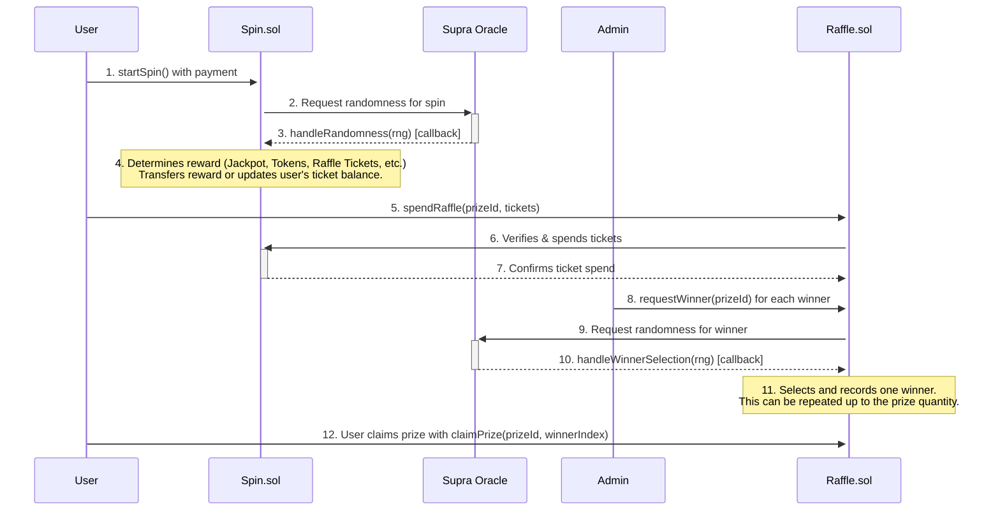

# Daily Spin & Raffle Contracts

This document provides a technical overview of the `Spin.sol` and `Raffle.sol` smart contracts, which together create a gamified daily spin and raffle system.

## High-Level Overview

The daily spin is a feature where users pay a fee to spin a virtual wheel once per day for a chance to win various rewards, including raffle tickets. These tickets can then be used in a separate raffle system to win larger prizes. The system is built around two main contracts, `Spin.sol` and `Raffle.sol`, and uses the Supra oracle for verifiable on-chain randomness.

The overall process can be visualized as follows:

---

## 1. The Spin Contract (`Spin.sol`)

This is the core of the feature. It manages the user's ability to spin, the rewards, and the daily streak mechanic.

### Spinning Process

-   **Initiation**: A user calls the `startSpin()` function, sending a payment equal to the `spinPrice`.
-   **Cooldown**: The `canSpin` modifier ensures a user can only spin once per calendar day. This check is bypassed for whitelisted addresses. An attempt to spin more than once a day will result in an `AlreadySpunToday` error.
-   **Randomness**: The contract requests a random number from the Supra oracle. The spin is considered "pending" until the oracle returns a value.
-   **Reward Callback**: The Supra oracle calls `handleRandomness()` with the random number. This function is protected against re-entrancy and can only be called by the trusted oracle address.

### Rewards & Probabilities

The random number determines the user's reward. The rewards are checked in a specific order:

-   **Jackpot**: This is the top prize.
    -   **Eligibility**: To win the jackpot, a user must have a sufficient "daily streak". The required streak increases each week of the campaign (e.g., 2 consecutive days for week 1, 3 for week 2).
    -   **Weekly Limit**: The `lastJackpotClaimWeek` variable ensures that only one jackpot can be claimed by any user per week. If a user hits the jackpot odds but someone has already won that week, they receive "Nothing" instead.
-   **Plume Token**: The user receives a small, fixed amount of PLUME tokens, which are transferred directly to their wallet.
-   **Raffle Ticket**: The user gains raffle tickets. The amount is calculated as `baseRaffleMultiplier` \* `streakCount`, rewarding consistent players with more tickets. The logic correctly calculates the reward based on the user's streak *after* accounting for any breaks, ensuring fairness.
-   **PP (Plume Points)**: The user is awarded a fixed amount of "PP". The contract tracks `PPGained`, but their utility is defined outside of these contracts.
-   **Nothing**: The user receives no reward but still maintains their daily streak.

### Daily Streak (`streakCount`)

The contract calculates a user's streak of consecutive daily spins.
-   Spinning on consecutive calendar days increases the streak.
-   Missing a day resets the streak to `1` upon the next spin.
-   The streak is a key component for jackpot eligibility and increases the number of raffle tickets won. The tests in `test/Spin.t.sol` confirm this is based on calendar days, not 24-hour periods.

---

## 2. The Raffle Contract (`Raffle.sol`)

This contract allows users to spend the raffle tickets they've earned from the Spin contract to enter drawings for prizes that can have **multiple winners**.

### Raffle Process

-   **Prize Management**: An admin can call `addPrize` and `editPrize`. A critical parameter is `quantity`, which defines how many winners a single prize can have.
-   **Entering a Raffle**: A user calls `spendRaffle(prizeId, ticketAmount)` to enter a specific prize drawing. The `Raffle` contract communicates with the `Spin` contract to verify the user has enough `raffleTicketsBalance` and then to deduct the spent amount.

### Multi-Winner Selection

Winner selection is an admin-initiated process that can be repeated for each available prize slot. It is designed to be fair and transparent.

1.  **Request**: The admin calls `requestWinner(prizeId)`. This can be done as long as the number of `winnersDrawn` is less than the prize `quantity`.
2.  **Oracle Callback**: The function requests a random number from the Supra oracle. The oracle's callback, `handleWinnerSelection`, receives the random number and performs a binary search on the ticket entries to find the winner.
3.  **Recording Winner**: The winner's address, their winning ticket number, and the timestamp are stored in the `prizeWinners` array for that prize. The `setWinner` function has been deprecated and removed in favor of this direct approach.
4.  **Repeat**: This process can be repeated by the admin until the `quantity` of winners for that prize has been drawn. Once `winnersDrawn == quantity`, the prize automatically becomes inactive.

### Claiming a Prize (Multi-Winner Aware)

-   **Individual Claims**: Each winner must call `claimPrize(prizeId, winnerIndex)` to claim their specific prize. Since a prize can have multiple winners, the `winnerIndex` (starting from 0) is used to identify which winning slot is being claimed.
-   **Independent Status**: Each winner's claim status is tracked independently. One user claiming their prize has no effect on the ability of other winners to claim theirs. The actual delivery of the prize is handled off-chain.
---

## 3. Technical Details

This section provides a reference for the key functions, events, and errors in each contract.

### `Spin.sol`

#### **Key Functions**
-   `startSpin()`: User-callable function to initiate a spin by sending the required `spinPrice`.
-   `handleRandomness(uint256 nonce, uint256[] memory rngList)`: The callback function for the Supra oracle. It processes the spin result, calculates rewards, and updates the user's state. Can only be called by the `SUPRA_ROLE`.
-   `spendRaffleTickets(address user, uint256 amount)`: Allows the `Raffle` contract to deduct tickets from a user's balance. Can only be called by the registered `raffleContract`.
-   `currentStreak(address user)`: A view function to get a user's current consecutive daily spin streak.
-   `getUserData(address user)`: A view function that returns a comprehensive struct of a user's spin-related data, including streak, tickets, and rewards.
-   `set...()`: Various admin-only functions to configure the contract, such as `setJackpotProbabilities`, `setSpinPrice`, and `setRaffleContract`.

#### **Events**
-   `SpinRequested(uint256 indexed nonce, address indexed user)`: Emitted when a user successfully initiates a spin.
-   `SpinCompleted(address indexed walletAddress, string rewardCategory, uint256 rewardAmount)`: Emitted after the oracle callback is processed, detailing the reward.
-   `RaffleTicketsSpent(address indexed walletAddress, uint256 ticketsUsed, uint256 remainingTickets)`: Emitted when the `Raffle` contract spends a user's tickets.
-   `NotEnoughStreak(string message)`: Emitted if a user meets the odds for a jackpot but does not have the required streak count.
-   `JackpotAlreadyClaimed(string message)`: Emitted if a user meets the odds for a jackpot but it has already been won that week.

#### **Errors**
-   `AlreadySpunToday()`: Reverts if a user tries to spin more than once in a calendar day.
-   `CampaignNotStarted()`: Reverts if `startSpin()` is called before the campaign is enabled by an admin.
-   `InvalidNonce()`: Reverts if the `handleRandomness` callback receives a nonce that does not correspond to a pending spin.
-   `SpinRequestPending(address user)`: Reverts if a user tries to `startSpin()` while another spin is already pending an oracle callback.

---

### `Raffle.sol`

#### **Key Functions**
-   `spendRaffle(uint256 prizeId, uint256 ticketAmount)`: User-callable function to spend raffle tickets and enter a prize drawing.
-   `requestWinner(uint256 prizeId)`: Admin-only function to initiate the winner selection process for a specific prize.
-   `handleWinnerSelection(uint256 requestId, uint256[] memory rng)`: The callback function for the Supra oracle. It finds and records a winner for the prize associated with the request.
-   `claimPrize(uint256 prizeId, uint256 winnerIndex)`: User-callable function for a winning user to claim their prize. The `winnerIndex` specifies which of the multiple winning slots they are claiming.
-   `addPrize(...)`, `editPrize(...)`, `removePrize(...)`: Admin-only functions for managing prize details.
-   `getPrizeDetails(...)`: View function to get all public details about a specific prize, including ticket counts and number of winners drawn.
-   `getPrizeWinners(uint256 prizeId)`: View function to get an array of all the `Winner` structs for a prize.
-   `getUserWinnings(address user)`: View function to get an array of prize IDs that a specific user has won.

#### **Events**
-   `PrizeAdded(uint256 indexed prizeId, string name)`: Emitted when a new prize is created.
-   `TicketSpent(address indexed user, uint256 indexed prizeId, uint256 tickets)`: Emitted when a user successfully spends tickets on a prize.
-   `WinnerRequested(uint256 indexed prizeId, uint256 indexed requestId)`: Emitted when an admin requests a winner to be drawn.
-   `WinnerSelected(uint256 indexed prizeId, address indexed winner, uint256 winningTicketIndex)`: Emitted when the oracle callback successfully selects and records a winner.
-   `PrizeClaimed(address indexed user, uint256 indexed prizeId, uint256 winnerIndex)`: Emitted when a winner successfully claims their prize.

#### **Errors**
-   `AllWinnersDrawn()`: Reverts if `requestWinner` is called after all available winner slots for a prize have been filled.
-   `EmptyTicketPool()`: Reverts if `requestWinner` is called for a prize that has no ticket entries.
-   `InsufficientTickets()`: Reverts if a user tries to spend more raffle tickets than they have.
-   `WinnerNotDrawn()`: Reverts if a user tries to claim a prize before the winner selection process is complete.
-   `NotAWinner()`: Reverts if a user tries to claim a prize they did not win.
-   `WinnerClaimed()`: Reverts if a winner tries to claim the same prize slot more than once.
-   `WinnerRequestPending(uint256 prizeId)`: Reverts if `requestWinner` is called for a prize that already has a pending VRF request.