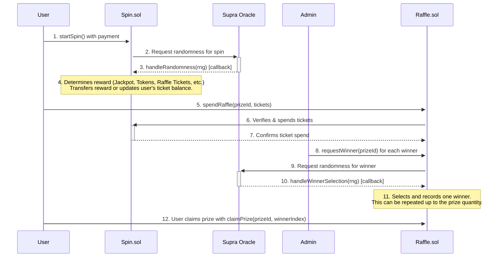
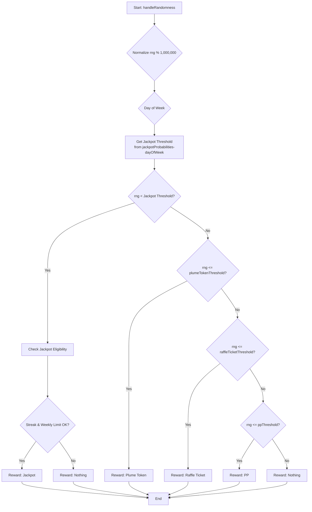

# Daily Spin & Raffle Contracts

> [!TIP]
> **The Daily Spin is now live on Plume!**
> Try it out here: [https://portal.plume.org/daily-spin](https://portal.plume.org/daily-spin)

This document provides a technical overview of the `Spin.sol` and `Raffle.sol` smart contracts, which together create a gamified daily spin and raffle system.

## Table of Contents
1.  [High-Level Overview](#high-level-overview)
2.  [The Spin Contract (`Spin.sol`)](#1-the-spin-contract-spin.sol)
    -   [Spinning Process](#spinning-process)
    -   [Reward Determination Logic](#reward-determination-logic)
    -   [Daily Streak Mechanic](#daily-streak-mechanic)
    -   [`Spin.sol` Technical Reference](#spin.sol-technical-reference)
3.  [The Raffle Contract (`Raffle.sol`)](#2-the-raffle-contract-raffle.sol)
    -   [Raffle Process](#raffle-process)
    -   [Multi-Winner Selection](#multi-winner-selection)
    -   [Claiming a Prize](#claiming-a-prize-multi-winner-aware)
    -   [`Raffle.sol` Technical Reference](#raffle.sol-technical-reference)

## High-Level Overview

The daily spin is a feature where users pay a fee to spin a virtual wheel once per day for a chance to win various rewards, including raffle tickets. These tickets can then be used in a separate raffle system to win larger prizes. The system is built around two main contracts, `Spin.sol` and `Raffle.sol`, and uses the Supra oracle for verifiable on-chain randomness.

The overall process can be visualized as follows:



---

## 1. The Spin Contract (`Spin.sol`)

This is the core of the feature. It manages the user's ability to spin, the rewards, and the daily streak mechanic.

### Spinning Process

-   **Initiation**: A user calls the `startSpin()` function, sending a payment equal to the `spinPrice`.
-   **Cooldown**: The `canSpin` modifier ensures a user can only spin once per calendar day. This check is bypassed for whitelisted addresses. An attempt to spin more than once a day will result in an `AlreadySpunToday` error.
-   **Randomness**: The contract requests a random number from the Supra oracle. The spin is considered "pending" until the oracle returns a value.
-   **Reward Callback**: The Supra oracle calls `handleRandomness()` with the random number. This function is protected against re-entrancy and can only be called by the trusted oracle address.

### Reward Determination Logic

The `determineReward` function uses a multi-stage process to assign a reward based on a pseudo-random number (`rng`) from the Supra oracle. The `rng` is normalized to a value between 0 and 999,999.



**Reward Tiers & Probabilities:**

| Reward Category | Probability Logic | Notes |
| :--- | :--- |:---|
| **Jackpot** | `rng < jackpotProbabilities-dayOfWeek` | The probability changes daily. Requires passing additional eligibility checks. |
| **Plume Token** | `rng <= plumeTokenThreshold` | A fixed amount of PLUME tokens. |
| **Raffle Ticket** | `rng <= raffleTicketThreshold` | Amount is `baseRaffleMultiplier * streakCount`. |
| **PP** | `rng <= ppThreshold` | A fixed amount of Plume Points. |
| **Nothing** | `rng > ppThreshold` | The default outcome if no other tier is met. |

**Jackpot Eligibility:**
Even if a user's `rng` falls within the jackpot range, they must meet two additional criteria:
1.  **Weekly Limit**: Only one jackpot can be won per campaign week across all users. The `lastJackpotClaimWeek` variable prevents further jackpot rewards within the same week. If this check fails, the reward defaults to "Nothing".
2.  **Streak Requirement**: The user's `streakCount` must be greater than or equal to `currentWeek + 2`. This means the required streak to be eligible for the jackpot increases as the campaign progresses. If this check fails, the reward also defaults to "Nothing".

### Daily Streak Mechanic

The contract calculates a user's streak of consecutive daily spins to reward consistent engagement. The core logic resides in the internal `_computeStreak` function.

- **Calculation**: The streak is based on calendar days, not 24-hour periods. This is achieved by dividing the `lastSpinTimestamp` and `block.timestamp` by `SECONDS_PER_DAY` (86,400) and comparing the resulting day numbers.
    - If `today == lastDaySpun`, the streak is unchanged.
    - If `today == lastDaySpun + 1`, the streak is incremented.
    - If `today > lastDaySpun + 1`, the streak is considered broken and resets to `1` (for the current day's spin).
- **Impact**: The `streakCount` directly multiplies the number of raffle tickets awarded, significantly increasing rewards for daily players. It is also a critical requirement for jackpot eligibility.

---
### `Spin.sol` Technical Reference

#### **Key Functions**
| Function | Description | Access |
|:---|:---|:---|
| `startSpin()` | User-callable function to initiate a spin by sending the required `spinPrice`. | Public |
| `handleRandomness(...)` | The callback function for the Supra oracle. Processes the spin result and updates user state. | `SUPRA_ROLE` |
| `spendRaffleTickets(...)` | Allows the `Raffle` contract to deduct tickets from a user's balance. | `raffleContract` only |
| `pause()` / `unpause()` | Pauses or unpauses the `startSpin` functionality. | `ADMIN_ROLE` |
| `adminWithdraw(...)` | Allows admin to withdraw PLUME tokens from the contract balance. | `ADMIN_ROLE` |
| `cancelPendingSpin(address user)` | Escape hatch to cancel a user's spin request that is stuck pending an oracle callback. | `ADMIN_ROLE` |
| `set...()` functions | A suite of functions (`setSpinPrice`, `setRaffleContract`, etc.) for configuring contract parameters. | `ADMIN_ROLE` |
| `currentStreak(address user)` | View function to get a user's current consecutive daily spin streak. | Public View |
| `getUserData(address user)` | View function that returns a comprehensive struct of a user's spin-related data. | Public View |
| `getWeeklyJackpot()` | View function to get the current week's jackpot prize and required streak. | Public View |

#### **Events**
-   `SpinRequested(uint256 indexed nonce, address indexed user)`: Emitted when a user successfully initiates a spin.
-   `SpinCompleted(address indexed walletAddress, string rewardCategory, uint256 rewardAmount)`: Emitted after the oracle callback is processed, detailing the reward.
-   `RaffleTicketsSpent(address indexed walletAddress, uint256 ticketsUsed, uint256 remainingTickets)`: Emitted when the `Raffle` contract spends a user's tickets.
-   `NotEnoughStreak(string message)`: Emitted if a user meets the odds for a jackpot but does not have the required streak count.
-   `JackpotAlreadyClaimed(string message)`: Emitted if a user meets the odds for a jackpot but it has already been won that week.

#### **Errors**
-   `AlreadySpunToday()`: Reverts if a user tries to spin more than once in a calendar day.
-   `CampaignNotStarted()`: Reverts if `startSpin()` is called before the campaign is enabled by an admin.
-   `InvalidNonce()`: Reverts if the `handleRandomness` callback receives a nonce that does not correspond to a pending spin.
-   `SpinRequestPending(address user)`: Reverts if a user tries to `startSpin()` while another spin is already pending an oracle callback.

---

## 2. The Raffle Contract (`Raffle.sol`)

This contract allows users to spend the raffle tickets they've earned from the Spin contract to enter drawings for prizes that can have **multiple winners**.

### Raffle Process

-   **Prize Management**: An admin can call `addPrize` and `editPrize`. A critical parameter is `quantity`, which defines how many winners a single prize can have.
-   **Entering a Raffle**: A user calls `spendRaffle(prizeId, ticketAmount)` to enter a specific prize drawing. The `Raffle` contract communicates with the `Spin` contract to verify the user has enough `raffleTicketsBalance` and then to deduct the spent amount.

### Multi-Winner Selection

Winner selection is an admin-initiated process that can be repeated for each available prize slot. It is designed to be fair and transparent.

1.  **Request**: The admin calls `requestWinner(prizeId)`. This can be done as long as the number of `winnersDrawn` is less than the prize `quantity`.
2.  **Oracle Callback**: The function requests a random number from the Supra oracle. The oracle's callback, `handleWinnerSelection`, receives the random number and performs a binary search on the ticket entries to find the winner.
3.  **Recording Winner**: The winner's details are stored in the `prizeWinners` array for that prize.
4.  **Repeat**: This process can be repeated by the admin until the `quantity` of winners for that prize has been drawn. Once `winnersDrawn == quantity`, the prize automatically becomes inactive.

### Claiming a Prize (Multi-Winner Aware)

-   **Individual Claims**: Each winner must call `claimPrize(prizeId, winnerIndex)` to claim their specific prize. Since a prize can have multiple winners, the `winnerIndex` (starting from 0) is used to identify which winning slot is being claimed.
-   **Independent Status**: Each winner's claim status is tracked independently. One user claiming their prize has no effect on the ability of other winners to claim theirs. The actual delivery of the prize is handled off-chain.

---
### `Raffle.sol` Technical Reference

#### Data Structures

**`Prize` Struct**
```solidity
struct Prize {
    string name;
    string description;
    uint256 value;
    uint256 endTimestamp;
    bool isActive;
    uint256 quantity;
    // --- Deprecated Fields ---
    address winner;
    uint256 winnerIndex;
    bool claimed;
}
```
> *Note: The `winner`, `winnerIndex`, and `claimed` fields on the `Prize` struct are deprecated and are no longer used in favor of the multi-winner `prizeWinners` mapping.*

**`Winner` Struct**
```solidity
struct Winner {
    address winnerAddress;
    uint256 winningTicketIndex;
    uint256 drawnAt;
    bool claimed;
}
```

#### **Key Functions**
| Function | Description | Access |
|:---|:---|:---|
| `spendRaffle(prizeId, ticketAmount)` | User-callable function to spend raffle tickets and enter a prize drawing. | Public |
| `requestWinner(prizeId)` | Initiates the winner selection process for a specific prize. | `ADMIN_ROLE` |
| `handleWinnerSelection(...)` | The callback from the Supra oracle. Finds and records a winner. | `SUPRA_ROLE` |
| `claimPrize(prizeId, winnerIndex)` | User-callable for a winner to claim their prize slot. | Public |
| `addPrize(...)` / `editPrize(...)` / `removePrize(...)` | Functions for managing prize details. | `ADMIN_ROLE` |
| `setPrizeActive(prizeId, active)` | Manually activates or deactivates a prize. | `ADMIN_ROLE` |
| `cancelWinnerRequest(prizeId)` | Escape hatch to cancel a pending VRF request for a winner drawing. | `ADMIN_ROLE` |
| `getPrizeDetails(...)` | View function to get all public details about a specific prize. | Public View |
| `getPrizeWinners(prizeId)` | View function to get an array of all the `Winner` structs for a prize. | Public View |
| `getUserWinnings(address user)` | View function to get an array of prize IDs that a specific user has won. | Public View |

#### **Events**
-   `PrizeAdded(uint256 indexed prizeId, string name)`: Emitted when a new prize is created.
-   `PrizeEdited(uint256 indexed prizeId, ...)`: Emitted when an existing prize is modified via `editPrize`.
-   `TicketSpent(address indexed user, uint256 indexed prizeId, uint256 tickets)`: Emitted when a user successfully spends tickets on a prize.
-   `WinnerRequested(uint256 indexed prizeId, uint256 indexed requestId)`: Emitted when an admin requests a winner to be drawn.
-   `WinnerSelected(uint256 indexed prizeId, address indexed winner, uint256 winningTicketIndex)`: Emitted when the oracle callback successfully selects and records a winner.
-   `PrizeClaimed(address indexed user, uint256 indexed prizeId, uint256 winnerIndex)`: Emitted when a winner successfully claims their prize.

#### **Errors**
-   `AllWinnersDrawn()`: Reverts if `requestWinner` is called after all available winner slots for a prize have been filled.
-   `EmptyTicketPool()`: Reverts if `requestWinner` is called for a prize that has no ticket entries.
-   `InsufficientTickets()`: Reverts if a user tries to spend more raffle tickets than they have.
-   `WinnerNotDrawn()`: Reverts if a user tries to claim a prize before the winner selection process is complete for that slot.
-   `NotAWinner()`: Reverts if a user tries to claim a prize they did not win.
-   `WinnerClaimed()`: Reverts if a winner tries to claim the same prize slot more than once.
-   `WinnerRequestPending(uint256 prizeId)`: Reverts if `requestWinner` is called for a prize that already has a pending VRF request.