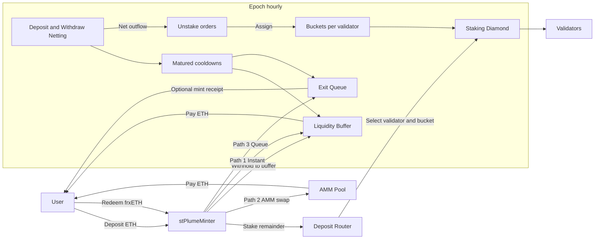
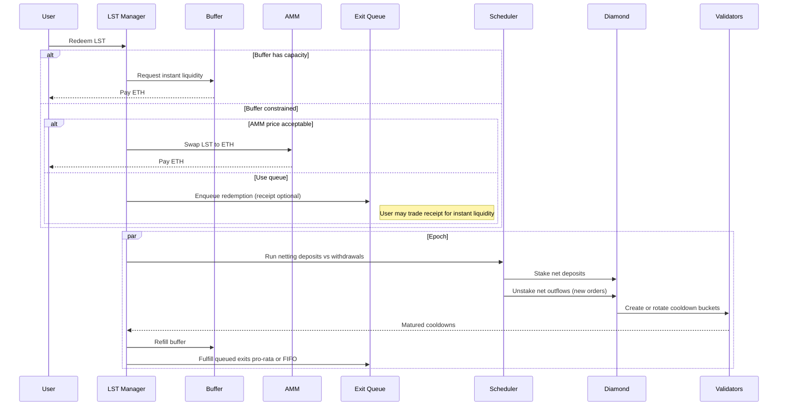

# Plume LST integration

This folder contains the LST contracts that integrate with the Plume Staking diamond using a bucket based bus model for predictable exits, buffer backed instant redemptions, and keeper friendly operations.

## Table of contents
- [Overview](#overview)
- [Architecture](#architecture)
  - [Components](#components)
  - [Key flows](#key-flows)
  - [Anti merge bus model](#anti-merge-bus-model)
- [Policy and parameters](#policy-and-parameters)
- [Unstake timing](#unstake-timing)
- [Roles and permissions](#roles-and-permissions)
- [Recommended parameters](#recommended-parameters)
- [Failure modes and safety](#failure-modes-and-safety)
- [Monitoring and alerts](#monitoring-and-alerts)
- [Production checklist](#production-checklist)
- [Optional AMM path (if enabled)](#optional-amm-path-if-enabled)
- [Public API (stPlumeMinter excerpts)](#public-api-stplumeminter-excerpts)
  - [Buckets and registry](#buckets-and-registry)
  - [Buffer and queue operations](#buffer-and-queue-operations)
  - [Keeper views](#keeper-views)
  - [Policy and params (admin)](#policy-and-params-admin)
- [Getting started](#getting-started)
- [Keeper runbook](#keeper-runbook)
- [Scripts](#scripts)
  - [Bucket deployment (example)](#bucket-deployment-example)
- [Observability](#observability)
- [What’s new vs the original LST code](#whats-new-vs-the-original-lst-code)
- [Testing](#testing)

## Overview
- No changes to the staking diamond; all integration logic is LST side.
- Buckets provide independent cooldown slots per validator to avoid cooldown merges.
- Minter maintains a liquidity buffer and supports FIFO or pro rata fulfillment.
- Keepers handle claims, sweeps, and fulfils in bounded batches.

## Architecture
### Components
- stPlumeMinter: deposits, buffer, batching, bucket scheduling, queue fulfilment.
- stPlumeRewards: receives native rewards and accounts them to holders.
- StakerBucket: minimal account that stakes, unstakes, withdraws, and restakes with the diamond, forwarding matured funds to the minter.
- Scripts under [`plume/script/lst`](../../script/lst/): setup, validator sync, bucket deployment, claims, sweeps, and fulfils.

### Key flows
- Deposit: user sends ETH -> frxETH minted -> withholdRatio seeds buffer -> remainder staked via validator and bucket routing.
- Rewards: keeper calls claim or claimAll on the diamond and minter loads rewards into stPlumeRewards.
- Unstake: requests queued per validator; when threshold or timer hits, minter selects an available bucket to call unstake. After cooldown, bucket withdraws to minter, refilling buffer; keeper fulfils queue from buffer (FIFO or pro rata).

### Anti merge bus model
- Diamond has one cooldown slot per address and validator. Buckets create independent slots. Minter never re uses a bucket for unstake until its previous cooldown matures.

## Policy and parameters
- Fees: instant and standard.
- Buffer: withholdRatio, utilization guard (pause and threshold).
- Batching: withdrawalQueueThreshold and batchUnstakeInterval (set close to diamond cooldown plus small buffer).

## Unstake timing
### TL;DR
- Instant: seconds, if buffer capacity and policy allow (may be partial).
- AMM: seconds, if enabled and price is within slippage limits.
- Standard queue: T_exit ≈ T_to_batch + cooldownInterval + T_keeper.

### Standard queue explained
- T_to_batch: time until your validator’s next batch is placed. Triggered by reaching `withdrawalQueueThreshold` or by the periodic `batchUnstakeInterval` (worst case you just missed the last batch, so ≤ batchUnstakeInterval). If all buckets for that validator are currently cooling, the batch waits until the earliest `nextAvailableTime` across buckets (generally bounded by your ladder spacing/safety buffer).
- cooldownInterval: the staking diamond’s cooldown (e.g., 21 days on mainnet deployments).
- T_keeper: sweep and fulfill latency, typically one keeper cycle for `sweepMaturedBuckets(...)` followed by `fulfillRequests(...)` or `fulfillProRata(...)`.

### Examples
- Example A (typical): cooldown=21d, batchUnstakeInterval=1h, keeper cadence=5m → 0–1h + 21d + 0–10m.
- Example B (partial instant): buffer covers 30% now → 30% paid instantly; remaining 70% follows the standard timeline above.

### Estimating live from views
- Buffer headroom and queued exits: `getBufferAndQueueStats()`
- Bucket readiness per validator: `getBucketAvailabilitySummary(validatorId)`
- Validator processing priority: `getValidatorsToProcess(maxCount)`
- Ops cadence: keeper frequency for sweep/fulfil in your environment

## Roles and permissions
- ADMIN: set fees, minStake, withholdRatio, instant policy, batch thresholds/interval; set rewards sink; grant/revoke roles; add buckets.
- REBALANCER: sweep matured buckets, stake withheld, restake cooled funds if exposed.
- CLAIMER: run `claim/claimAll` and load rewards to `stPlumeRewards` via the minter.
- HANDLER: fulfill queues (`fulfillRequests`, `fulfillProRata`).

## Recommended parameters
- withholdRatio: 10%–30% to start; tune to target instant success rate.
- fees: instant 30–100 bps; standard 0–20 bps.
- withdrawalQueueThreshold: small fixed amount (e.g., 5–20 ETH) or policy based per validator.
- batchUnstakeInterval: ≈ cooldown + small buffer to avoid bucket merge; ladder buckets to smooth cadence.
- keeper cadence: 3–10 minutes for sweep/fulfil; claims hourly or daily.

## Failure modes and safety
- Buffer depletion/paused instant: requests fall back to AMM (if enabled) or queue; increase withholdRatio or run sweeps.
- All buckets cooling: next batch waits for earliest `nextAvailableTime`; increase bucket count if sustained.
- Queue growth: raise cadence/thresholds, add buckets, or temporarily increase withholdRatio.
- RPC/backfill failures: keepers are idempotent; retry small bounded batches.

## Monitoring and alerts
- Buffer headroom below X ETH or Y% of queued exits.
- Matured but unswept buckets > N or oldest matured age > T.
- Queue growth rate and tail age per validator.
- Last sweep/fulfil timestamps; keeper error rates.

## Production checklist
- Preflight on fork: deploy minter/rewards, sync validators, deploy buckets, set params, dry run keepers.
- Post‑deploy: verify views (buffers, queues, buckets), small live deposit/exit, start keepers.
- Rollback: ability to pause instant, lower thresholds, and stop keepers.

## Optional AMM path (if enabled)
- When buffer is insufficient and instant is desired, route via AMM under slippage caps and policy flags.
- Not required for core operation; default deployments may omit AMM wiring.

## Public API (stPlumeMinter excerpts)
### Buckets and registry
- `addBuckets(uint16 validatorId, uint256 count)`
- `getBuckets(uint16 validatorId) -> BucketInfo[]`
- `getBucketAvailabilitySummary(uint16 validatorId) -> (totalBuckets, availableNow, nextAvailableTs)`

### Buffer and queue operations
- `sweepMaturedBuckets(uint16 validatorId, uint256 maxToSweep) -> (swept, gainedTotal)`
- `fulfillRequests(address[] users, uint256[] ids) -> (processed, totalPaid)`
- `fulfillProRata(address[] users, uint256[] ids, uint256 maxSpend) -> (spent, processed, totalPaid)`

### Keeper views
- `getBufferAndQueueStats() -> (buffer, reserved, unstakedTotal, headroom, totalQueued)`
- `getReadyRequestsForUser(address user, uint256 startId, uint256 maxItems)`
- `getValidatorsToProcess(uint256 maxCount)`

### Policy and params (admin)
- `setFees(uint256 instantFeeBps, uint256 standardFeeBps)`
- `setInstantPolicy(bool pause, uint256 utilizationThresholdBps)`
- `setBatchUnstakeParams(uint256 threshold, uint256 interval)`
- `setMinStake(uint256 minStake)` (must be >= diamond min stake)
- `setWithholdRatio(uint256 ratio)` (seeds buffer, inherited from frxETHMinter)
- Roles: `REBALANCER_ROLE`, `CLAIMER_ROLE`, `HANDLER_ROLE`

## Getting started
1) Deploy or point to an existing Plume Staking diamond with validators, treasury, and reward token configured.
2) Deploy stPlumeMinter and stPlumeRewards. Initialize minter with diamond address and set stPlumeRewards.
3) Run `SyncValidators.s.sol` to mirror diamond validators into minter registry.
4) Run `DeployBuckets.s.sol` to append N buckets per validator (start small, e.g., 2 or 3).
5) Run `SetupRolesAndParams.s.sol` to grant roles and set fees, withholdRatio, thresholds, interval, minStake, and instant policy.
6) Fund user deposits to mint frxETH; verify deposits route to buckets and buffer grows.
7) Start keepers:
   - `Claimer.s.sol` to claim and load rewards periodically.
   - `FulfillAndSweep.s.sol` to sweep matured buckets and fulfill bounded FIFO slices.
8) Monitor via views: buffer and queue stats, bucket availability, validators to process.

## Keeper runbook
1) Prioritize: `getValidatorsToProcess(maxCount)`
2) Sweep: `sweepMaturedBuckets(validatorId, maxToSweep)` with small caps
3) Slice: `getReadyRequestsForUser(user, startId, maxItems)` off chain for multiple users
4) Fulfil: `fulfillRequests` (FIFO) or `fulfillProRata` with utilization guard
5) Batch exits: minter will enforce scheduling and bucket selection; call periodically per validator

## Scripts
- `DeployBuckets.s.sol`: append buckets per validator
- `SyncValidators.s.sol`: copy validator IDs from diamond into minter registry
- `FulfillAndSweep.s.sol`: sweep matured buckets and fulfill a small FIFO slice
- `SetupRolesAndParams.s.sol`: assign roles and configure fees, thresholds, interval, buffer
- `Claimer.s.sol`: run claimAll and load rewards into stPlumeRewards

### Bucket deployment (example)
Env:
```
STPLUME_MINTER=0xYourMinter
VALIDATOR_IDS=1001,1002
BUCKETS_PER_VALIDATOR=3
```
Run:
```
forge script plume/script/lst/DeployBuckets.s.sol:DeployBuckets --rpc-url $RPC --broadcast -vvvv
```

## Observability
- Buffer and queue: `getBufferAndQueueStats()`
- Buckets: `getBucketAvailabilitySummary(validatorId)`
- Requests: `getReadyRequestsForUser(user, startId, maxItems)`
- Priorities: `getValidatorsToProcess(maxCount)`

## What’s new vs the original LST code
- Bucket based bus model to avoid cooldown merges and enable predictable exit cadence
- Queue aware exits with per validator counters and gated bucket reuse until maturity
- Buffer first redemption with pause and utilization threshold; FIFO and pro rata payoff modes
- Keeper friendly views and bounded batch scripts for operations
- Strict LST side integration; diamond and rewards logic are untouched

## Testing
- Example scaffold in `test/lst/KeeperFlow.t.sol` covers validator sync, bucket creation, sweeps, FIFO and pro rata fulfillment
Run:
```
forge test --match-contract KeeperFlowTest -vvvv
```



- Bucketized bus model (LST-only)
  - Add `StakerBucket` (minimal ownable contract) that can stake/unstake/withdraw/restake with the diamond and forwards withdrawals to `stPlumeMinter`.
  - Add `BucketFactory` (CREATE2 or clones) to deploy and catalog bucket instances.

- stPlumeMinter edits (no diamond edits)
  - Storage
    - Per validator: `Bucket[]` (address bucket, uint256 nextAvailableTime, uint256 activeStake, uint256 coolingAmount).
    - Views to expose per-validator bucket state and schedules.
  - Admin
    - `configureBuckets(validatorId, count)` to create/retire buckets via factory.
    - Sync function to mirror diamond validator set to local registry.
  - Stake bus
    - Accumulate deposits; pick `(validatorId, bucketIndex)` by capacity and minStake, then `bucket.stake{value:amount}(validatorId)`.
  - Exit bus (anti-merge)
    - On threshold/time, choose a bucket whose `nextAvailableTime` ≤ now; call `bucket.unstake(validatorId, amount)`.
    - After calling `unstake`, set `nextAvailableTime = block.timestamp + diamond.getCooldownInterval() + safetyBuffer`.
    - Never call `unstake` on the same `(bucket, validator)` before maturity (prevents cooldown merges).
  - Maturity and refill
    - Keeper calls `bucket.withdraw()` once matured; `receive()` on minter credits ETH, refills `currentWithheldETH`, fulfills queue, updates `totalInstantUnstaked/totalUnstaked`.
  - Routing policy
    - Extend `getNextValidator` to also choose a bucket by capacity, bucket availability, and local per-validator percentage caps.
  - Invariants and guards
    - Enforce `currentWithheldETH >= totalInstantUnstaked`.
    - Validate bucket not reused before maturity.
    - Keep `batchUnstakeInterval ≈ cooldown + small buffer`.

- Buffer, fees, optional AMM
  - Maintain `withholdRatio` target via rebalancer; use instant and standard fees already present.
  - Optional AMM route behind a flag (slippage caps) when buffer insufficient.

- Keepers and cadence
  - Rebalancer: `rebalance()`, `stakeWitheldForValidator`, `restake` matured cooled funds.
  - Claimer: periodic `claim/claimAll` and `_loadRewards` to `stPlumeRewards`.
  - Queue/bus: `processBatchUnstake`, rotate buckets, `withdraw` matured, refill buffer, fulfill queue.

- Observability
  - Views/events: buffer stats, queue per validator, `nextBatchUnstakeTimePerValidator`, per-bucket `nextAvailableTime/active/cooling`, rewards loaded.

- Parameters to set
  - `setMinStake` ≥ diamond minimum; `setBatchUnstakeParams(threshold, interval ≈ cooldown + 1h)`.
  - `setFees`, `withholdRatio`, local `setMaxValidatorPercentage` if desired.

- Tests (LST-only)
  - Deposit routing and stake bus; instant and queued exits; per-bucket anti-merge; maturity withdraw/refill; slashing/inactive validator handling; buffer invariants; AMM fallback (if enabled).

- Scripts
  - Deploy `BucketFactory`, pre-deploy buckets per validator via CREATE2, wire into `stPlumeMinter`.
  - Keep a validator-sync script (diamond → minter registry) and keeper runbooks.





