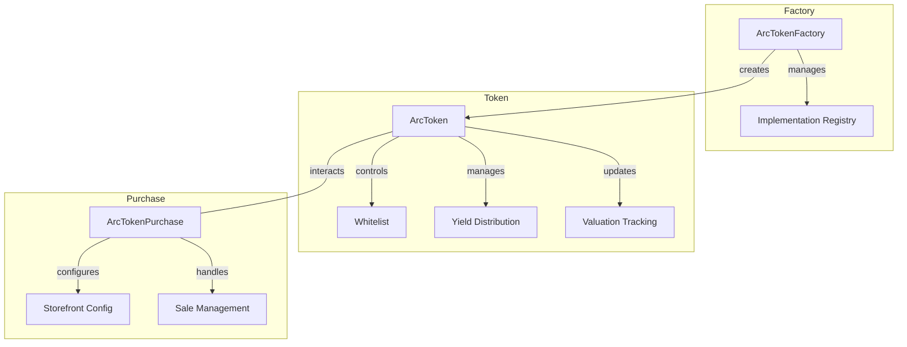
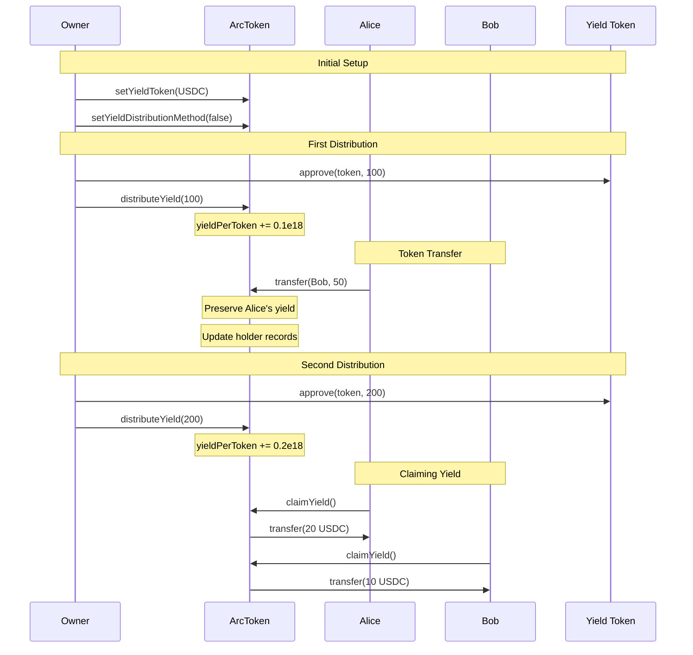
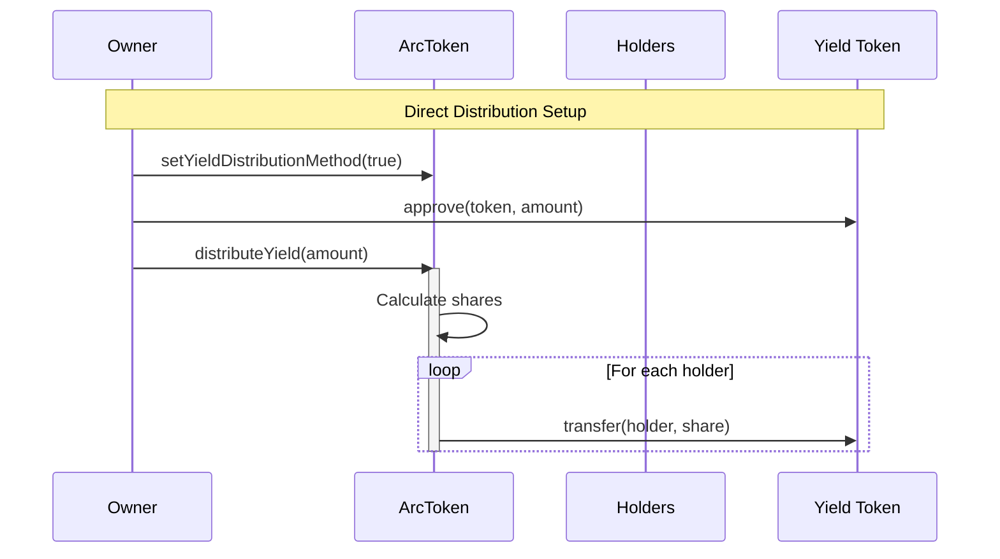

# Arc Token System

A comprehensive token system for representing company shares with built-in yield distribution, whitelisting, and sales functionality.

## Overview

The Arc Token System consists of three main contracts:
1. `ArcToken`: The core ERC20 token contract with yield distribution and transfer restrictions
2. `ArcTokenFactory`: Factory contract for deploying new ArcToken instances
3. `ArcTokenPurchase`: Handles token sales and storefront configuration

## Contracts

### ArcToken

An ERC20 token representing company shares with advanced features:

#### Key Features
- Whitelist-controlled transfers
- Configurable transfer restrictions
- Yield distribution to token holders
- Asset valuation tracking
- Minting/burning by issuer
- Upgradeable design using EIP-7201 namespaced storage

#### Yield Distribution
Supports two distribution methods:
1. **Direct Distribution**: Immediately transfers yield tokens to holders
2. **Claimable Distribution**: Holders must claim their yield

#### Functions

**Initialization**
```solidity
function initialize(
    string memory name_,
    string memory symbol_,
    string memory assetName_,
    uint256 assetValuation_,
    uint256 initialSupply_,
    address yieldToken_
) public initializer
```

**Whitelist Management**
```solidity
function addToWhitelist(address account) external onlyOwner
function batchAddToWhitelist(address[] calldata accounts) external onlyOwner
function removeFromWhitelist(address account) external onlyOwner
function isWhitelisted(address account) external view returns (bool)
```

**Transfer Controls**
```solidity
function setTransfersAllowed(bool allowed) external onlyOwner
function transfersAllowed() external view returns (bool)
```

**Supply Management**
```solidity
function mint(address to, uint256 amount) external onlyOwner
function burn(address from, uint256 amount) external onlyOwner
```

**Yield Distribution**
```solidity
function distributeYield(uint256 amount) external onlyOwner nonReentrant
function claimYield() external nonReentrant
function setYieldToken(address yieldTokenAddr) external onlyOwner
function setYieldDistributionMethod(bool isDirectDistribution) external onlyOwner
```

### ArcTokenFactory

Factory contract for deploying new ArcToken instances with proper initialization.

#### Key Features
- Creates upgradeable token instances using ERC1967 proxy pattern
- Implementation whitelisting for security
- Access control for administrative functions

#### Functions

**Initialization**
```solidity
function initialize(address _initialImplementation) public initializer
```

**Token Creation**
```solidity
function createToken(
    string memory name,
    string memory symbol,
    string memory assetName,
    uint256 assetValuation,
    uint256 initialSupply,
    address yieldToken
) external returns (address)
```

**Implementation Management**
```solidity
function whitelistImplementation(address newImplementation) external onlyRole(DEFAULT_ADMIN_ROLE)
function removeWhitelistedImplementation(address implementation) external onlyRole(DEFAULT_ADMIN_ROLE)
function isImplementationWhitelisted(address implementation) external view returns (bool)
```

### ArcTokenPurchase

Handles token sales and storefront configuration for ArcTokens.

#### Key Features
- Token sale management
- Storefront configuration
- Purchase token management
- Access control for administrative functions

#### Functions

**Sale Management**
```solidity
function enableToken(
    address _tokenContract,
    uint256 _numberOfTokens,
    uint256 _tokenPrice
) external onlyTokenOwner(_tokenContract)

function buy(
    address _tokenContract,
    uint256 _purchaseAmount
) external
```

**Storefront Configuration**
```solidity
function setStorefrontConfig(
    address _tokenContract,
    string memory _domain,
    string memory _title,
    string memory _description,
    string memory _ogImageUrl,
    string memory _accentColor,
    string memory _backgroundColor,
    string memory _companyLogoUrl,
    bool _showPlumeBadge
) external onlyTokenOwner(_tokenContract)
```

## Usage Examples

### 1. Deploying a New Token

```solidity
// 1. Deploy factory
ArcTokenFactory factory = new ArcTokenFactory();
factory.initialize(arcTokenImplementation);

// 2. Create new token
address tokenAddress = factory.createToken(
    "Arc Token",
    "ARC",
    "Company Shares",
    1000000e18, // valuation
    1000e18,    // initial supply
    address(usdc) // yield token
);
```

### 2. Setting Up Token Sale

```solidity
// 1. Enable token for sale
arcTokenPurchase.enableToken(
    tokenAddress,
    100e18,     // tokens for sale
    10e18       // price per token
);

// 2. Configure storefront
arcTokenPurchase.setStorefrontConfig(
    tokenAddress,
    "company.arc",
    "Company Token Sale",
    "Description",
    "image.url",
    "#FFFFFF",
    "#000000",
    "logo.url",
    true
);
```

### 3. Distributing Yield

```solidity
// 1. Set distribution method
arcToken.setYieldDistributionMethod(true); // direct distribution

// 2. Approve yield tokens
yieldToken.approve(address(arcToken), amount);

// 3. Distribute yield
arcToken.distributeYield(amount);
```

## Example Scenario: Yield Distribution Mechanics

Let's walk through a detailed example of how yield distribution and token transfers interact:

### Initial State
```
Total Supply: 1000 tokens
Alice has: 100 tokens (10%)
Bob has: 0 tokens
yieldPerToken = 0
```

### Step 1: First Yield Distribution (100 USDC)
```
Contract distributes 100 USDC yield
yieldPerToken increases by: (100 * 1e18) / 1000 = 0.1e18

Alice's entitlement: 10 USDC (10% of distribution)
Bob's entitlement: 0 USDC (no tokens held)
```

### Step 2: Alice Transfers to Bob
```
Alice transfers 50 tokens to Bob

Before transfer:
- Alice's unclaimed yield: 10 USDC
- Bob's unclaimed yield: 0 USDC

After transfer:
- Alice: 50 tokens, 10 USDC unclaimed (preserves previous yield)
- Bob: 50 tokens, 0 USDC unclaimed (starts fresh)
```

### Step 3: Second Yield Distribution (200 USDC)
```
Contract distributes 200 USDC yield
yieldPerToken increases by: (200 * 1e18) / 1000 = 0.2e18

New yield entitlements:
- Alice: 10 USDC (previous) + (50 tokens * 0.2e18) = 20 USDC
- Bob: 0 USDC (previous) + (50 tokens * 0.2e18) = 10 USDC
```

### Key Points
1. **Yield Preservation**: When tokens are transferred, the sender keeps their unclaimed yield
2. **Fresh Start**: New token recipients start accumulating yield from their acquisition point
3. **Proportional Distribution**: Yield is always distributed proportionally to token holdings
4. **Precision**: All calculations use 1e18 scaling to handle fractional amounts accurately

### Direct vs Claimable Distribution
The above example uses claimable distribution. In direct distribution mode:
- Yield tokens would be immediately transferred to holders
- No need to track unclaimed amounts
- Slightly higher gas costs for distribution but no separate claim step

## Security Considerations

1. **Access Control**
   - Token owner controls minting, burning, and whitelist
   - Factory admin controls implementation whitelisting
   - Purchase contract admin controls purchase token

2. **Transfer Restrictions**
   - Transfers can be restricted to whitelisted addresses
   - Whitelist status checked in transfer hooks

3. **Yield Distribution**
   - Reentrancy protection on yield distribution and claims
   - Accurate accounting during transfers
   - Protection against precision loss

4. **Upgradability**
   - Uses EIP-7201 namespaced storage
   - Implementation whitelisting in factory
   - Proper initialization checks

## Events

### ArcToken Events
```solidity
event WhitelistStatusChanged(address indexed account, bool isWhitelisted)
event TransfersRestrictionToggled(bool transfersAllowed)
event YieldDistributed(uint256 amount, bool directDistribution)
event YieldClaimed(address indexed account, uint256 amount)
event YieldTokenUpdated(address indexed newYieldToken)
event AssetValuationUpdated(uint256 newValuation)
event AssetNameUpdated(string newAssetName)
event YieldDistributionMethodUpdated(bool isDirectDistribution)
```

### Factory Events
```solidity
event TokenCreated(address indexed tokenAddress, address indexed owner, string name, string symbol, string assetName)
event ImplementationWhitelisted(address indexed implementation)
event ImplementationRemoved(address indexed implementation)
```

### Purchase Events
```solidity
event PurchaseMade(address indexed buyer, address indexed tokenContract, uint256 amount, uint256 pricePaid)
event TokenSaleEnabled(address indexed tokenContract, uint256 numberOfTokens, uint256 tokenPrice)
event StorefrontConfigSet(address indexed tokenContract, string domain)
event PurchaseTokenUpdated(address indexed newPurchaseToken)
```

## Development

### Prerequisites
- Solidity ^0.8.25
- OpenZeppelin Contracts
- Node.js and npm/yarn

### Testing
```bash
forge test
```

### Deployment
```bash
forge script scripts/deploy.s.sol:Deploy --rpc-url <your_rpc_url> --broadcast
```

## System Architecture



## Yield Distribution Flow



## Direct Distribution Flow


