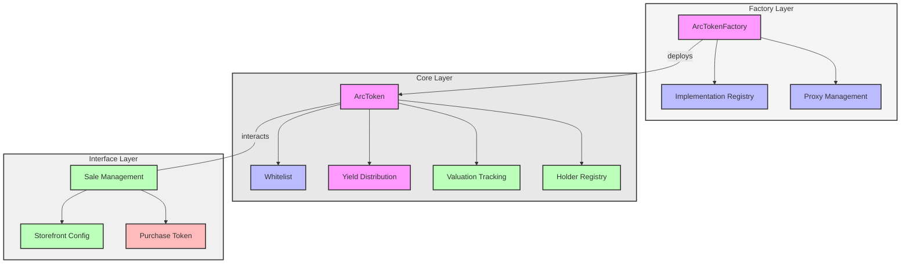
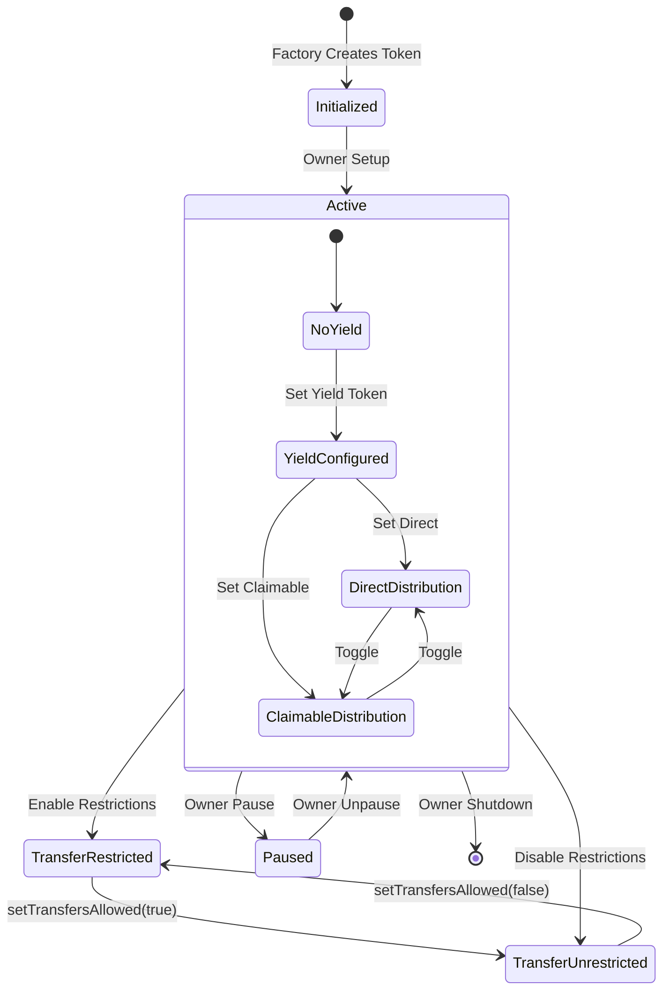
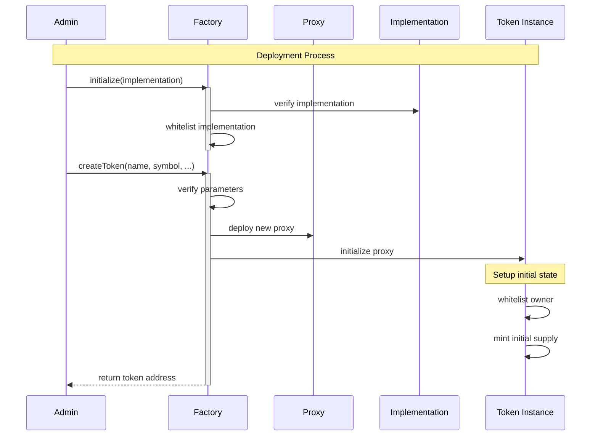
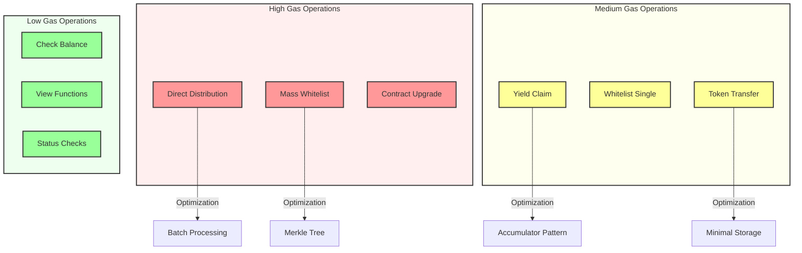
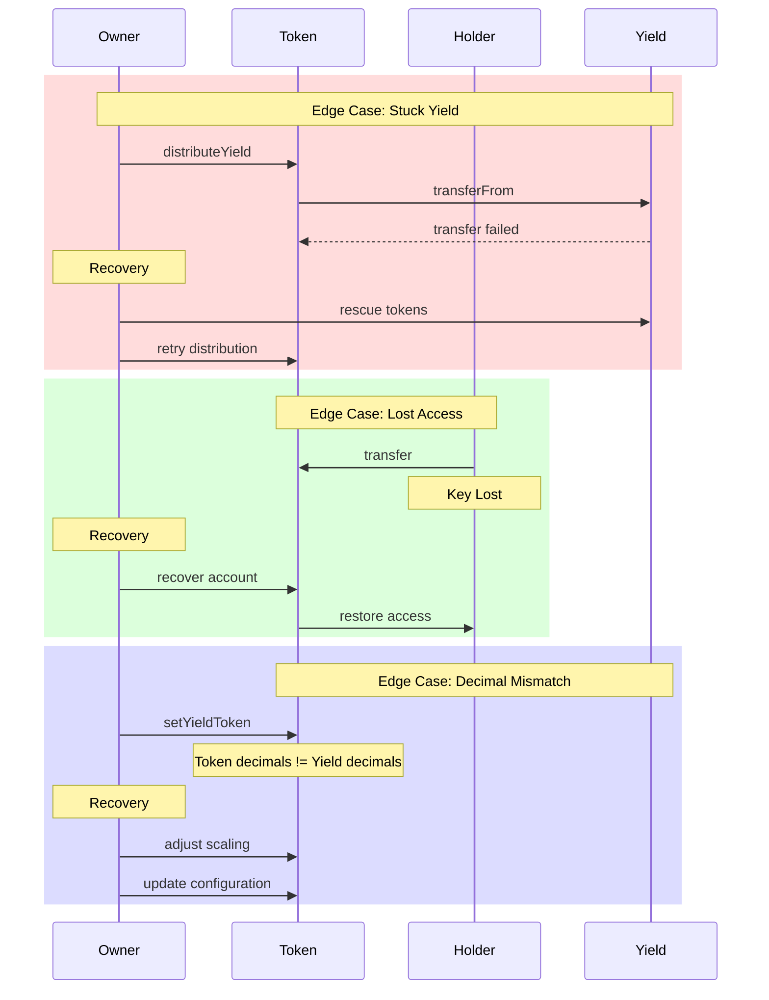

# Arc Token System

A comprehensive token system for representing company shares with built-in yield distribution, whitelisting, and sales functionality.

## Source Files
- [`ArcToken.sol`](src/token/ArcToken.sol) - Core token implementation with yield distribution
- [`ArcTokenFactory.sol`](src/token/ArcTokenFactory.sol) - Factory for deploying new token instances
- [`ArcTokenPurchase.sol`](src/token/ArcTokenPurchase.sol) - Token sale and storefront management

## Table of Contents
1. [Overview](#overview)
2. [Contracts](#contracts)
   - [ArcToken](#arctoken)
   - [ArcTokenFactory](#arctokenfactory)
   - [ArcTokenPurchase](#arctokenpurchase)
3. [Usage Examples](#usage-examples)
   - [Deploying a New Token](#1-deploying-a-new-token)
   - [Setting Up Token Sale](#2-setting-up-token-sale)
   - [Distributing Yield](#3-distributing-yield)
4. [Example Scenario: Yield Distribution Mechanics](#example-scenario-yield-distribution-mechanics)
5. [System Architecture](#system-architecture)
6. [Token Lifecycle](#token-lifecycle)
7. [Token Creation Flow](#token-creation-flow)
8. [Purchase Flow](#purchase-flow)
9. [Error Handling](#error-handling)
10. [Gas Optimization Considerations](#gas-optimization-considerations)
11. [Edge Cases and Recovery](#edge-cases-and-recovery)
12. [Security Considerations](#security-considerations)
13. [Events](#events)
14. [Development](#development)
15. [Testing](#testing)

## Overview

The Arc Token System consists of three main contracts:
1. `ArcToken`: The core ERC20 token contract with yield distribution and transfer restrictions
2. `ArcTokenFactory`: Factory contract for deploying new ArcToken instances
3. `ArcTokenPurchase`: Handles token sales and storefront configuration

## Contracts

### ArcToken

An ERC20 token representing company shares with advanced features:

#### Key Features
- Whitelist-controlled transfers
- Configurable transfer restrictions
- Yield distribution to token holders with historical tracking
- Asset valuation tracking
- Minting/burning by issuer
- Upgradeable design using EIP-7201 namespaced storage
- Token metadata via URI system
- Dynamic redemption price based on holding period
- Custom error messages for improved gas efficiency

#### Financial Metrics
The token implements a time-based accrual system:
- **Issue Price**: Fixed price at which tokens are issued
- **Accrual Rate**: Per-second rate at which token value increases
- **Redemption Price**: Dynamically calculated based on:
  - Base value (issue price)
  - Accrual rate per second
  - Actual holding period (in seconds)

#### Yield Distribution System
The token supports two yield distribution methods:

1. **Direct Distribution**
   - Yield is immediately transferred to holders
   - Distribution based on token balance proportion
   - No accumulation or claiming required
   - Last holder receives remainder for complete distribution

2. **Claimable Distribution**
   - Yield is tracked using global accumulator
   - Users can claim their share at any time
   - Includes unclaimed yield tracking
   - Complete distribution history maintained

**Yield History Tracking**
- All distributions recorded with timestamps
- Accessible via `getYieldHistory()` function
- Returns arrays of dates and amounts
- Useful for auditing and analytics

#### Custom Errors
```solidity
error AlreadyWhitelisted(address account)
error NotWhitelisted(address account)
error YieldTokenNotSet()
error NoTokensInCirculation()
error NoYieldToClaim()
error InvalidYieldTokenAddress()
error IssuePriceMustBePositive()
error InvalidAddress()
error TransferRestricted()
```

#### Functions

**Initialization**
```solidity
function initialize(
    string memory name_,
    string memory symbol_,
    string memory assetName_,
    uint256 assetValuation_,
    uint256 initialSupply_,
    address yieldToken_,
    uint256 tokenIssuePrice_,
    uint256 accrualRatePerSecond_,
    uint256 totalTokenOffering_
) public initializer
```

**Financial Metrics Management**
```solidity
function updateTokenPrice(uint256 newIssuePrice) external onlyOwner
function updateTokenMetrics(
    uint256 tokenIssuePrice_,
    uint256 accrualRatePerSecond_,
    uint256 totalTokenOffering_
) external onlyOwner
function getTokenMetrics(address holder) external view returns (
    uint256 tokenIssuePrice,
    uint256 accrualRatePerSecond,
    uint256 totalTokenOffering,
    uint256 currentRedemptionPrice,
    uint256 secondsHeld
)
```

**Yield Management**
```solidity
function distributeYield(uint256 amount) external onlyOwner nonReentrant
function claimYield() external nonReentrant
function getYieldHistory() external view returns (uint256[] memory dates, uint256[] memory amounts)
function getUnclaimedYield(address account) external view returns (uint256 unclaimedAmount)
```

**Redemption Price Calculation**
The redemption price is calculated dynamically based on the actual holding period:
```solidity
redemptionPrice = issuePrice + (issuePrice * accrualRatePerSecond * secondsHeld / 1e18)
```

Where:
- `issuePrice`: Base price at which tokens are issued
- `accrualRatePerSecond`: Rate at which value accrues (scaled by 1e18)
- `secondsHeld`: Time elapsed since purchase (in seconds)

This provides a more precise and fair calculation of token value based on actual holding duration.

**Whitelist Management**
```solidity
function addToWhitelist(address account) external onlyOwner
function batchAddToWhitelist(address[] calldata accounts) external onlyOwner
function removeFromWhitelist(address account) external onlyOwner
function isWhitelisted(address account) external view returns (bool)
```

**Transfer Controls**
```solidity
function setTransfersAllowed(bool allowed) external onlyOwner
function transfersAllowed() external view returns (bool)
```

**Supply Management**
```solidity
function mint(address to, uint256 amount) external onlyOwner
function burn(address from, uint256 amount) external onlyOwner
```

**Yield Distribution**
```solidity
function distributeYield(uint256 amount) external onlyOwner nonReentrant
function claimYield() external nonReentrant
function setYieldToken(address yieldTokenAddr) external onlyOwner
function setYieldDistributionMethod(bool isDirectDistribution) external onlyOwner
```

**URI Management**
```solidity
function uri() public view returns (string memory)
function setBaseURI(string memory newBaseURI) external onlyOwner
function setTokenURI(string memory newTokenURI) external onlyOwner
```

### ArcTokenFactory

Factory contract for deploying new ArcToken instances with proper initialization.

#### Key Features
- Creates upgradeable token instances using ERC1967 proxy pattern
- Implementation whitelisting for security
- Access control for administrative functions

#### Functions

**Initialization**
```solidity
function initialize(address _initialImplementation) public initializer
```

**Token Creation**
```solidity
function createToken(
    string memory name,
    string memory symbol,
    string memory assetName,
    uint256 assetValuation,
    uint256 initialSupply,
    address yieldToken
) external returns (address)
```

**Implementation Management**
```solidity
function whitelistImplementation(address newImplementation) external onlyRole(DEFAULT_ADMIN_ROLE)
function removeWhitelistedImplementation(address implementation) external onlyRole(DEFAULT_ADMIN_ROLE)
function isImplementationWhitelisted(address implementation) external view returns (bool)
```

### ArcTokenPurchase

Handles token sales and storefront configuration for ArcTokens.

#### Key Features
- Token sale management
- Storefront configuration
- Purchase token management
- Access control for administrative functions

#### Functions

**Sale Management**
```solidity
function enableToken(
    address _tokenContract,
    uint256 _numberOfTokens,
    uint256 _tokenPrice
) external onlyTokenOwner(_tokenContract)

function buy(
    address _tokenContract,
    uint256 _purchaseAmount
) external
```

**Storefront Configuration**
```solidity
function setStorefrontConfig(
    address _tokenContract,
    string memory _domain,
    string memory _title,
    string memory _description,
    string memory _ogImageUrl,
    string memory _accentColor,
    string memory _backgroundColor,
    string memory _companyLogoUrl,
    bool _showPlumeBadge
) external onlyTokenOwner(_tokenContract)
```

## Usage Examples

### 1. Deploying a New Token

```solidity
// 1. Deploy factory
ArcTokenFactory factory = new ArcTokenFactory();
factory.initialize(arcTokenImplementation);

// 2. Create new token
address tokenAddress = factory.createToken(
    "Arc Token",
    "ARC",
    "Company Shares",
    1000000e18, // valuation
    1000e18,    // initial supply
    address(usdc) // yield token
);
```

### 2. Setting Up Token Sale

```solidity
// 1. Enable token for sale
arcTokenPurchase.enableToken(
    tokenAddress,
    100e18,     // tokens for sale
    10e18       // price per token
);

// 2. Configure storefront
arcTokenPurchase.setStorefrontConfig(
    tokenAddress,
    "company.arc",
    "Company Token Sale",
    "Description",
    "image.url",
    "#FFFFFF",
    "#000000",
    "logo.url",
    true
);
```

### 3. Distributing Yield

```solidity
// 1. Set distribution method
arcToken.setYieldDistributionMethod(true); // direct distribution

// 2. Approve yield tokens
yieldToken.approve(address(arcToken), amount);

// 3. Distribute yield
arcToken.distributeYield(amount);
```

## Example Scenario: Yield Distribution Mechanics

Let's walk through a detailed example of how yield distribution and token transfers interact:

### Initial State
```
Total Supply: 1000 tokens
Alice has: 100 tokens (10%)
Bob has: 0 tokens
yieldPerToken = 0
```

### Step 1: First Yield Distribution (100 USDC)
```
Contract distributes 100 USDC yield
yieldPerToken increases by: (100 * 1e18) / 1000 = 0.1e18

Alice's entitlement: 10 USDC (10% of distribution)
Bob's entitlement: 0 USDC (no tokens held)
```

### Step 2: Alice Transfers to Bob
```
Alice transfers 50 tokens to Bob

Before transfer:
- Alice's unclaimed yield: 10 USDC
- Bob's unclaimed yield: 0 USDC

After transfer:
- Alice: 50 tokens, 10 USDC unclaimed (preserves previous yield)
- Bob: 50 tokens, 0 USDC unclaimed (starts fresh)
```

### Step 3: Second Yield Distribution (200 USDC)
```
Contract distributes 200 USDC yield
yieldPerToken increases by: (200 * 1e18) / 1000 = 0.2e18

New yield entitlements:
- Alice: 10 USDC (previous) + (50 tokens * 0.2e18) = 20 USDC
- Bob: 0 USDC (previous) + (50 tokens * 0.2e18) = 10 USDC
```

### Key Points
1. **Yield Preservation**: When tokens are transferred, the sender keeps their unclaimed yield
2. **Fresh Start**: New token recipients start accumulating yield from their acquisition point
3. **Proportional Distribution**: Yield is always distributed proportionally to token holdings
4. **Precision**: All calculations use 1e18 scaling to handle fractional amounts accurately

### Direct vs Claimable Distribution
The above example uses claimable distribution. In direct distribution mode:
- Yield tokens would be immediately transferred to holders
- No need to track unclaimed amounts
- Slightly higher gas costs for distribution but no separate claim step

## Security Considerations

1. **Access Control**
   - Token owner controls minting, burning, and whitelist
   - Factory admin controls implementation whitelisting
   - Purchase contract admin controls purchase token

2. **Transfer Restrictions**
   - Transfers can be restricted to whitelisted addresses
   - Whitelist status checked in transfer hooks

3. **Yield Distribution**
   - Reentrancy protection on yield distribution and claims
   - Accurate accounting during transfers
   - Protection against precision loss

4. **Upgradability**
   - Uses EIP-7201 namespaced storage
   - Implementation whitelisting in factory
   - Proper initialization checks

## Events

### ArcToken Events
```solidity
event WhitelistStatusChanged(address indexed account, bool isWhitelisted)
event TransfersRestrictionToggled(bool transfersAllowed)
event YieldDistributed(uint256 amount, bool directDistribution)
event YieldClaimed(address indexed account, uint256 amount)
event YieldTokenUpdated(address indexed newYieldToken)
event AssetValuationUpdated(uint256 newValuation)
event AssetNameUpdated(string newAssetName)
event YieldDistributionMethodUpdated(bool isDirectDistribution)
event BaseURIUpdated(string newBaseURI)
event TokenURIUpdated(string newTokenURI)
```

### Factory Events
```solidity
event TokenCreated(address indexed tokenAddress, address indexed owner, string name, string symbol, string assetName)
event ImplementationWhitelisted(address indexed implementation)
event ImplementationRemoved(address indexed implementation)
```

### Purchase Events
```solidity
event PurchaseMade(address indexed buyer, address indexed tokenContract, uint256 amount, uint256 pricePaid)
event TokenSaleEnabled(address indexed tokenContract, uint256 numberOfTokens, uint256 tokenPrice)
event StorefrontConfigSet(address indexed tokenContract, string domain)
event PurchaseTokenUpdated(address indexed newPurchaseToken)
```

## Development

### Prerequisites
- Solidity ^0.8.25
- OpenZeppelin Contracts
- npm/yarn

### Testing
```bash
forge test
```

### Deployment
```bash
forge script scripts/deploy.s.sol:Deploy --rpc-url <your_rpc_url> --broadcast
```

## System Architecture



## Token Lifecycle



## Token Creation Flow



## Purchase Flow

The token purchase process includes several safeguards and tracking mechanisms:

1. **Pre-Purchase Checks**
   ```solidity
   if (!$.transfersAllowed && (!$.isWhitelisted[from] || !$.isWhitelisted[to])) {
       revert TransferRestricted();
   }
   ```

2. **Purchase Timestamp Tracking**
   ```solidity
   if (from == owner() && to != address(0) && amount > 0) {
       $.purchaseTimestamp[to] = block.timestamp;
       emit TokenPurchased(to, amount, block.timestamp);
   }
   ```

3. **Redemption Price Calculation**
   ```solidity
   uint256 baseValue = $.tokenIssuePrice;
   uint256 accrualValue = baseValue * $.accrualRatePerSecond * secondsHeld / 1e18;
   currentRedemptionPrice = baseValue + accrualValue;
   ```

### Purchase Events
- `TokenPurchased(address indexed buyer, uint256 amount, uint256 timestamp)`
- `YieldClaimed(address indexed account, uint256 amount)`
- `YieldDistributed(uint256 amount, bool direct)`

## Error Handling

The system uses custom errors for improved gas efficiency and better error reporting:

### Core Token Errors
- `AlreadyWhitelisted(address)`: Account is already on the whitelist
- `NotWhitelisted(address)`: Account is not on the whitelist
- `TransferRestricted()`: Transfer not allowed due to restrictions

### Yield Management Errors
- `YieldTokenNotSet()`: Yield token address not configured
- `NoTokensInCirculation()`: No tokens available for yield distribution
- `NoYieldToClaim()`: No yield available to claim
- `InvalidYieldTokenAddress()`: Invalid yield token address provided

### Financial Management Errors
- `IssuePriceMustBePositive()`: Issue price must be greater than zero
- `InvalidAddress()`: Invalid address provided

### Error Prevention
1. **Whitelist Management**
   - Check whitelist status before transfers
   - Validate addresses before adding to whitelist
   - Prevent duplicate whitelist entries

2. **Yield Distribution**
   - Verify yield token is set
   - Check for tokens in circulation
   - Validate yield amounts
   - Handle rounding correctly for last recipient

3. **Financial Updates**
   - Validate price inputs
   - Check for positive values
   - Prevent zero amounts

## Gas Optimization Considerations



## Edge Cases and Recovery



## Token Metadata

The ArcToken contract includes a flexible metadata system through URIs, allowing token information to be stored and retrieved from external sources.

### URI Structure
- `baseURI`: Base endpoint for metadata (e.g., "https://api.example.com/tokens/")
- `tokenURI`: Token-specific identifier (e.g., "arctoken1")
- Complete URI: Concatenation of base and token URIs

### Metadata Format
The metadata endpoint should return a JSON object following this structure:
```json
{
    "name": "ArcToken",
    "symbol": "ARC",
    "decimals": 18,
    "description": "Asset-backed token with yield distribution",
    "assetName": "Mineral Vault I",
    "assetValuation": "1000000",
    "yieldToken": "0x...",
    "image": "https://...",
    "properties": {
        "transfersAllowed": true,
        "directYieldDistribution": true,
        "totalSupply": "1000000000000000000000",
        "holders": 50
    }
}
```

### URI Management Functions

1. **uri()**
   - Returns the complete metadata URI
   - Concatenates baseURI and tokenURI if both are set
   - Returns baseURI alone if tokenURI is empty
   - Returns empty string if both are empty

2. **setBaseURI(string)**
   - Sets the base URI for metadata
   - Only callable by owner
   - Emits `BaseURIUpdated`

## Testing

The test suite is organized into three main test files, each focusing on a specific contract:

### Test Structure

1. `ArcToken.t.sol`: Tests for the core token functionality
   - Initialization tests
   - Whitelist management
   - Transfer restrictions
   - Yield distribution
   - Financial metrics
   - Error cases

2. `ArcTokenFactory.t.sol`: Tests for the token factory
   - Implementation management
   - Token creation
   - Access control
   - Error cases

3. `ArcTokenPurchase.t.sol`: Tests for the token purchase functionality
   - Sale management
   - Purchase flow
   - Storefront configuration
   - Integration tests

### Key Testing Patterns

1. **Proper Initialization Order**
   - Whitelist addresses before any transfers
   - Mint tokens to owner first, then transfer
   - Set up proper permissions before operations

2. **Error Handling**
   - Use `abi.encodeWithSignature()` for custom errors
   - Proper error messages that match contract implementation
   - Correct access control error formats

3. **Event Testing**
   - Verify event emissions with correct parameters
   - Test both successful and failed scenarios

4. **Integration Testing**
   - Test complete workflows across contracts
   - Verify state changes and balances
   - Test multiple user interactions

### Running Tests

```bash
forge test
```

For verbose output with traces:
```bash
forge test -vvv
```

For a specific test file:
```bash
forge test --match-path test/ArcToken.t.sol
```

## Contract Interface Reference

### ArcToken

#### View (Read) Functions
```solidity
// Token Information
function name() external view returns (string memory)
function symbol() external view returns (string memory)
function decimals() external view returns (uint8)
function totalSupply() external view returns (uint256)
function balanceOf(address account) external view returns (uint256)
function allowance(address owner, address spender) external view returns (uint256)

// Whitelist & Transfer Controls
function isWhitelisted(address account) external view returns (bool)
function transfersAllowed() external view returns (bool)

// Yield & Financial Metrics
function getUnclaimedYield(address account) external view returns (uint256)
function getYieldHistory() external view returns (uint256[] memory dates, uint256[] memory amounts)
function getTokenMetrics(address holder) external view returns (
    uint256 tokenIssuePrice,
    uint256 accrualRatePerSecond,
    uint256 totalTokenOffering,
    uint256 currentRedemptionPrice,
    uint256 secondsHeld
)

// URI & Metadata
function uri() public view returns (string memory)
```

#### External (Write) Functions
```solidity
// Token Operations
function transfer(address to, uint256 amount) external returns (bool)
function transferFrom(address from, address to, uint256 amount) external returns (bool)
function approve(address spender, uint256 amount) external returns (bool)
function mint(address to, uint256 amount) external onlyOwner
function burn(address from, uint256 amount) external onlyOwner

// Whitelist Management
function addToWhitelist(address account) external onlyOwner
function batchAddToWhitelist(address[] calldata accounts) external onlyOwner
function removeFromWhitelist(address account) external onlyOwner
function setTransfersAllowed(bool allowed) external onlyOwner

// Yield Management
function distributeYield(uint256 amount) external onlyOwner nonReentrant
function claimYield() external nonReentrant
function setYieldToken(address yieldTokenAddr) external onlyOwner
function setYieldDistributionMethod(bool isDirectDistribution) external onlyOwner

// Configuration
function updateTokenPrice(uint256 newIssuePrice) external onlyOwner
function updateTokenMetrics(
    uint256 tokenIssuePrice_,
    uint256 accrualRatePerSecond_,
    uint256 totalTokenOffering_
) external onlyOwner
function setBaseURI(string memory newBaseURI) external onlyOwner
function setTokenURI(string memory newTokenURI) external onlyOwner
```

### ArcTokenFactory

#### View (Read) Functions
```solidity
function isImplementationWhitelisted(address implementation) external view returns (bool)
function hasRole(bytes32 role, address account) public view returns (bool)
function getRoleAdmin(bytes32 role) public view returns (bytes32)
```

#### External (Write) Functions
```solidity
function createToken(
    string memory name,
    string memory symbol,
    string memory assetName,
    uint256 assetValuation,
    uint256 initialSupply,
    address yieldToken
) external returns (address)

function whitelistImplementation(address newImplementation) external onlyRole(DEFAULT_ADMIN_ROLE)
function removeWhitelistedImplementation(address implementation) external onlyRole(DEFAULT_ADMIN_ROLE)
function grantRole(bytes32 role, address account) public virtual override onlyRole(getRoleAdmin(role))
function revokeRole(bytes32 role, address account) public virtual override onlyRole(getRoleAdmin(role))
```

### ArcTokenPurchase

#### View (Read) Functions
```solidity
function purchaseToken() external view returns (address)
function tokenInfo(address _tokenContract) external view returns (
    bool isEnabled,
    uint256 price,
    uint256 tokensAvailable
)
function getStorefrontConfig(address _tokenContract) external view returns (StorefrontConfig memory)
```

#### External (Write) Functions
```solidity
function setPurchaseToken(address _purchaseToken) external onlyOwner
function enableToken(
    address _tokenContract,
    uint256 _numberOfTokens,
    uint256 _tokenPrice
) external onlyTokenOwner(_tokenContract)

function buy(address _tokenContract, uint256 _purchaseAmount) external
function setStorefrontConfig(
    address _tokenContract,
    string memory _domain,
    string memory _title,
    string memory _description,
    string memory _ogImageUrl,
    string memory _accentColor,
    string memory _backgroundColor,
    string memory _companyLogoUrl,
    bool _showPlumeBadge
) external onlyTokenOwner(_tokenContract)
```

Each function includes its access modifiers (e.g., `onlyOwner`, `nonReentrant`) to clearly indicate who can call them and what protections are in place. The view functions can be called by anyone without gas costs, while external functions require a transaction and appropriate permissions.